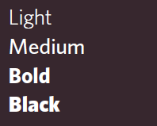
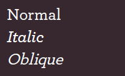
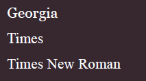
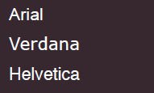
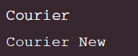
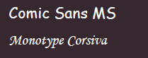

# [CSS Note](../README.md) - Chapter 3 Text
| Chapter | Title |
| :-: | :- |
| 3.1 | [Typefaces]() |
|  | [Serif]() |
|  | [Sans-Serif]() |
|  | [Monospace]() |
|  | [Weigh]() |
|  | [Style]() |
|  | [Stretch]() |
|  |  |
|  |  |
|  |  |
|  |  |
|  |  |
|  |  |
|  |  |
|  |  |
|  |  |
|  |  |
|  |  |
|  |  |

 

## 3.1 Typefaces
### Serif

- Serif fonts have extra details on the ends of the main strokes of the letters.
- These details are known as serifs.

### Sans-Serif

- Sans-serif fonts have straight ends to letters, and therefore have a much cleaner design.

### Monospace

- Every letter in a monospace (or fixed-width) font is the same width. (Non-monospace fonts have different widths.)

### Weigh

- The font weight not only adds emphasis but can also affect the amount of white space and contrast on a page.

### Style

- Italic fonts have a cursive aspect to some of the lettering.
- Oblique font styles take the normal style and put it on an angle.

### Stretch

- In condensed (or narrow) versions of the font, letters are thinner and closer together.
- In expanded versions they are thicker and further apart.

 

## 3.2 Fonts
### Serif

- Serif fonts have extra details on the end of the main strokes of the letters.

### Sans-Serif

- Sans-serif fonts have straight ends to letters and therefore have a much cleaner design.

### Monospace

- Every letter in a monospace typeface is the same width. (Non-monospace fonts have different widths.)

### Cursive

- Cursive fonts either have joining strokes or other cursive characteristics, such as handwriting styles.

### Fantasy

- Fantasy fonts are usually decorative fonts and are often used for titles. They're not designed for long bodies of text.

 

## 3.5 Property: font-family

 

## 3.6 Property: font-size

 

## 3.7 Property: font-face

 

## 3.8 Font Format

 

## 3.9 Property: font-weigh

 

## 3.10 Property: font-style

 

## 3.11 Text Transform

 

## 3.12 Text Decoration

 

## 3.13 Line Heigh

 

