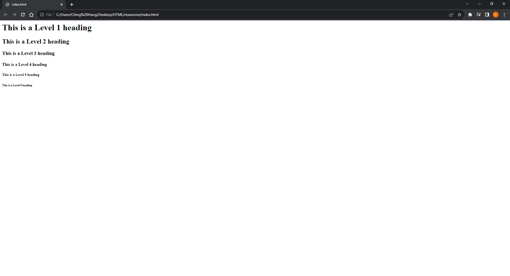
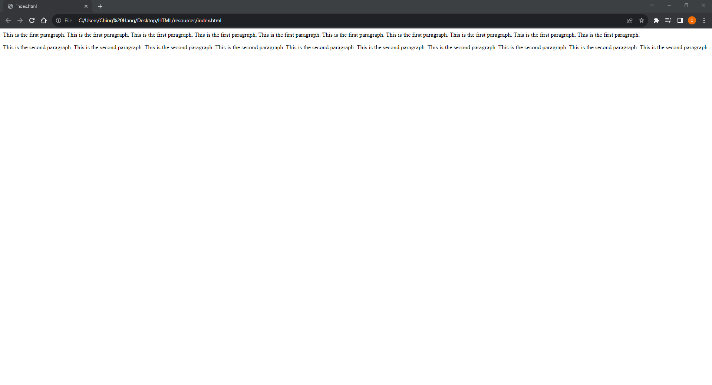
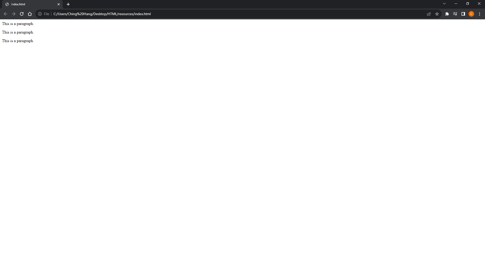
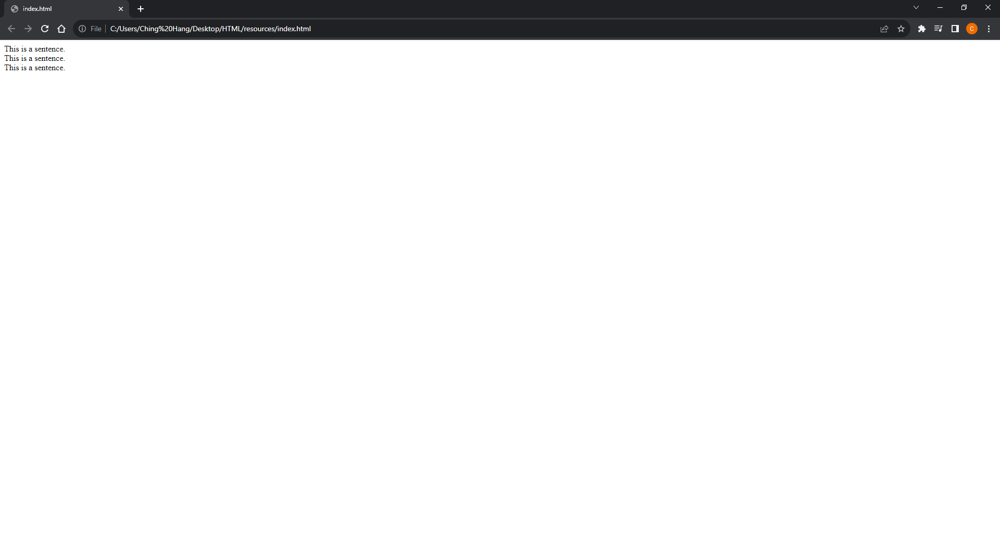
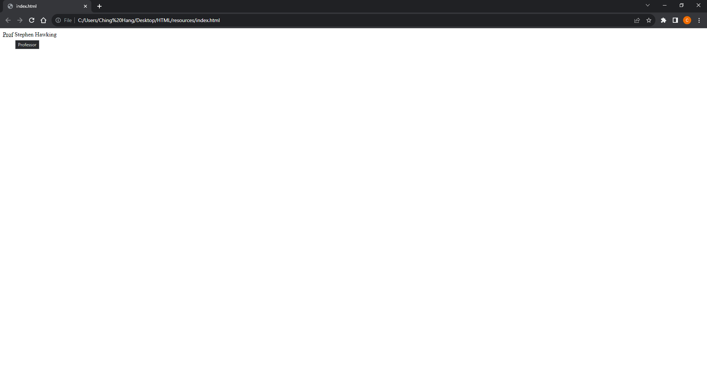
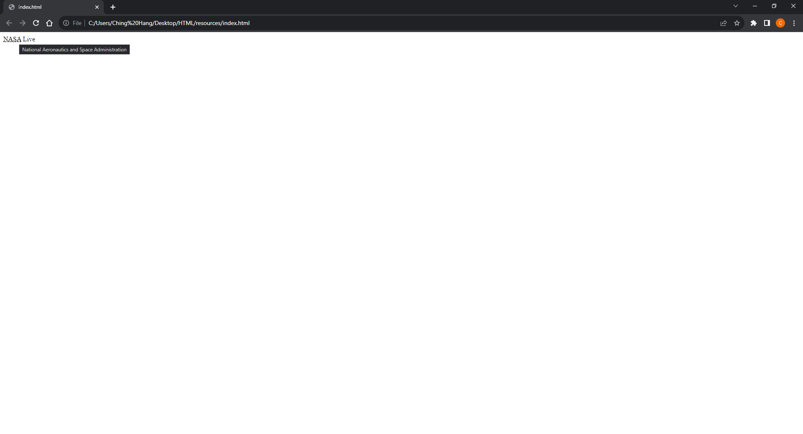
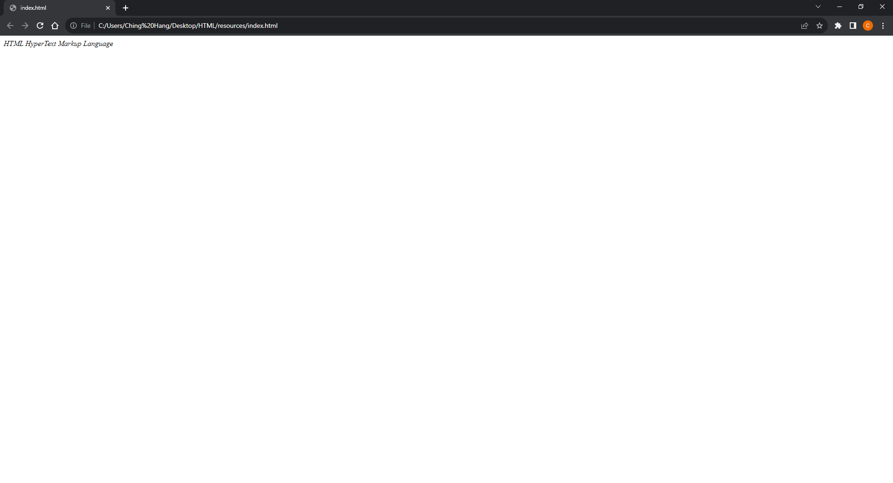
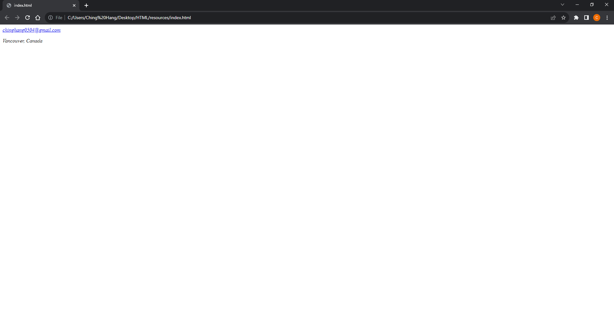

# [HTML Note](../README.md) - Chapter 2 Text
| Chapter | Title |
| :-: | :- |
| 2.1 | [Types of Markup](#21-types-of-markup) |
| 2.2 | [Structural Markup](#22-structural-markup) |
|  | [Headings \<h1>, \<h2>, \<h3>, \<h4>, \<h5>, and \<h6>](#headings-h1-h2-h3-h4-h5-and-h6) |
|  | [Paragraphs \<p>](#paragraphs-p) |
|  | [Bold \<b>](#bold-b) |
|  | [Italic \<i>](#italic-i) |
|  | [Superscript \<sup>](#superscript-sup) |
|  | [Subscript \<sub>](#subscript-sub) |
|  | [White Space](#white-space) |
|  | [Empty Elements](#empty-elements) |
|  | [Line Breaks \<br />](#line-breaks-br) |
|  | [Horizontal Rules \<hr />](#horizontal-rules-hr) |
| 2.3 | [Semantic Markup](#23-semantic-markup) |
|  | [Strong \<strong>](#strong-strong) |
|  | [Emphasis \<em>](#emphasis-em) |
|  | [Block Quotations \<blockquote>](#block-quotations-blockquote) |
|  | [Inline Quotations \<q>](#inline-quotations-q) |
|  | [Abbreviations \<abbr>](#abbreviations-abbr) |
|  | [Acronyms \<acronym>](#acronyms-acronym) |
|  | [Citation \<cite>](#citation-cite) |
|  | [Definitions \<dfn>](#definitions-dfn) |
|  | [Addresses \<address>](#addresses-address) |
|  | [Inserted \<ins>](#inserted-ins) |
|  | [Delected \<del>](#delected-del) |
|  | [No Longer Accurate or Relevant \<s>](#no-longer-accurate-or-relevant-s) |

<br />

## 2.1 Types of Markup
- Structural Markup
    - The elements that you can use to describe both headings and paragraphs.
- Semantic markup
    - Which provides extra information; such as where emphasis is placed in a sentence, that something you have written is a quotation (and who said it), the meaning of acronyms, and so on.

<br />

## 2.2 Structural Markup
### Headings \<h1>, \<h2>, \<h3>, \<h4>, \<h5>, and \<h6>
- Browsers display the contents of headings at different sizes.
- The contents of an \<h1> element is the largest, and the contents of an \<h6> element is the smallest.
- The exact size at which each browser shows the headings can vary slightly.
- Users can also adjust the size of text in their browser.
- You will see how to control the size of text, its color, and the fonts used when we come to look at CSS.

```html
<html>
    <body>
        <h1>This is a Level 1 heading</h1>
        <h2>This is a Level 2 heading</h2>
        <h3>This is a Level 3 heading</h3>
        <h4>This is a Level 4 heading</h4>
        <h5>This is a Level 5 heading</h5>
        <h6>This is a Level 6 heading</h6>
    </body>
</html>
```

Result


### Paragraphs \<p>
- By default, a browser will show each paragraph on a new line with some space between it and any subsequent paragraphs.

```html
<html>
    <body>
        <p>
            This is the first paragraph. This is the first paragraph.
            This is the first paragraph. This is the first paragraph.
            This is the first paragraph. This is the first paragraph.
            This is the first paragraph. This is the first paragraph.
            This is the first paragraph. This is the first paragraph.
        </p>
        <p>
            This is the second paragraph. This is the second paragraph.
            This is the second paragraph. This is the second paragraph.
            This is the second paragraph. This is the second paragraph.
            This is the second paragraph. This is the second paragraph.
            This is the second paragraph. This is the second paragraph.
        </p>
    </body>
</html>
```

Result


### Bold \<b>
- The \<b> element also represents a section of text that would be presented in a visually different way (for example key words in a paragraph) although the use of the \<b> element does not imply any additional meaning.

```html
<html>
    <body>
        <p>
            This is the <b>first</b> paragraph. This is the first paragraph.
        </p>
    </body>
</html>
```

Result


### Italic \<i>
- The \<i> element also represents a section of text that would be said in a different way from surrounding content — such as technical terms, names of ships, foreign words, thoughts, or other terms that would usually be italicized.

```html
<html>
    <body>
        <p>
            This is the <i>first</i> paragraph. This is the first paragraph.
        </p>
    </body>
</html>
```

Result


### Superscript \<sup>
- The \<sup> element is used to contain characters that should be superscript such as the suffixes of dates or mathematical concepts like raising a number to a power.

```html
<html>
    <body>
        <p>
            E=mc<sup>2</sup>
        </p>
    </body>
</html>
```

Result


### Subscript \<sub>
- The \<sub> element is used to contain characters that should be subscript.
- It is commonly used with foot notes or chemical formulas.

```html
<html>
    <body>
        <p>
            H<sub>2</sub>O
        </p>
    </body>
</html>
```

Result


### White Space
- When the browser comes across two or more spaces next to each other, it only displays one space.
- Similarly if it comes across a line break, it treats that as a single space too.
- This is known as white space collapsing.
```html
<html>
    <body>
        <p> This is a paragraph.</p>
        <p> This is           a paragraph.</p>
        <p> This
            is
            a
            paragraph.</p>
    </body>
</html>
```

Result


### Empty Elements
- There are a few elements that do not have any words between an opening and closing tag.
- They are known as empty elements and they are written differently.
- An empty element usually has only one tag.
- Before the closing angled bracket of an empty element there will often be a space and a forward slash character.

### Line Breaks \<br />
- If you wanted to add a line break inside the middle of a paragraph you can use the line break tag \<br />.

```html
<html>
    <body>
        <p> This is a sentence.<br />This is a sentence.<br />This is a sentence.</p>
    </body>
</html>
```

Result


### Horizontal Rules \<hr />
- To create a break between themes — such as a change of topic in a book or a new scene in a play — you can add a horizontal rule between sections using the \<hr /> tag.

```html
<html>
    <body>
        <p> This is a paragraph.</p>
        <hr />
        <p> This is a paragraph.</p>
    </body>
</html>
```

Result


<br />

## 2.3 Semantic Markup
### Strong \<strong>
- The use of the \<strong> element indicates that its content has strong importance.
- For example, the words contained in this element might be said with strong emphasis.
- By default, browsers will show the contents of a \<strong> element in bold.

```html
<html>
    <body>
        <p><strong>Warning:</strong> System Error</p>
    </body>
</html>
```

Result


### Emphasis \<em>
- The \<em> element indicates emphasis that subtly changes the meaning of a sentence.
- By default browsers will show the contents of an \<em> element in italic.

```html
<html>
    <body>
        <p><em>Warning:</em> System Error</p>
    </body>
</html>
```

Result


### Block Quotations \<blockquote>
- The \<blockquote> element is used for longer quotes that take up an entire paragraph.
- Note how the \<p> element is still used inside the \<blockquote> element.
- Browsers tend to indent the contents of the \<blockquote> element, however you should not use this element just to indent a piece of text — rather you should achieve this effect using CSS.

```html
<html>
    <body>
        <p>
            This is a sentence.
            <blockquote>This is a quatation.</blockquote>
            This is a sentence.
        </p>
    </body>
</html>
```

Result


### Inline Quotations \<q>
- The \<q> element is used for shorter quotes that sit within a paragraph.
- Browsers are supposed to put quotes around the \<q> element, however Internet Explorer does not —
therefore many people avoid using the \<q> element.
- Both elements may use the cite attribute to indicate where the quote is from. Its value should
be a URL that will have more information about the source of the quotation.

```html
<html>
    <body>
        <p>
            This is a sentence.
            <q>This is a quatation.</q>
            This is a sentence.
        </p>
    </body>
</html>
```

Result


### Abbreviations \<abbr>
- If you use an abbreviation or an acronym, then the \<abbr> element can be used.
- A title attribute on the opening tag is used to specify the full term.

```html
<html>
    <body>
        <p><abbr title="Professor">Prof</abbr> Stephen Hawking</p>
    </body>
</html>
```

Result


### Acronyms \<acronym>
- In HTML 4 there was a separate \<acronym> element for acronyms.
- To spell out the full form of the acronym, the title attribute was used (as with the \<abbr> element above).
- HTML5 just uses the \<abbr> element for both abbreviations and acronyms.

```html
<html>
    <body>
        <p><acronym title="National Aeronautics and Space Administration">NASA</acronym> Live</p>
    </body>
</html>
```

Result


### Citation \<cite>
- When you are referencing a piece of work such as a book, film or research paper, the \<cite> element can be used to indicate where the citation is from.
- In HTML5, \<cite> should not really be used for a person's name — but it was allowed in HTML 4, so most people are likely to continue to use it.
- Browsers will render the content of a \<cite> element in italics.

```html
<html>
    <body>
        <p><cite>HTML and CSS</cite> book</p>
    </body>
</html>
```

Result


### Definitions \<dfn>
- The first time you explain some new terminology (perhaps an academic concept or some jargon) in a document, it is known as the defining instance of it.
- The \<dfn> element is used to indicate the defining instance of a new term.
- Some browsers show the content of the \<dfn> element in italics.
- Safari and Chrome do not change its appearance.

```html
<html>
    <body>
        <p><dfn>HTML</cite> HyperText Markup Language</p>
    </body>
</html>
```

Result


### Addresses \<address>
- The \<address> element has quite a specific use: to contain contact details for the author of the page.
- It can contain a physical address, but it does not have to.
- For example, it may also contain a phone number or email address.
- Browsers often display the content of the \<address> element in italics.

```html
<html>
    <body>
        <address>
            <p><a href="mailto:chinghang0504@gmail.com">chinghang0504@gmail.com</a></p>
            <p>Vancouver, Canada</p>
        </address>
    </body>
</html>
```

Result


### Inserted \<ins>
- The \<ins> element can be used to show content that has been inserted into a document.
- The content of a \<ins> element is usually underlined.

```html
<html>
    <body>
        <p>Hello <ins>World</ins></p>
    </body>
</html>
```

Result


### Delected \<del>
- The \<del> element can show text that has been deleted from it.
- The content of a \<del> element usually has a line through it.

```html
<html>
    <body>
        <p>Hello <del>World</del></p>
    </body>
</html>
```

Result


### No Longer Accurate or Relevant \<s>
- The \<s> element indicates something that is no longer accurate or relevant (but that should not be deleted).
- Visually the content of an \<s> element will usually be displayed with a line through the center.
- Older versions of HTML had a \<u> element for content that was underlined, but this is being phased out.

```html
<html>
    <body>
        <p><s>Was $1000</s></p>
    </body>
</html>
```

Result


<br />
