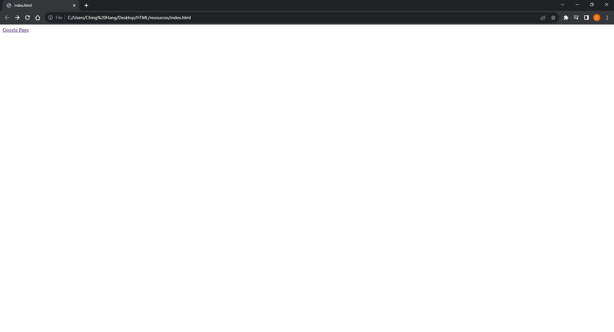
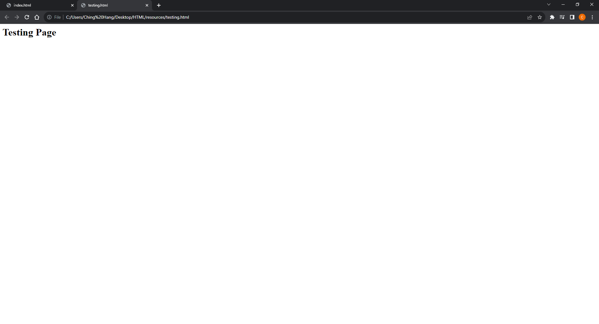
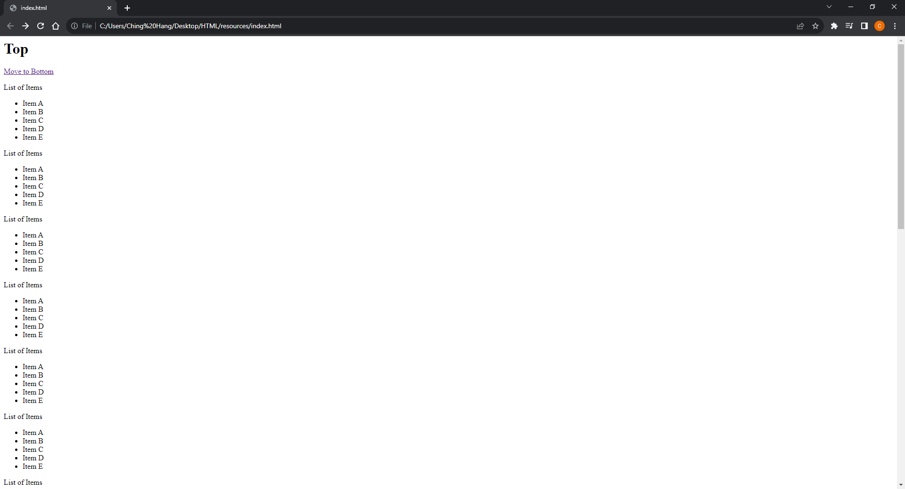
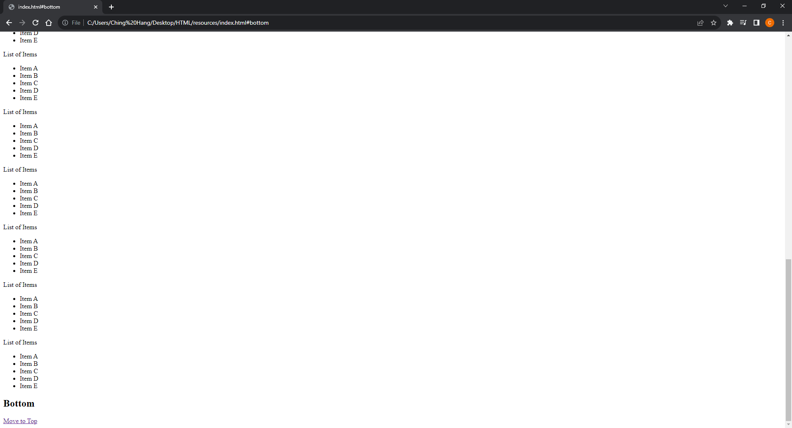

# [HTML Note](../README.md) - Chapter 4 Links
| Chapter | Title |
| :-: | :- |
| 4.1 | [Webpage Links \<a>](#41-webpage-links-a) |
|  | [Absolute URL](#absolute-url) |
|  | [Relative URL](#relative-url) |
| 4.2 | [Email Links \<a>](#42-email-links-a) |
| 4.3 | [Opening Links in a New Window \<a>](#43-opening-links-in-a-new-window-a) |
| 4.4 | [Linking to a Specific Part \<a>](#44-linking-to-a-specific-part-a) |

<br />

## 4.1 Webpage Links \<a>
### Absolute URL
- An absolute URL starts with the domain name for that site, and can be followed by the path to a specific page.
- If no page is specified, the site will display the homepage.

```html
<html>
    <body>
        <p>
            <a href="https://www.google.com/">Google Page</a>
        </p>
    </body>
</html>
```

Result


### Relative URL
- When you are linking to other pages within the same site, you do not need to specify the domain name in the URL.

```html
<html>
    <body>
        <p>
            <a href="testing.html">Testing Page</a>
        </p>
    </body>
</html>
```

Result


<br />

## 4.2 Email Links \<a>
- When it is clicked on, the user's email program will open a new email message and address it to the person specified in the link.

```html
<html>
    <body>
        <p>
            <a href="mailto:chinghang0504@gmail.com">Email to Me</a>
        </p>
    </body>
</html>
```

Result


<br />

## 4.3 Opening Links in a New Window \<a>
- One of the most common reasons a web page author might want a link to be opened in a new window is if it points to another website.
- In such cases, they hope the user will return to the window containing their site after finishing looking at the other one. =
- Generally you should avoid opening links in a new window, but if you do, it is considered good practice to inform users that the link will open a new window before they click on it.

```html
<html>
    <body>
        <p>
            <a href="testing.html" target="_blank">Testing Page</a>
        </p>
    </body>
</html>
```

Result



<br />

## 4.4 Linking to a Specific Part \<a>
- At the top of a long page you might want to add a list of contents that links to the corresponding sections lower down.
- Or you might want to add a link from part way down the page back to the top of it to save users from having to scroll back to the top.
- The value of the id attribute should start with a letter or an underscore (not a number or any other character) and, on a single page, no two id attributes should have the same value.
- To link to an element that uses an id attribute you use the \<a> element again, but the value of
the href attribute starts with the # symbol, followed by the value of the id attribute of the element you want to link to.
- In this example, \<a href="#top"> links to the \<h1> element at the top of the page whose id attribute has a value of top.

```html
<html>
    <body>
        <h1 id="top">Top</h1>
        <a href="#bottom">Move to Bottom</a>
        <p>
            List of Items
            <ul>
                <li>Item A</li>
                <li>Item B</li>
                <li>Item C</li>
                <li>Item D</li>
                <li>Item E</li>
            </ul>
        </p>
        <p>
            List of Items
            <ul>
                <li>Item A</li>
                <li>Item B</li>
                <li>Item C</li>
                <li>Item D</li>
                <li>Item E</li>
            </ul>
        </p>
        <p>
            List of Items
            <ul>
                <li>Item A</li>
                <li>Item B</li>
                <li>Item C</li>
                <li>Item D</li>
                <li>Item E</li>
            </ul>
        </p>
        <p>
            List of Items
            <ul>
                <li>Item A</li>
                <li>Item B</li>
                <li>Item C</li>
                <li>Item D</li>
                <li>Item E</li>
            </ul>
        </p>
        <p>
            List of Items
            <ul>
                <li>Item A</li>
                <li>Item B</li>
                <li>Item C</li>
                <li>Item D</li>
                <li>Item E</li>
            </ul>
        </p>
        <p>
            List of Items
            <ul>
                <li>Item A</li>
                <li>Item B</li>
                <li>Item C</li>
                <li>Item D</li>
                <li>Item E</li>
            </ul>
        </p>
        <p>
            List of Items
            <ul>
                <li>Item A</li>
                <li>Item B</li>
                <li>Item C</li>
                <li>Item D</li>
                <li>Item E</li>
            </ul>
        </p>
        <p>
            List of Items
            <ul>
                <li>Item A</li>
                <li>Item B</li>
                <li>Item C</li>
                <li>Item D</li>
                <li>Item E</li>
            </ul>
        </p>
        <p>
            List of Items
            <ul>
                <li>Item A</li>
                <li>Item B</li>
                <li>Item C</li>
                <li>Item D</li>
                <li>Item E</li>
            </ul>
        </p>
        <p>
            List of Items
            <ul>
                <li>Item A</li>
                <li>Item B</li>
                <li>Item C</li>
                <li>Item D</li>
                <li>Item E</li>
            </ul>
        </p>
        <p>
            List of Items
            <ul>
                <li>Item A</li>
                <li>Item B</li>
                <li>Item C</li>
                <li>Item D</li>
                <li>Item E</li>
            </ul>
        </p>
        <p>
            List of Items
            <ul>
                <li>Item A</li>
                <li>Item B</li>
                <li>Item C</li>
                <li>Item D</li>
                <li>Item E</li>
            </ul>
        </p>
        <p>
            List of Items
            <ul>
                <li>Item A</li>
                <li>Item B</li>
                <li>Item C</li>
                <li>Item D</li>
                <li>Item E</li>
            </ul>
        </p>
        <p>
            List of Items
            <ul>
                <li>Item A</li>
                <li>Item B</li>
                <li>Item C</li>
                <li>Item D</li>
                <li>Item E</li>
            </ul>
        </p>
        <p>
            List of Items
            <ul>
                <li>Item A</li>
                <li>Item B</li>
                <li>Item C</li>
                <li>Item D</li>
                <li>Item E</li>
            </ul>
        </p>
        <h2 id="bottom">Bottom</h2>
        <a href="#top">Move to Top</a>
    </body>
</html>
```

Result



<br />
