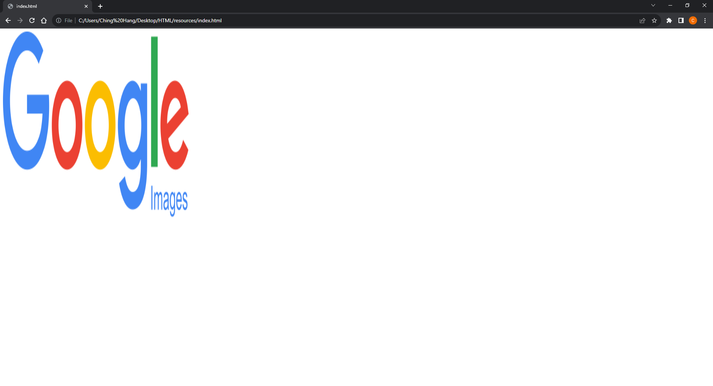
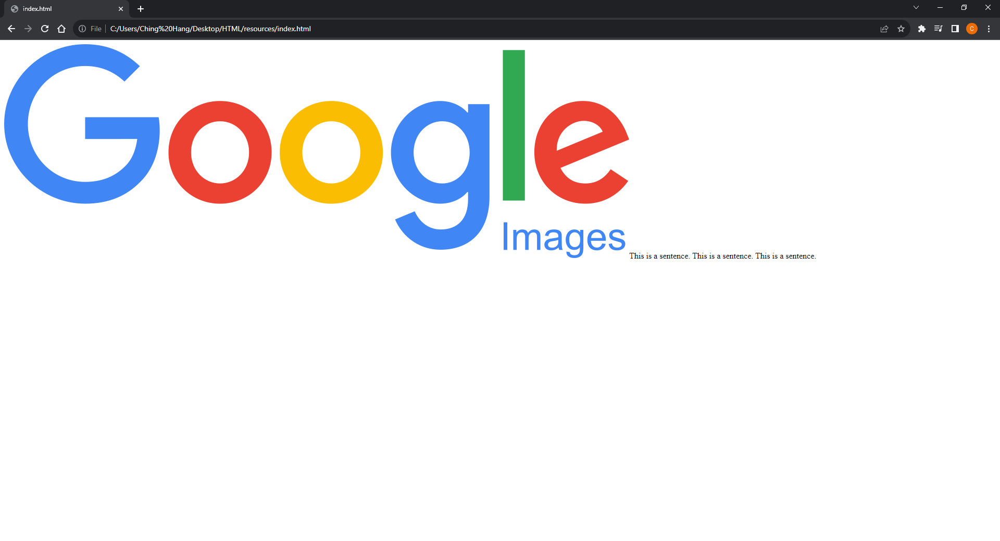
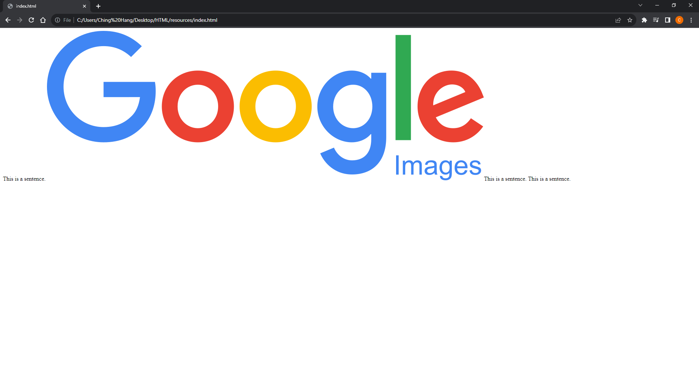
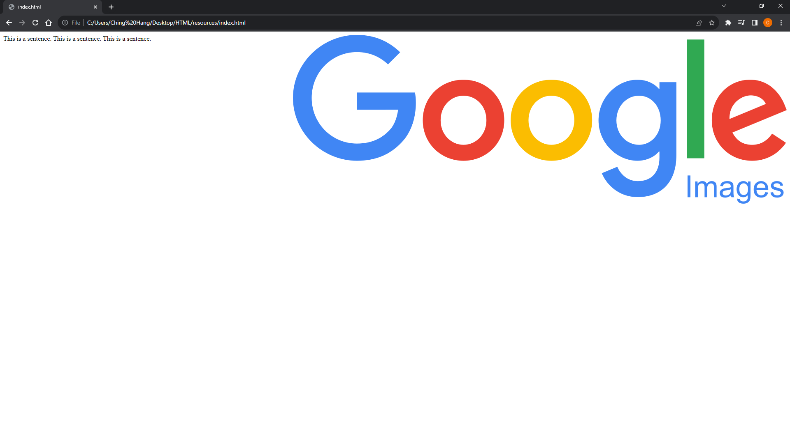
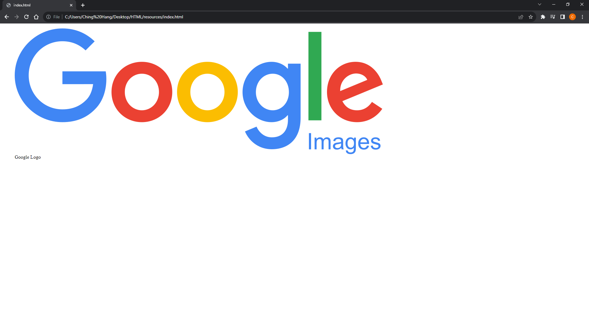

# [HTML Note](../README.md) - Chapter 5 Images
| Chapter | Title |
| :-: | :- |
| 5.1 | [Images \](#51-images-img) |
|  | [Attribute: src](#attribute-src) |
|  | [Attributes: alt and title](#attributes-alt-and-title) |
|  | [Attributes: height and width](#attributes-height-and-width) |
| 5.2 | [Image Element Placements](#52-image-element-placements) |
|  | [Before a Paragraph](#before-a-paragraph) |
|  | [Inside the Start of a Paragraph](#inside-the-start-of-a-paragraph) |
|  | [In the Middle of a Paragraph](#in-the-middle-of-a-paragraph) |
| 5.3 | [Block and Inline Elements](#53-block-and-inline-elements) |
|  | [Block Elements](#block-elements) |
|  | [Inline Elements](#inline-elements) |
| 5.4 | [Old Code: Image Aligment](#54-old-code-image-aligment) |
|  | [Attribute: align](#attribute-align) |
|  | [Value: left](#value-left) |
|  | [Value: right](#value-right) |
|  | [Value: top](#value-top) |
|  | [Value: middle](#value-middle) |
|  | [Value: bottom](#value-bottom) |
| 5.5 | [HTML5: Figure \<figure> and \<figcaption>](#55-html5-figure-figure-and-figcaption) |

<br />

## 5.1 Images \
### Attribute: src
- src
    - This tells the browser where it can find the image file.

```html
<html>
    <body>
        <p>
            
        </p>
    </body>
</html>
```

Result


### Attributes: alt and title
- alt
    - This provides a text description of the image which describes the image if you cannot see it.
- title
    - You can also use the title attribute with the \ element to provide additional information about the image.
    - Most browsers will display the content of this attribute in a tootip when the user hovers over the image.

```html
<html>
    <body>
        <p>
            
        </p>
    </body>
</html>
```

Result


### Attributes: height and width
- height
    - This specifies the height of the image in pixels.
- width
    - This specifies the width of the image in pixels.

```html
<html>
    <body>
        <p>
            
        </p>
    </body>
</html>
```

Result


- Images often take longer to load than the HTML code that makes up the rest of the page.
- It is, therefore, a good idea to specify the size of the image so that the browser can render the rest of the text on the page while leaving the right amount of space for the image that is still loading.

<br />

## 5.2 Image Element Placements
- Where an image is placed in the code will affect how it is displayed.
    1. Before a paragraph
    2. Inside the start of a paragraph
    3. In the middle of a paragraph

### Before a Paragraph
- The paragraph starts on a new line after the image.

```html
<html>
    <body>
        
        <p>This is a sentence. This is a sentence. This is a sentence.</p>
    </body>
</html>
```

Result


### Inside the Start of a Paragraph
- The first row of text aligns with the bottom of the image.

```html
<html>
    <body>
        <p>This is a sentence. This is a sentence. This is a sentence.</p>
    </body>
</html>
```

Result


### In the Middle of a Paragraph
- The image is placed between the words of the paragraph that it appears in.

```html
<html>
    <body>
        <p>This is a sentence. This is a sentence. This is a sentence.</p>
    </body>
</html>
```

Result


<br />

## 5.3 Block and Inline Elements
### Block Elements
- Block elements always appear on a new line.
- Examples of block elements include the \<h1> and \<p> elements.
- If the \ is followed by a block level element (such as a paragraph) then the block level element will sit on a new line after the imageas.

### Inline Elements
- Inline elements sit within a block level element and do not start on a new line.
- Examples of inline elements include the \<b>, \<em>, and \ elements.
- If the \ element is inside a block level element, any text or other inline elements will flow around the image.

<br />

## 5.4 Old Code: Image Aligment
### Attribute: align
- align
    - The align attribute was commonly used to indicate how the other parts of a page should flow around an image.
    - It has been removed from HTML5 and new websites should use CSS to control the alignment of images.

### Value: left
```html
<html>
    <body>
        <p>This is a sentence. This is a sentence. This is a sentence.</p>
    </body>
</html>
```

Result


### Value: right
```html
<html>
    <body>
        <p>This is a sentence. This is a sentence. This is a sentence.</p>
    </body>
</html>
```

Result


### Value: top
```html
<html>
    <body>
        <p>This is a sentence. This is a sentence. This is a sentence.</p>
    </body>
</html>
```

Result


### Value: middle
```html
<html>
    <body>
        <p>This is a sentence. This is a sentence. This is a sentence.</p>
    </body>
</html>
```

Result


### Value: bottom
```html
<html>
    <body>
        <p>This is a sentence. This is a sentence. This is a sentence.</p>
    </body>
</html>
```

Result


<br />

## 5.5 HTML5: Figure \<figure> and \<figcaption>
- HTML5 has introduced a new \<figure> element to contain images and their caption so that the two are associated.

```html
<html>
    <body>
        <p>
            <figure>
                
                <figcaption>Google Logo</figcaption>
            </figure>
        </p>
    </body>
</html>
```

Result


<br />
