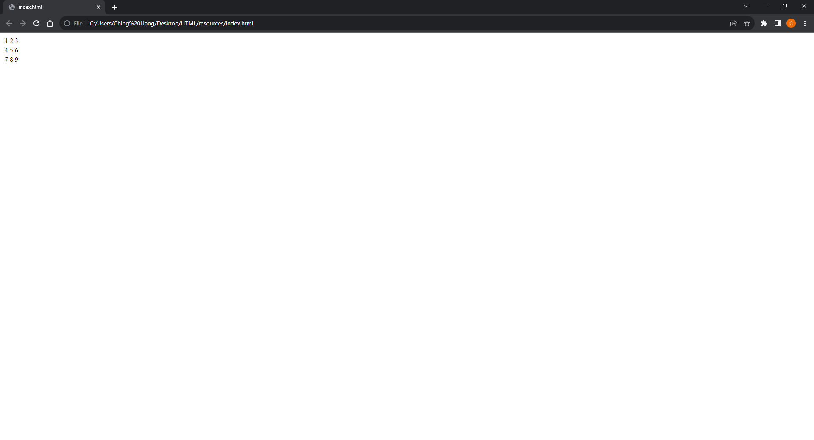
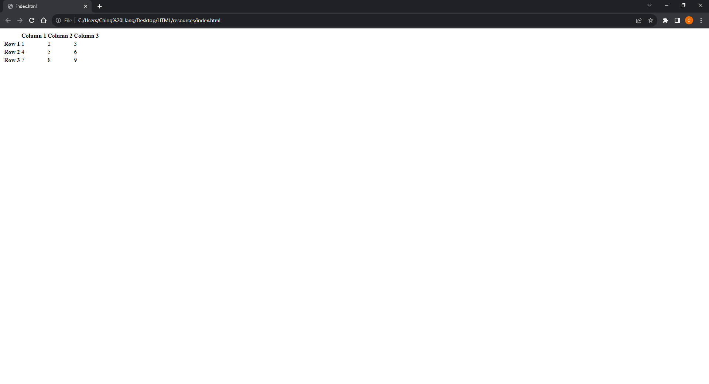
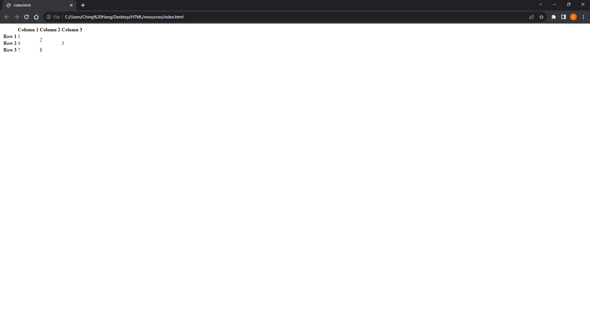
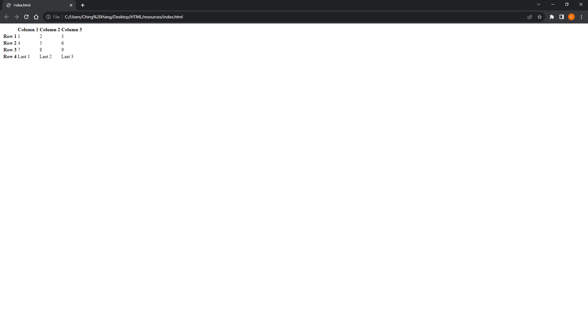
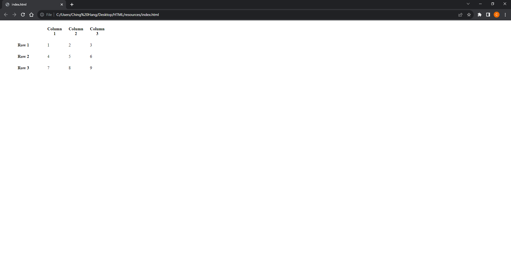
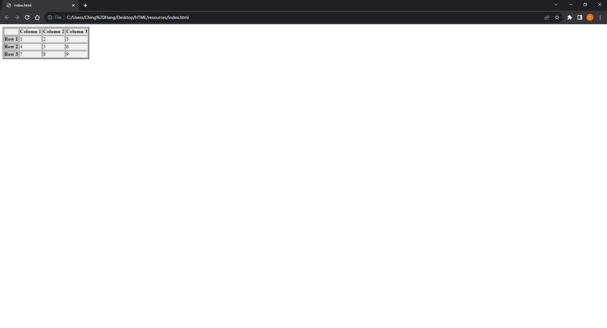

# [HTML Note](../README.md) - Chapter 6 Tables
| Chapter | Title |
| :-: | :- |
| 6.1 | [Tables \<table>, \<tr>, and \<td>](#61-tables-table-tr-and-td) |
| 6.2 | [Table Headings \<th>](#62-table-headings-th) |
|  | [Attribute: scope](#attribute-scope) |
| 6.3 | [Spanning Rows and Columns](#63-spanning-rows-and-columns) |
|  | [Attribute: colspan](#attribute-colspan) |
|  | [Attribute: rowspan](#attribute-rowspan) |
| 6.4 | [Long Tables \<thread>, \<tbody>, and \<tfoot>](#64-long-tables-thread-tbody-and-tfoot) |
| 6.5 | [Old Code: Width, Padding, and Spacing](#65-old-code-width-padding-and-spacing) |
|  | [Attribute: width, cellpadding, and cellspacing](#attribute-width-cellpadding-and-cellspacing) |
| 6.6 | [Old Code: Border and Background](#66-old-code-border-and-background) |
|  | [Attribute: border and bgcolor](#attribute-border-and-bgcolor) |

<br />

## 6.1 Tables \<table>, \<tr>, and \<td>
- \<table>
    - The \<table> element is used to create a table. The contents of the table are written out row by row.
- \<tr>
    - You indicate the start of each row using the opening \<tr> tag.
- \<td>
    - Each cell of a table is represented using a \<td> element.

```html
<html>
    <body>
        <p>
            <table>
                <tr>
                    <td>1</td>
                    <td>2</td>
                    <td>3</td>
                </tr>
                <tr>
                    <td>4</td>
                    <td>5</td>
                    <td>6</td>
                </tr>
                <tr>
                    <td>7</td>
                    <td>8</td>
                    <td>9</td>
                </tr>
            </table>
        </p>
    </body>
</html>
```

Result


- Some browsers automatically draw lines around the table and/or the individual cells.

<br />

## 6.2 Table Headings \<th>
- The \<th> element is used just like the \<td> element but its purpose is to represent the
heading for either a column or a row. (The th stands for table heading.)
- Even if a cell has no content, you should still use a \<td> or \<th> element to represent the presence of an empty cell otherwise the table will not render correctly.
- Using \<th> elements for headings helps people who use screen readers, improves the ability for search engines to index your pages, and also enables you to control the appearance of tables better when you start to use CSS.
- You can use the scope attribute on the \<th> element to indicate whether it is a heading for a column or a row.
- It can take the values: row to indicate a heading for a row or col to indicate a heading for a column.
- Browsers usually display the content of a \<th> element in bold and in the middle of the cell.

### Attribute: scope
```html
<html>
    <body>
        <p>
            <table>
                <tr>
                    <th></th>
                    <th scope="col">Column 1</th>
                    <th scope="col">Column 2</th>
                    <th scope="col">Column 3</th>
                </tr>
                <tr>
                    <th scope="row">Row 1</th>
                    <td>1</td>
                    <td>2</td>
                    <td>3</td>
                </tr>
                <tr>
                    <th scope="row">Row 2</th>
                    <td>4</td>
                    <td>5</td>
                    <td>6</td>
                </tr>
                <tr>
                    <th scope="row">Row 3</th>
                    <td>7</td>
                    <td>8</td>
                    <td>9</td>
                </tr>
            </table>
        </p>
    </body>
</html>
```

Result


<br />

## 6.3 Spanning Rows and Columns
### Attribute: colspan
- Sometimes you may need the entries in a table to stretch across more than one column.
- The colspan attribute can be used on a \<th> or \<td> element and indicates how many columns that cell should run across.

```html
<html>
    <body>
        <p>
            <table>
                <tr>
                    <th></th>
                    <th>Column 1</th>
                    <th>Column 2</th>
                    <th>Column 3</th>
                </tr>
                <tr>
                    <th>Row 1</th>
                    <td>1</td>
                    <td>2</td>
                    <td>3</td>
                </tr>
                <tr>
                    <th>Row 2</th>
                    <td colspan="2">4</td>
                    <td>6</td>
                </tr>
                <tr>
                    <th>Row 3</th>
                    <td colspan="3">7</td>
                </tr>
            </table>
        </p>
    </body>
</html>
```

Result


<br />

### Attribute: rowspan
- You may also need entries in a table to stretch down across more than one row.
- The rowspan attribute can be used on a \<th> or \<td> element to indicate how many rows a cell should span down the table.

```html
<html>
    <body>
        <p>
            <table>
                <tr>
                    <th></th>
                    <th>Column 1</th>
                    <th>Column 2</th>
                    <th>Column 3</th>
                </tr>
                <tr>
                    <th>Row 1</th>
                    <td>1</td>
                    <td rowspan="2">2</td>
                    <td rowspan="3">3</td>
                </tr>
                <tr>
                    <th>Row 2</th>
                    <td>4</td>
                </tr>
                <tr>
                    <th>Row 3</th>
                    <td>7</td>
                    <td>8</td>
                </tr>
            </table>
        </p>
    </body>
</html>
```

Result


<br />

## 6.4 Long Tables \<thread>, \<tbody>, and \<tfoot>
- There are three elements that help distinguish between the main content of the table and the first and last rows (which can contain different content).
- These elements help people who use screen readers and also allow you to style these sections in a different manner than the rest of the table.

<br />

- \<thead>
    - The headings of the table should sit inside the \<thead> element.
- \<tbody>
    - The body should sit inside the \<tbody> element.
- \<tfoot>
    - The footer belongs inside the <tfoot> element.

<br />

```html
<html>
    <body>
        <p>
            <table>
                <thead>
                    <tr>
                        <th></th>
                        <th>Column 1</th>
                        <th>Column 2</th>
                        <th>Column 3</th>
                    </tr>
                </thead>
                <tbody>
                    <tr>
                        <th>Row 1</th>
                        <td>1</td>
                        <td>2</td>
                        <td>3</td>
                    </tr>
                    <tr>
                        <th>Row 2</th>
                        <td>4</td>
                        <td>5</td>
                        <td>6</td>
                    </tr>
                    <tr>
                        <th>Row 3</th>
                        <td>7</td>
                        <td>8</td>
                        <td>9</td>
                    </tr>
                </tbody>
                <tfoot>
                    <tr>
                        <th>Row 4</td>
                        <td>Last 1</td>
                        <td>Last 2</td>
                        <td>Last 3</td>
                    </tr>
                </tfoot>
            </table>
        </p>
    </body>
</html>
```

Result


<br />

## 6.5 Old Code: Width, Padding, and Spacing
### Attribute: width, cellpadding, and cellspacing
- The width attribute was used on the opening \<table> tag to indicate how wide that table should be and on some opening \<th> and \<td> tags to specify the width of individual cells.
- The value of this attribute is the width of the table or cell in pixels.
- The opening \<table> tag could also use the cellpadding attribute to add space inside each cell of the table, and the cellspacing attribute to create space between each cell of the table.
- The values for these attributes were given in pixels.

```html
<html>
    <body>
        <p>
            <table width="400" cellpadding="10" cellspacing="5">
                <tr>
                    <th width="150"></th>
                    <th>Column 1</th>
                    <th>Column 2</th>
                    <th>Column 3</th>
                </tr>
                <tr>
                    <th>Row 1</th>
                    <td>1</td>
                    <td>2</td>
                    <td>3</td>
                </tr>
                <tr>
                    <th>Row 2</th>
                    <td>4</td>
                    <td>5</td>
                    <td>6</td>
                </tr>
                <tr>
                    <th>Row 3</th>
                    <td>7</td>
                    <td>8</td>
                    <td>9</td>
                </tr>
            </table>
        </p>
    </body>
</html>
```

Result


<br />

## 6.6 Old Code: Border and Background
### Attribute: border and bgcolor
```html
<html>
    <body>
        <p>
            <table border="2" bgcolor="#efefef">
                <tr>
                    <th></th>
                    <th>Column 1</th>
                    <th>Column 2</th>
                    <th>Column 3</th>
                </tr>
                <tr>
                    <th bgcolor="#cccccc">Row 1</th>
                    <td>1</td>
                    <td>2</td>
                    <td>3</td>
                </tr>
                <tr>
                    <th bgcolor="#cccccc">Row 2</th>
                    <td>4</td>
                    <td>5</td>
                    <td>6</td>
                </tr>
                <tr>
                    <th bgcolor="#cccccc">Row 3</th>
                    <td>7</td>
                    <td>8</td>
                    <td>9</td>
                </tr>
            </table>
        </p>
    </body>
</html>
```

Result


<br />
