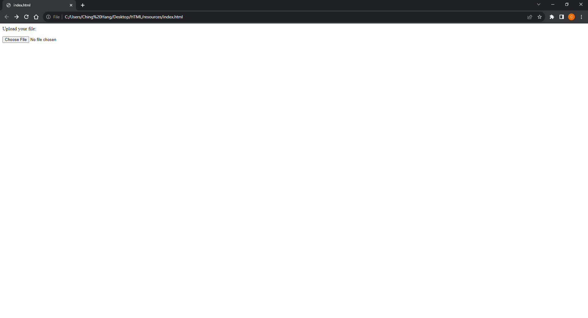
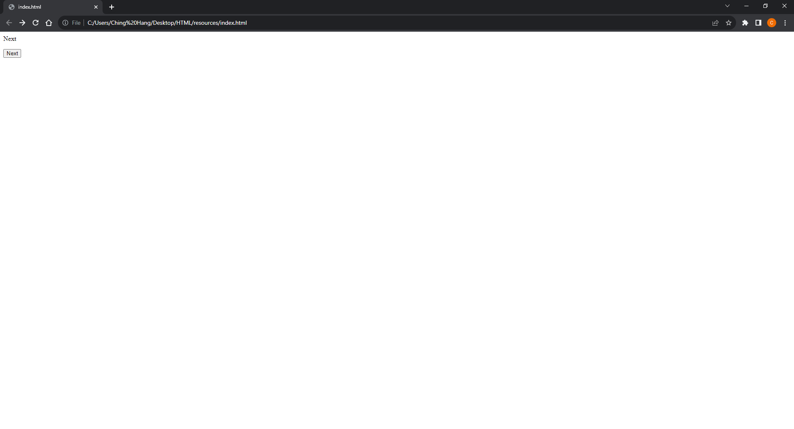
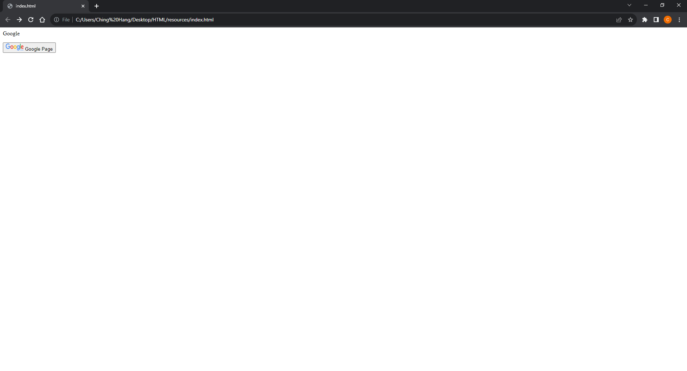
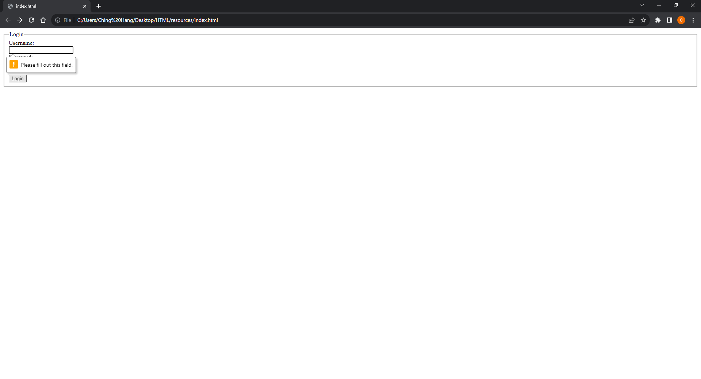
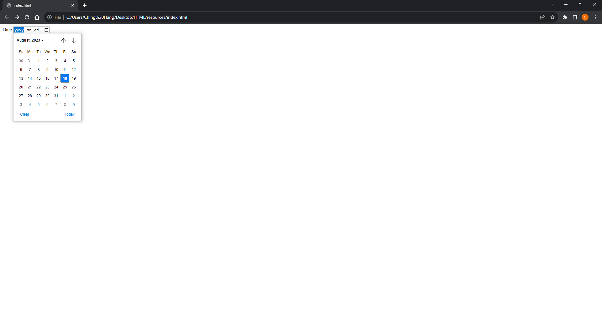
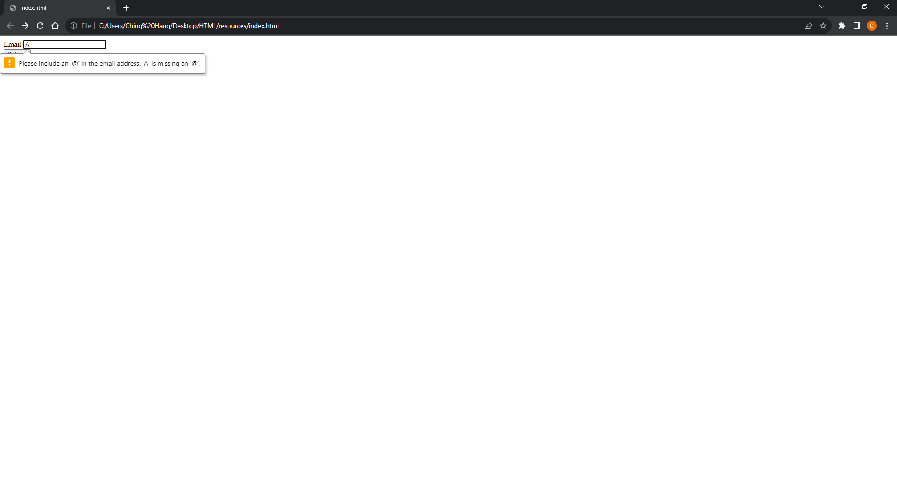
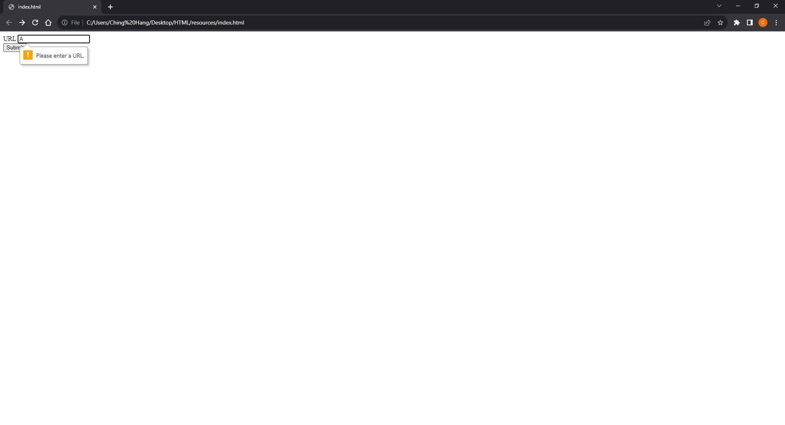
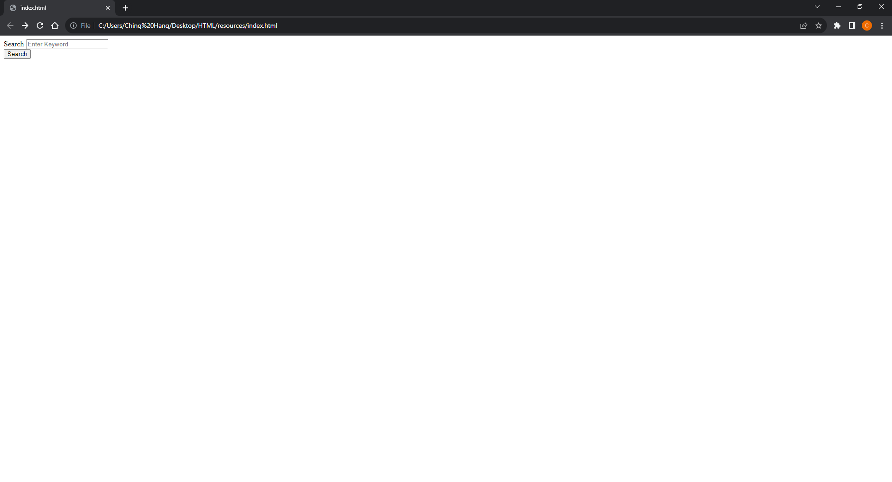

# [HTML Note](../README.md) - Chapter 7 Forms
| Chapter | Title |
| :-: | :- |
| 7.1 | [Forms \<form>](#71-forms-form) |
|  | [Attributes: action and method](#attributes-action-and-method) |
| 7.2 | [Text Input \<input>](#72-text-input-input) |
|  | [Attributes: type="text", name, size, and maxlength](#attributes-typetext-name-size-and-maxlength) |
| 7.3 | [Password Input \<input>](#73-password-input-input) |
|  | [Attributes: type="passowrd", name, size, and maxlength](#attributes-typepassowrd-name-size-and-maxlength) |
| 7.4 | [Text Area \<textarea>](#74-text-area-textarea) |
|  | [Attributes: name, cols, and rows](#attributes-name-cols-and-rows) |
| 7.5 | [Radio Button \<input>](#75-radio-button-input) |
|  | [Attributes: type="radio", name, value, and checked](#attributes-typeradio-name-value-and-checked) |
| 7.6 | [Checkbox \<input>](#76-checkbox-input) |
|  | [Attributes: type="checkbox", name, value and checked](#attributes-typecheckbox-name-value-and-checked) |
| 7.7 | [Drop Down List Box \<select> and \<option>](#77-drop-down-list-box-select-and-option) |
|  | [Attributes: name, value, and selected](#attributes-name-value-and-selected) |
| 7.8 | [Multiple Select Box \<select> and \<option>](#78-multiple-select-box-select-and-option) |
|  | [Attributes: name, size, multiple, value, and selected](#attributes-name-size-multiple-value-and-selected) |
| 7.9 | [File Input Box \<input>](#79-file-input-box-input) |
|  | [Attributes: type="file" and name](#attributes-typefile-and-name) |
| 7.10 | [Submit Button \<input>](#710-submit-button-input) |
|  | [Attributes: type="submit", name, and value](#attributes-typesubmit-name-and-value) |
| 7.11 | [Image Button \<input>](#711-image-button-input) |
|  | [Attributes: type="image", src, width, and height](#attributes-typeimage-src-width-and-height) |
| 7.12 | [Button \<button> and \<input>](#712-button-button-and-input) |
|  | [Attributes: type="image", src, width, and height](#attributes-typeimage-src-width-and-height-1) |
| 7.13 | [Hidden Input \<input>](#713-hidden-input-input) |
|  | [Attrubutes: type="hidden", name, and value](#attrubutes-typehidden-name-and-value) |
| 7.14 | [Label \<label>](#714-label-label) |
|  | [Attribute: for](#attribute-for) |
| 7.15 | [Grouping Form Elements \<fieldset> and \<legend>](#715-grouping-form-elements-fieldset-and-legend) |
| 7.16 | [HTML5: Form Validation \<input>](#716-html5-form-validation-input) |
|  | [Attributes: type, name, and required="required"](#attributes-type-name-and-requiredrequired) |
| 7.17 | [HTML5: Date Input \<input>](#717-html5-date-input-input) |
|  | [Attributes: type="date" and name](#attributes-typedate-and-name) |
| 7.18 | [HTML5: Email Input \<input>](#718-html5-email-input-input) |
|  | [Attributes: type="email" and name](#attributes-typeemail-and-name) |
| 7.19 | [HTML5: URL Input \<input>](#719-html5-url-input-input) |
|  | [Attributes: type="url" and name](#attributes-typeurl-and-name) |
| 7.20 | [HTML5: Search Input \<input>](#720-html5-search-input-input) |
|  | [Attributes: type="search" and name](#attributes-typesearch-and-name) |

<br />

## 7.1 Forms \<form>
- Form controls live inside a \<form> element. This element should always carry the action attribute and will usually have a method and id attribute too.

### Attributes: action and method
- action
    - Every \<form> element requires an action attribute.
    - Its value is the URL for the page on the server that will receive the information in the form when it is submitted.
- method
    - Forms can be sent using one of two methods: get or post.

```html
<html>
    <body>
        <form action="http://localhost:8080" method="get">

        </form>
    </body>
</html>
```

```html
<html>
    <body>
        <form action="http://localhost:8080" method="post">
            
        </form>
    </body>
</html>
```

- If the method attribute is not used, the form data will be sent using the get method.

<br />

## 7.2 Text Input \<input>
### Attributes: type="text", name, size, and maxlength
- text="text"
    - When the type attribute has a value of text, it creates a singleline text input.
- name
    - When users enter information into a form, the server needs to know which form control each piece of data was entered into. (For example, in a login form, the server needs to know what has been entered as the username and what has been given as the password.)
    - Therefore, each form control requires a name attribute.
    - The value of this attribute identifies the form control and is sent along with the information they enter to the server.
- size
    - The size attribute should not be used on new forms.
    - It was used in older forms to indicate the width of the text input (measured by the number of characters that would be seen).
    - For example, a value of 3 would create a box wide enough to display three characters
- maxlength
    - You can use the maxlength attribute to limit the number of characters a user may enter into the text field.
    - Its value is the number of characters they may enter.
    - For example, if you were asking for a year, the maxlength attribute could have a value of 4.

```html
<html>
    <body>
        <form action="http://localhost:8080">
            <p>Username:
                <input type="text" name="username" size="10" maxlength="10" />
            </p>
        </form>
    </body>
</html>
```

Result


<br />

## 7.3 Password Input \<input>
### Attributes: type="passowrd", name, size, and maxlength
- When the type attribute has a value of password it creates a text box that acts just like a single-line text input, except the characters are blocked out.
- They are hidden in this way so that if someone is looking over the user's shoulder, they cannot see sensitive data such as passwords.

```html
<html>
    <body>
        <form action="http://localhost:8080">
            <p>Password:
                <input type="password" name="password" size="10" maxlength="10" />
            </p>
        </form>
    </body>
</html>
```

Result


- Although the password is hidden on the screen, this does not mean that the data in a password control is sent securely to the server.
- You should never use these for sending sensitive data such as credit card numbers.
- For full security, the server needs to be set up to communicate with users' browsers using Secure Sockets Layer (SSL).

<br />

## 7.4 Text Area \<textarea>
- The \<textarea> element is used to create a mutli-line text input.
- Any text that appears between the opening \<textarea> and closing \</textarea> tags will appear in the text box when the page loads.
- If the user does not delete any text between these tags, this message will get sent to the server along with whatever the user has typed. (Some sites use JavaScript to clear this information when the user clicks in the text area.)

### Attributes: name, cols, and rows
- If you are creating a new form, you should use CSS to control the width and height of a \<textarea>.
- However, if you are looking at older code, you may see the cols and rows attributes used with this element.
- The cols attribute indicates how wide the text area should be (measured in numbers of characters).
- The rows attribute indicates how many rows the text area should take up vertically.

```html
<html>
    <body>
        <form action="http://localhost:8080">
            <p>Comment:</p>
            <textarea name="comment" cols="20" rows="4">Enter your comment.</textarea>
        </form>
    </body>
</html>
```

Result


<br />

## 7.5 Radio Button \<input>
- Radio buttons allow users to pick just one of a number of options.

### Attributes: type="radio", name, value, and checked
- name
    - The name attribute is sent to the server with the value of the option the user selects.
    - When a question provides users with options for answers in the form of radio buttons, the value of the name attribute should be the same for all of the radio buttons used to answer that question.
- value
    - The value attribute indicates the value that is sent to the server for the selected option.
    - The value of each of the buttons in a group should be different (so that the server knows which option the user has selected).
- checked
    - The checked attribute can be used to indicate which value (if any) should be selected when the page loads.
    - The value of this attribute is checked.
    - Only one radio button in a group should use this attribute.

```html
<html>
    <body>
        <form action="http://localhost:8080">
            <p>Gender:
                <br />
                <input type="radio" name="gender" value="male" />Male
                <input type="radio" name="gender" value="female" />Female
                <input type="radio" name="gender" value="notProvided" checked="checked" />Not Provided
            </p>
        </form>
    </body>
</html>
```

Result


- Please note: Once a radio button has been selected it cannot be deselected.
- The user can only select a different option. If you are only allowing the user one option and want them to be
able to deselect it (for example if they are indicating they agree to terms and conditions), you should use a checkbox instead.

<br />

## 7.6 Checkbox \<input>
- Checkboxes allow users to select (and unselect) one or more options in answer to a question.

### Attributes: type="checkbox", name, value and checked
- name
    - The name attribute is sent to the server with the value of the option(s) the user selects.
    - When a question provides users with options for answers in the form of checkboxes, the value of the name attribute should be the same for all of the buttons that answer that question.
- value
    - The value attribute indicates the value sent to the server if this checkbox is checked.
- checked
    - The checked attribute indicates that this box should be checked when the page loads. If used, its value should be checked.

```html
<html>
    <body>
        <form action="http://localhost:8080">
            <p>Items:
                <br />
                <input type="checkbox" name="items" value="itemA" />Item A
                <input type="checkbox" name="items" value="itemB" />Item A
                <input type="checkbox" name="items" value="itemC" checked="checked" />Item C
            </p>
        </form>
    </body>
</html>
```

Result


<br />

## 7.7 Drop Down List Box \<select> and \<option>
- A drop down list box (also known as a select box) allows users to select one option from a drop down list.
- The \<select> element is used to create a drop down list box. It contains two or more \<option> elements.
- The \<option> element is used to specify the options that the user can select from.
- The words between the opening \<option> and closing \</option> tags will be shown to the user in the drop down box.

### Attributes: name, value, and selected
- name
    - The name attribute indicates the name of the form control being sent to the server, along with the value the user selected.
- value
    - The \<option> element uses the value attribute to indicate the value that is sent to the server along with the name of the control if this option is selected.
- selected
    - The selected attribute can be used to indicate the option that should be selected when the page loads.
    - The value of this attribute should be selected.
    - If this attribute is not used, the first option will be shown when the page loads.

```html
<html>
    <body>
        <form action="http://localhost:8080">
            <p>Items: </p>
            <select name="items">
                <option value="itemA">Item A</option>
                <option value="itemB">Item B</option>
                <option value="itemC" selected="selected">Item C</option>
            </select>
        </form>
    </body>
</html>
```

Result


- If the user does not select an option, then the first item will be sent to the server as the value for this control.

<br />

## 7.8 Multiple Select Box \<select> and \<option>
### Attributes: name, size, multiple, value, and selected
- size
    - You can turn a drop down select box into a box that shows more than one option by adding the size attribute.
    - Its value should be the number of options you want to show at once.
- multiple
    - You can allow users to select multiple options from this list by adding the multiple attribute with a value of multiple.

```html
<html>
    <body>
        <form action="http://localhost:8080">
            <p>Items:</p>
            <select name="items" size="3" multiple="multiple">
                <option value="itemA">Item A</option>
                <option value="itemB">Item B</option>
                <option value="itemC" selected="selected">Item C</option>
            </select>
        </form>
    </body>
</html>
```

Result


<br />

## 7.9 File Input Box \<input>
- If you want to allow users to upload a file (for example an image, video, mp3, or a PDF), you will need to use a file input box.

### Attributes: type="file" and name
- This type of input creates a box that looks like a text input followed by a browse button.
- When the user clicks on the browse button, a window opens up that allows them to select a file from their computer to be uploaded to the website.
- When you are allowing users to upload files, the method attribute on the \<form> element must have a value of post. (You cannot send files using the HTTP get method.)
- When a user clicks on the browse button, the presentation of the window that allows them to browse for the file they want to upload will match the windows of the user's operating system.
- You cannot control the appearance of these windows.

```html
<html>
    <body>
        <form action="http://localhost:8080" method="post">
            <p>Upload your file:</p>
            <input type="file" name="file" />
        </form>
    </body>
</html>
```

Result


<br />

## 7.10 Submit Button \<input>
### Attributes: type="submit", name, and value
- type="submit"
    - The submit button is used to send a form to the server.
- name
    - It can use a name attribute but it does not need to have one.
- value
    - The value attribute is used to control the text that appears on a button.
    - It is a good idea to specify the words you want to appear on a button because the default value of buttons on some browsers is ‘Submit query’ and this might not be appropriate for all kinds of form.
    - Different browsers will show submit buttons in different ways and tend to fit the visual presentation of the browser.

```html
<html>
    <body>
        <form action="http://localhost:8080">
            <p>Next</p>
            <input type="submit" name="next" value="Next" />
        </form>
    </body>
</html>
```

Result


<br />

## 7.11 Image Button \<input>
### Attributes: type="image", src, width, and height
- If you want to use an image for the submit button, you can give the type attribute a value of image.

```html
<html>
    <body>
        <form action="http://localhost:8080">
            <p>Google</p>
            <input type="image" src="../resources/Google_Logo.png" width="50" height="20" />
        </form>
    </body>
</html>
```

Result


<br />

## 7.12 Button \<button> and \<input>
### Attributes: type="image", src, width, and height
- The \<button> element was introduced to allow users more control over how their buttons appear, and to allow other elements to appear inside the button.
- This means that you can combine text and images between the opening \<button> tag and closing \</button> tag.

```html
<html>
    <body>
        <form action="http://localhost:8080">
            <p>Google</p>
            <button>
                <input type="image" src="../resources/Google_Logo.png" width="50" height="20" />
                Google Page
            </button>
        </form>
    </body>
</html>
```

Result


<br />

## 7.13 Hidden Input \<input>
### Attrubutes: type="hidden", name, and value
- These form controls are not shown on the page (although you can see them if you use the View Source option
in the browser).
- They allow web page authors to add values to forms that users cannot see.
- For example, a web page author might use a hidden field to indicate which page the user was on when they submitted a form.

```html
<html>
    <body>
        <form action="http://localhost:8080">
            <p>Google</p>
            <button>
                <input type="image" src="../resources/Google_Logo.png" width="50" height="20" />
                Google Page
                <input type="hidden" name="hiddenData" value="hiddenData" />
            </button>
        </form>
    </body>
</html>
```
Result


## 7.14 Label \<label>
- When introducing form controls, the code was kept simple by indicating the purpose of each one in text next to it. - However, each form control should have its own \<label> element as this makes the form accessible to vision-impaired users.
- The \<label> element can be used in two ways. It can:
    1. Wrap around both the text description and the form input (as shown on the first line of the example to your right).
    2. Be kept separate from the form control and use the for attribute to indicate which form control it is a label for (as shown with the radio buttons).
    
### Attribute: for
- The for attribute states which form control the label belongs to.
- Note how the radio buttons use the id attribute.
- The value of the id attribute uniquely identifies an element from all other elements on a page. (The id attribute is
covered on page 183.)
- The value of the for attribute matches that of the id attribute on the form control it is labelling.
- This technique using the for and id attributes can be used on any form control.
- When a \<label> element is used with a checkbox or radio button, users can click on either the form control or the label to select.
- The expanded clickable area makes the form easier to use.
- The position of the label is very important.
- If users do not know where to enter information or what information to enter, they are less likely to use the form correctly.

<br />

- As a rule of thumb, here are the best places to place labels on form controls.
- Above or to the left
    1. Text inputs
    2. Text areas
    3. Select boxes
    4. File uploads
- To the right
    1. Individual checkboxes
    2. Individual radio buttons

```html
<html>
    <body>
        <form action="http://localhost:8080">
            <label>Username: <input type="text" name="username" /></label><br />
            Gender:
            <input id="male" type="radio" name="gender" value="male" /><label for="male">Male</label>
            <input id="female" type="radio" name="gender" value="female" /><label for="female">Female</label>
        </form>
    </body>
</html>
```

Result


<br />

## 7.15 Grouping Form Elements \<fieldset> and \<legend>
- \<fieldset>
    - You can group related form controls together inside the \<fieldset> element.
    - This is particularly helpful for longer forms.
    - Most browsers will show the fieldset with a line around the edge to show how they are related.
- \<legend>
    - The \<legend> element can come directly after the opening \<fieldset> tag and contains a caption which helps identify the purpose of that group of form controls.

```html
<html>
    <body>
        <form action="http://localhost:8080">
            <fieldset>
                <legend>Login</legend>
                <label>Username:<br />
                <input type="text" name="username"></label><br />
                <label>Password:<br />
                <input type="password" name="password"></label>
            </fieldset>
        </form>
    </body>
</html>
```

Result


<br />

## 7.16 HTML5: Form Validation \<input>
### Attributes: type, name, and required="required"
- Traditionally, form validation has been performed using JavaScript (which is beyond the scope of this book). But HTML5 is introducing validation and leaving the work to the browser.
- Validation helps ensure the user enters information in a form that the server will be able to understand when the form is submitted.
- Validating the contents of the form before it is sent to the server the helps:
    1. Reduce the amount of work the server has to do
    2. Enables users to see if there are problems with the form faster than if validation were performed on the server.
- At the time of writing, only Chrome and Opera supported HTML5 validation, although other browsers are expected to follow.
- In order to support older browsers (that do not understand HTML5), web page authors are likely to continue using JavaScript to validate forms.
- This HTML5 attribute does not need a value, but in HTML 4 all attributes must have a value. So, some people give this attribute a value of required.

```html
<html>
    <body>
        <form action="http://localhost:8080">
            <fieldset>
                <legend>Login</legend>
                <label>Username:<br /><input type="text" name="username" required="required"></label><br />
                <label>Password:<br /><input type="password" name="password" required="required"></label><br /><br />
                <input type="submit" value="Login" />
            </fieldset>
        </form>
    </body>
</html>
```

Result


<br />

## 7.17 HTML5: Date Input \<input>
### Attributes: type="date" and name
- HTML5 introduces new form controls to standardize the way that some information is gathered.
- Older browsers that do not recognize these inputs will just treat them as a single line text box.

```html
<html>
    <body>
        <form action="http://localhost:8080">
            <label>Date <input type="date" name="date" /></label>
        </form>
    </body>
</html>
```

Result


<br />

## 7.18 HTML5: Email Input \<input>
### Attributes: type="email" and name
- Browsers that do not support these input types will just treat them as text boxes.
- Browsers that support HTML5 validation will check that the user has provided information in the correct format of an email address.

```html
<html>
    <body>
        <form action="http://localhost:8080">
            <label>Email <input type="email" name="email" /></label><br />
            <input type="submit" value="Submit" />
        </form>
    </body>
</html>
```

Result


<br />

## 7.19 HTML5: URL Input \<input>
### Attributes: type="url" and name
- Browsers that do not support these input types will just treat them as text boxes.
- Browsers that support HTML5 validation will check that the user has provided information in the format of a URL.

```html
<html>
    <body>
        <form action="http://localhost:8080">
            <label>URL <input type="url" name="url" /></label><br />
            <input type="submit" value="Submit" />
        </form>
    </body>
</html>
```

Result


<br />

## 7.20 HTML5: Search Input \<input>
- If you want to create a single line text box for search queries, HTML5 provides a special search input.
- Older browsers will simply treat it like a single line text box.
- Recent browsers add some features that improve usability.
- For example, Safari on a Mac adds a cross to clear the search box when you have started to enter information.

### Attributes: type="search" and name
- placeholder
    - On any text input, you can also use an attribute called placeholder whose value is text that will be shown in the text box until the user clicks in that area.
    - Older browsers simply ignore this attribute.

```html
<html>
    <body>
        <form action="http://localhost:8080">
            <label>Search <input type="search" name="search" placeholder="Enter Keyword" /></label><br />
            <input type="submit" value="Search" />
        </form>
    </body>
</html>
```

Result



<br />
