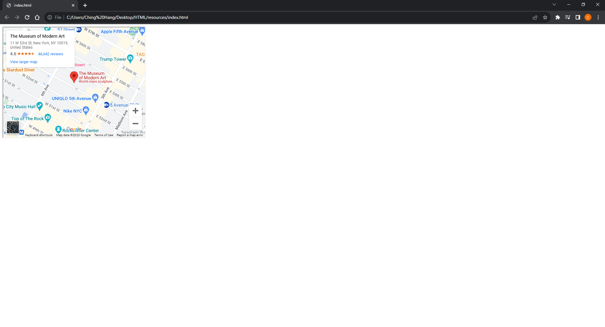
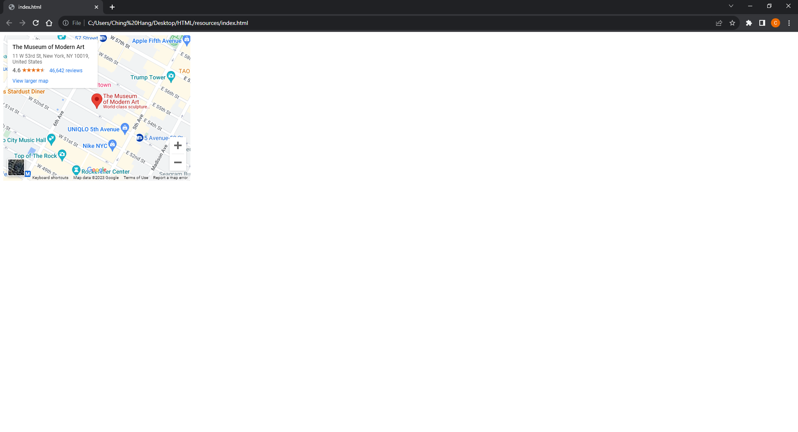

# [HTML Note](../README.md) - Chapter 8 Extra Markup
| Chapter | Title |
| :-: | :- |
| 8.1 | [Document Type \<!DOCTYPE html>](#81-document-type-doctype-html) |
|  | [HTML5](#html5) |
|  | [HTML4](#html4) |
|  | [Transitional XHTML 1.0](#transitional-xhtml-10) |
|  | [Strict XHTML 1.0](#strict-xhtml-10) |
|  | [XML Declaration](#xml-declaration) |
| 8.2 | [Comments](#82-comments) |
| 8.3 | [Attribute: id](#83-attribute-id) |
| 8.4 | [Attribute: class](#84-attribute-class) |
| 8.5 | [Grouping Elements in a Block \<div>](#85-grouping-elements-in-a-block-div) |
| 8.6 | [Grouping Elements Inline \<span>](#86-grouping-elements-inline-span) |
| 8.7 | [Inline Frame \<iframe>](#87-inline-frame-iframe) |
|  | [Attributes: src, height, and width](#attributes-src-height-and-width) |
|  | [Attributes: src, height, width, frameborder, scrolling, and seamless](#attributes-src-height-width-frameborder-scrolling-and-seamless) |
| 8.8 | [Meta \<meta>](#88-meta-meta) |
|  | [Attributes: name and content](#attributes-name-and-content) |
|  | [Value: description](#value-description) |
|  | [Value: keywords](#value-keywords) |
|  | [Value: robots](#value-robots) |
|  | [Attributes: http-equiv and content](#attributes-http-equiv-and-content) |
|  | [Value: author](#value-author) |
|  | [Value: pragma](#value-pragma) |
|  | [Value: expires](#value-expires) |
| 8.9 | [Escape Characters](#89-escape-characters) |

<br />

## 8.1 Document Type \<!DOCTYPE html>
- Because there have been several versions of HTML, each web page should begin with a DOCTYPE declaration to tell a browser which version of HTML the page is using (although browsers usually display the page even if it is not included).

### HTML5
```html
<!DOCTYPE html>
```

### HTML4
```html
<!DOCTYPE html PUBLIC "-//W3C//DTD HTML 4.01 Transitional//EN" "http://www.w3.org/TR/html4/loose.dtd">
```

### Transitional XHTML 1.0
```html
<!DOCTYPE html PUBLIC "-//W3C//DTD XHTML 1.0 Transitional//EN" "http://www.w3.org/TR/xhtml1/DTD/xhtml1-transitional.dtd">
```

### Strict XHTML 1.0
```html
<!DOCTYPE html PUBLIC "-//W3C//DTD XHTML 1.0 Strict//EN" "http://www.w3.org/TR/xhtml1/DTD/xhtml1-strict.dtd">
```

### XML Declaration
```html
<?xml version="1.0" ?>
```

<br />

## 8.2 Comments
- If you want to add a comment to your code that will not be visible in the user's browser, you can add the text between these characters:

```html
<!-- Comment -->
```

- Although comments are not visible to users in the main browser window, they can be viewed by anyone who looks at the source code behind the page.

<br />

## 8.3 Attribute: id
- Every HTML element can carry the id attribute.
- It is used to uniquely identify that element from other elements on the page.
- Its value should start with a letter or an underscore (not a number or any other character).
- It is important that no two elements on the same page have the same value for their id attributes (otherwise the value is no longer unique).
- The id attribute is known as a global attribute because it can be used on any element.

```html
<html>
    <body>
        <p id="paragraph">Hello World</p>
    </body>
</html>
```

<br />

## 8.4 Attribute: class
- Every HTML element can also carry a class attribute.
- Sometimes, rather than uniquely identifying one element within a document, you will want a way to identify several elements as being different from the other elements on the page.
- For example, you might have some paragraphs of text that contain information that is more important than others and want to distinguish these elements, or you might want to differentiate between links that point to other pages on your own site and links that point to external sites.
- By default, using these attributes does not affect the presentation of an element.
- It will only change their appearance if there is a CSS rule that indicates it should be displayed differently.

```html
<html>
    <body>
        <p class="important">Hello World</p>
    </body>
</html>
```

<br />

## 8.5 Grouping Elements in a Block \<div>
- The \<div> element allows you to group a set of elements together in one block-level box.
- For example, you might create a \<div> element to contain all of the elements for the header of your site (the logo and the navigation), or you might create a \<div> element to contain comments from visitors.
- In a browser, the contents of the \<div> element will start on a new line, but other than this it will make no difference to the presentation of the page.
- Using an id or class attribute on the \<div> element, however, means that you can create CSS style rules to indicate how much space the \<div> element should occupy on the screen and change the appearance of all the elements contained within it.

```html
<html>
    <body>
        <div id="header">
            <br />
            Google Logo
        </div>
    </body>
</html>
```

<br />

## 8.6 Grouping Elements Inline \<span>
- The \<span> element acts like an inline equivalent of the \<div> element.
- It is used to either:
    1. Contain a section of text where there is no other suitable element to differentiate it from its surrounding text
    2. Contain a number of inline elements
- The most common reason why people use \<span> elements is so that they can control the appearance of the content of these elements using CSS.
- You will usually see that a class or id attribute is used with \<span> elements:
    1. To explain the purpose of this \<span> element
    2. So that CSS styles can be applied to elements that have specific values for these attributes

```html
<html>
    <body>
        <p>
            This is a sentence.
            <span class="important">Hello World.</span>
            This is a sentence.
        </p>
    </body>
</html>
```

<br />

## 8.7 Inline Frame \<iframe>
- An iframe is like a little window that has been cut into your page — and in that window you can see another page.
- The term iframe is an abbreviation of inline frame.
- One common use of iframes (that you may have seen on various websites) is to embed a Google Map into a page.
- The content of the iframe can be any html page (either located on the same server or anywhere else on the web).

<br />

### Attributes: src, height, and width
- src
    - The src attribute specifies the URL of the page to show in the frame.
- height
    - The height attribute specifies the height of the iframe in pixels.
- width
    - The width attribute specifies the width of the iframe in pixels.

```html
<html>
    <body>
        <iframe width="450" height="350"
            src="http://maps.google.co.uk/maps?q=moma+new+york&amp;output=embed"></iframe>
    </body>
</html>
```

Result


### Attributes: src, height, width, frameborder, scrolling, and seamless
- scrolling
    - The scrolling attribute will not be supported in HTML5.
    - In HTML 4 and XHTML, it indicates whether the iframe should have scrollbars or not.
    - This is important if the page inside the iframe is larger than the space you have allowed for it (using the height and width attributes).
    - Scrollbars allow the user to move around the frame to see more content.
    - It can take one of three values: yes (to show scrollbars), no (to hide scrollbars) and auto (to show them only if needed).
- frameborder
    - The frameborder attribute will not be supported in HTML5.
    - In HTML 4 and XHTML, it indicates whether the frame should have a border or not.
    - A value of 0 indicates that no border should be shown.
    - A value of 1 indicates that a border should be shown.
- seamless
    - In HTML5, a new attribute called seamless can be applied to an iframe where scrollbars are not desired.
    - The seamless attribute (like some other new HTML5 attributes) does not need a value, but you will often see authors give it a value of seamless.
    - Older browsers do not support the seamless attribute.

```html
<html>
    <body>
        <iframe width="450" height="350"
            frameborder="0" scrolling="no"
            src="http://maps.google.co.uk/maps?q=moma+new+york&amp;output=embed"></iframe>
    </body>
</html>
```

Result


<br />

## 8.8 Meta \<meta>
- The \<meta> element lives inside the \<head> element and contains information about that web page.
- It is not visible to users but fulfills a number of purposes such as telling search engines about your page, who created it, and whether or not it is time sensitive. (If the page is time sensitive, it can be set to expire.)
- The \<meta> element is an empty element so it does not have a closing tag.
- It uses attributes to carry the information.

### Attributes: name and content
- The most common attributes are the name and content attributes, which tend to be used together.
- These attributes specify properties of the entire page.
- The value of the name attribute is the property you are setting, and the value of the content attribute is the value that you want to give to this property.

### Value: description
- This contains a description of the page.
- This description is commonly used by search engines to understand what the page is about and should be a maximum of 155 characters.
- Sometimes it is also displayed in search engine results.

### Value: keywords
- This contains a list of commaseparated words that a user might search on to find the page.
- In practice, this no longer has any noticeable effect on how search engines index your site.

### Value: robots
- This indicates whether search engines should add this page to their search results or not.
- A value of noindex can be used if this page should not be added.
- A value of nofollow can be used if search engines should add this page in their results but not any pages that it links to.

### Attributes: http-equiv and content
- The \<meta> element also uses the http-equiv and content attributes in pairs.

### Value: author
- This defines the author of the web page.

### Value: pragma
- This prevents the browser from caching the page. (That is, storing it locally to save time downloading it on subsequent visits.)

### Value: expires
- Because browsers often cache the content of a page, the expires option can be used to indicate when the page should expire (and no longer be cached).
- Note that the date must be specified in the format shown.

```html
<!DOCTYPE html>
<html>
    <head>
        <title>Programming Languages</title>
        <meta name="description" content="A list of Programming Languages" />
        <meta name="keywords" content="C, C++, Java, Python" />
        <meta name="robots" content="nofollow" />
        <meta http-equiv="author" content="Ching Hang Lam" />
        <meta http-equiv="pragma" content="no-cache" />
        <meta http-equiv="expires" content="Sat, 19 Aug 2022 23:59:59 GMT" />
    </head>
    <body>

    </body>
</html>
```

<br />

## 8.9 Escape Characters
- There are some characters that are used in and reserved by HTML code. (For example, the left and right angled brackets.)

| Character | Name | code | code |
| :--: | :-- | :-- | :-- |
| &lt; | Less-than sign | \&lt; | \&#60; |
| &gt; | Greater-than sign | \&gt; | \&#62; |
| &amp; | Ampersand | \&amp; | \&#38; |
| &quot; | Quotation mark | \&quot; | \&#34; |
| &cent; | Cent sign | \&cent; | \&#162; |
| &pound; | Pound sign | \&pound; | \&#163; |
| &yen; | Yen sign | \&yen; | \&#165; |
| &euro; | Euro sign | \&euro; | \&#8364; |
| &copy; | Copyright symbol | \&copy; | \&#169; |
| &reg; | Registered trademark | \&reg; | \&#174; |
| &trade; | Trademark | \&trade; | \&#8482; |
| &lsquo; | Left single quote | \&lsquo; | \&#8216; |
| &rsquo; | Right single quote | \&rsquo; | \&#8217; |
| &ldquo; | Left double quotes | \&ldquo; | \&#8220; |
| &rdquo; | Right double quotes | \&rdquo; | \&#8221; |
| &times; | Multiplication sign | \&times; | \&#215; |
| &divide; | Division sign | \&divide; | \&#247; |

<br />
