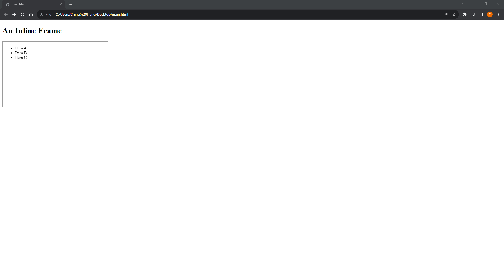
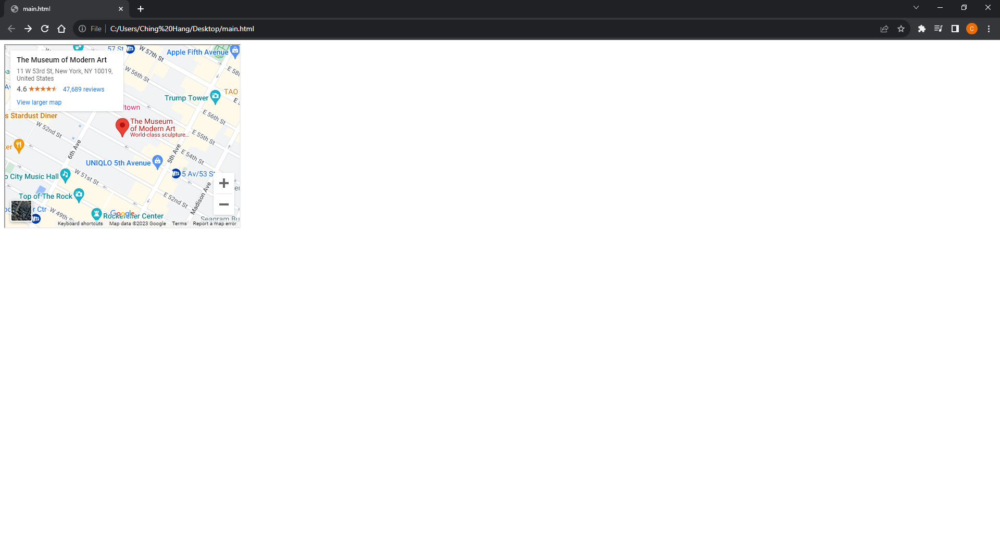

# [Kotlin Note](../../README.md) - Chapter 10 Media
| Chapter | Title |
| :-: | :- |
| 10.1 | [Inline Frames \<iframe>](#101-inline-frames-iframe) |
|  | [Nested Browsing Windows](#nested-browsing-windows) |
|  | [Googgle Map Windows](#googgle-map-windows) |
| 10.2 | [Videos \<video>](#102-videos-video) |
| 10.3 | [Audio \<audio>](#103-audio-audio) |
| 10.4 | [Canvas \<canvas>](#104-canvas-canvas) |

<br>

## 10.1 Inline Frames \<iframe>
### Nested Browsing Windows
- The iframe (short for inline frame) element lets you embed a separate HTML document or other web resource in a document.
```html
<h1>An Inline Frame</h1>
<iframe src="menu.html" width="400" height="250" >
    Read the <a href="glossary.html">glossary</a>.
</iframe>
```


### Googgle Map Windows
```html
<iframe width="450" height="350" src="http://maps.google.co.uk/maps?q=moma+new+york&amp;output=embed">
</iframe>
```


<br>

## 10.2 Videos \<video>

<br>

## 10.3 Audio \<audio>

<br>

## 10.4 Canvas \<canvas>

<br>
