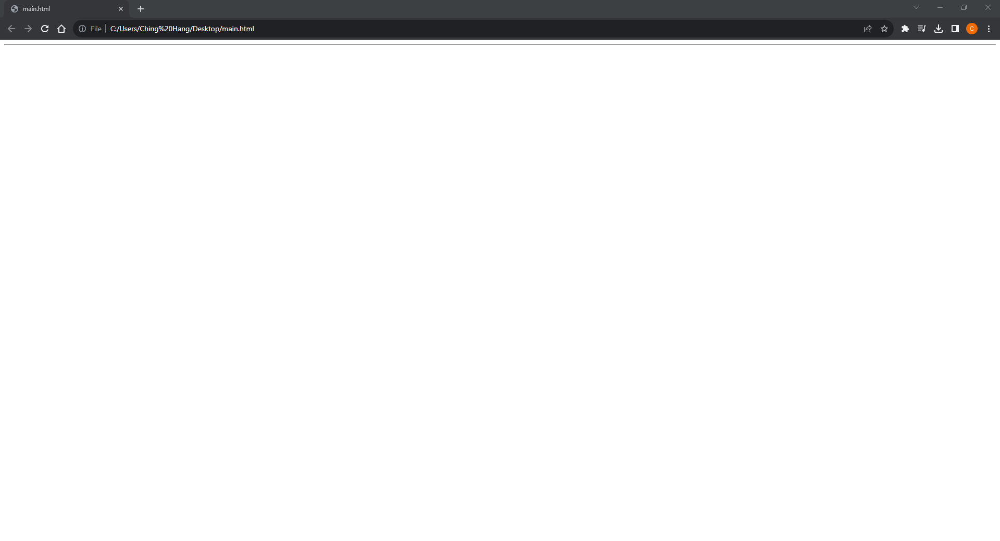
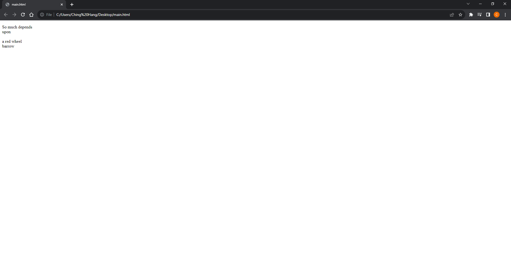
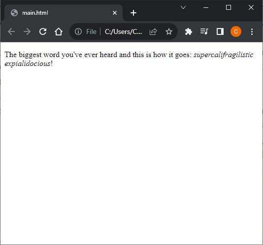

# [HTML and CSS Note](../../README.md) - Chapter 11 Extra Markup
| Chapter | Title |
| :-: | :- |
| 11.1 | [Horizontal Rule \<hr>](#111-horizontal-rule-hr) |
| 11.2 | [Line Breaks \<br>](#112-line-breaks-br) |
| 11.3 | [Word Breaks \<wbr>](#113-word-breaks-wbr) |

<br>

## 11.1 Horizontal Rule \<hr>
```html
<hr>
```


<br>

## 11.2 Line Breaks \<br>
```html
<p>So much depends <br>upon <br><br>a red wheel <br>barrow</p>
```


<br>

## 11.3 Word Breaks \<wbr>
```html
<p>The biggest word you've ever heard and this is how it goes:
<em>supercali<wbr>fragilistic<wbr>expialidocious</em>!</p>
```


<br>
