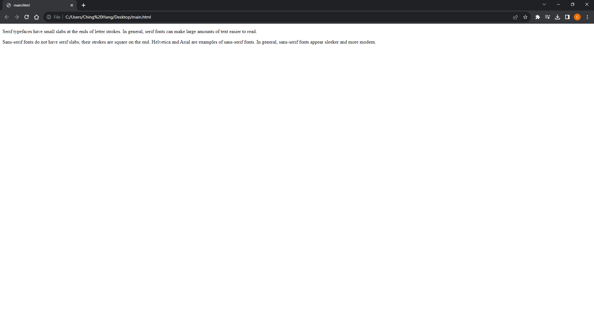
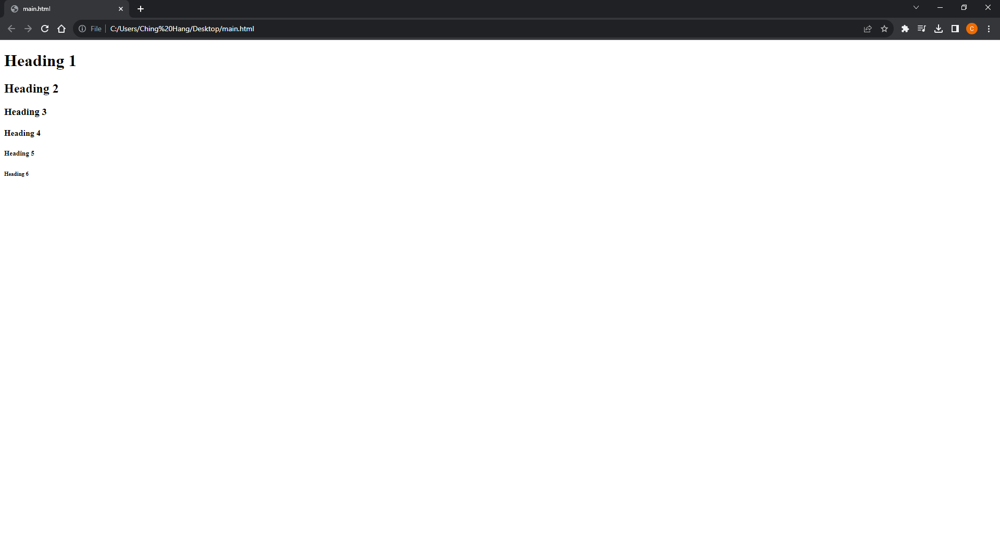
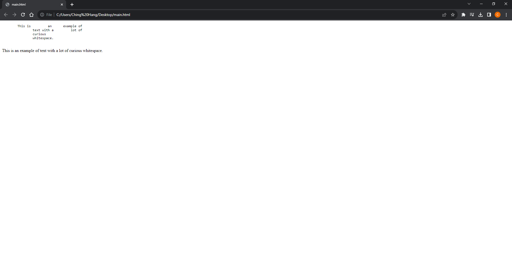
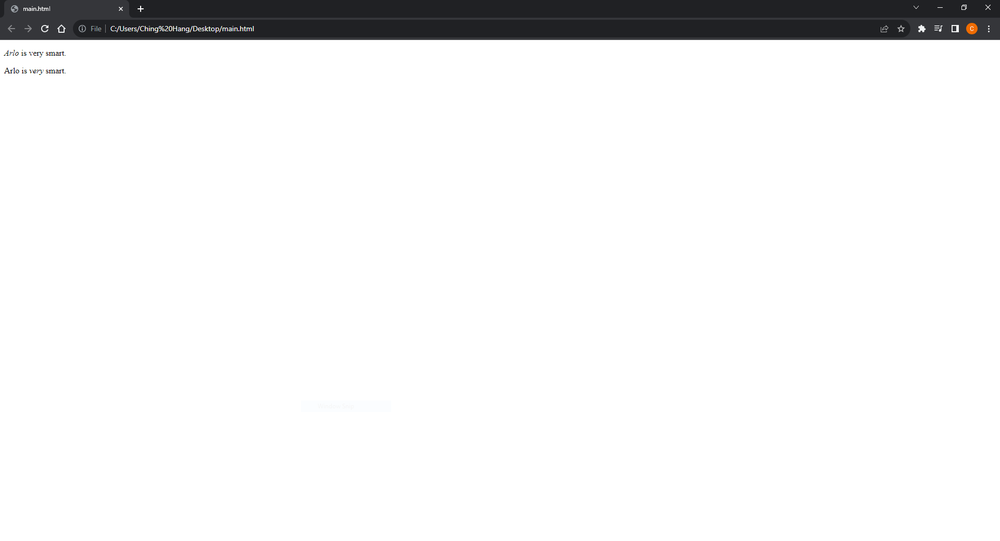
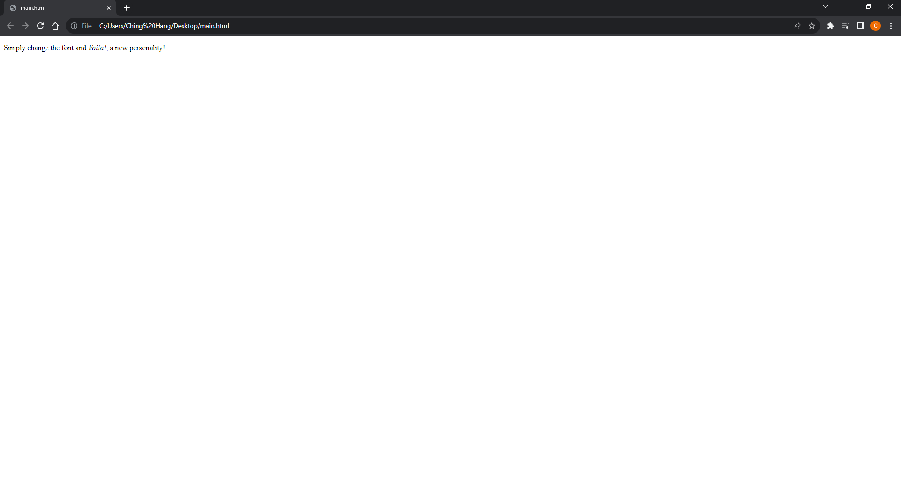
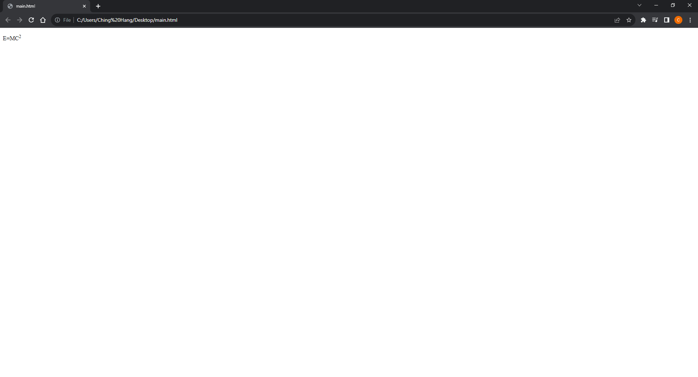
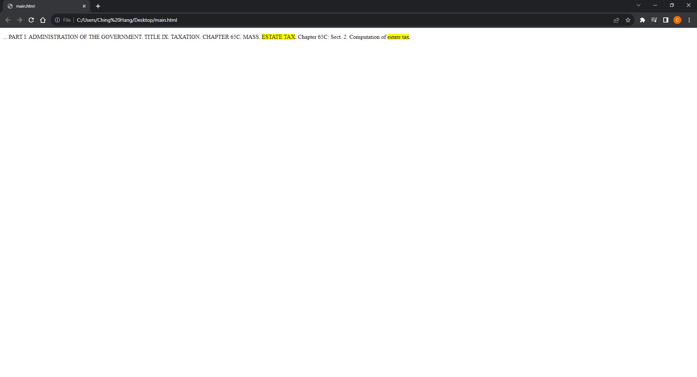
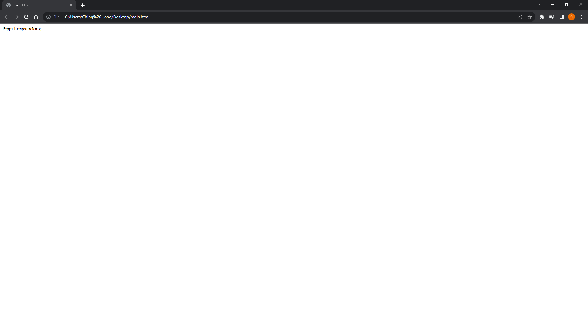

# [Kotlin Note](../../README.md) - Chapter 2 Text
| Chapter | Title |
| :-: | :- |
| 2.1 | [Paragraphs \<p>](#21-paragraphs-p) |
| 2.2 | [Headings \<h1>, \<h2>, \<h3>, \<h4>, \<h5>, and \<h6>](#22-headings-h1-h2-h3-h4-h5-and-h6) |
| 2.3 | [Preformatted Text \<pre>](#23-preformatted-text-pre) |
| 2.4 | [Text-Level Elements](#24-text-level-elements) |
|  | [Emphasized Text \<em>](#emphasized-text-em) |
|  | [Important Text \<strong>](#important-text-strong) |
|  | [Bold Text \<bold>](#bold-text-bold) |
|  | [Italic Text \<i>](#italic-text-i) |
|  | [Strike-Through Text \<s>](#strike-through-text-s) |
|  | [Underline Text \<u>](#underline-text-u) |
|  | [Smaller Type Size Text \<small>](#smaller-type-size-text-small) |
|  | [Subscript Text \<sub>](#subscript-text-sub) |
|  | [Superscript \<sup>](#superscript-sup) |
|  | [Highlighted Text \<mark>](#highlighted-text-mark) |
|  | [Inserted Text \<ins>](#inserted-text-ins) |
|  | [Deleted Text \<del>](#deleted-text-del) |

<br>

## 2.1 Paragraphs \<p>
```html
<p>Serif typefaces have small slabs at the ends of letter strokes. In
general, serif fonts can make large amounts of text easier to
read.</p>
<p>Sans-serif fonts do not have serif slabs; their strokes are square
on the end. Helvetica and Arial are examples of sans-serif fonts.
In general, sans-serif fonts appear sleeker and more modern.</p>
```


<br>

## 2.2 Headings \<h1>, \<h2>, \<h3>, \<h4>, \<h5>, and \<h6>
```html
<h1>Heading 1</h1>
<h2>Heading 2</h2>
<h3>Heading 3</h3>
<h4>Heading 4</h4>
<h5>Heading 5</h5>
<h6>Heading 6</h6>
```


<br>

## 2.3 Preformatted Text \<pre>
```html
<pre>
This is         an      example of
        text with a         lot of
        curious
        whitespace.
</pre>
<p>
This is         an      example of
        text with a         lot of
        curious
        whitespace.
</p>
```


<br>

## 2.4 Text-Level Elements
### Emphasized Text \<em>
```html
<p><em>Arlo</em> is very smart.</p>
<p>Arlo is <em>very</em> smart.</p>
```


### Important Text \<strong>
```html
<p>When returning the car, <strong>drop the keys in the red box by the
front desk</strong>.</p>
```


### Bold Text \<bold>
```html
<p>The slabs at the ends of letter strokes are called
<b>serifs</b>.</p>
```


### Italic Text \<i>
```html
<p>Simply change the font and <i>Voila!</i>, a new
personality!</p>
```


### Strike-Through Text \<s>
```html
<p>Scala Sans was designed by <s>Eric Gill</s> Martin
Majoor.</p>
```


### Underline Text \<u>
```html
<p>New York subway signage is set in <u>Helviteca</u>.</p>
```


### Smaller Type Size Text \<small>
```html
<p><small>(This font is free for personal and commercial
use.)</small></p>
```


### Subscript Text \<sub>
```html
<p>H<sub>2</sub>0</p>
```


### Superscript \<sup>
```html
<p>E=MC<sup>2</sup></p>
```


### Highlighted Text \<mark>
```html
<p> ... PART I. ADMINISTRATION OF THE GOVERNMENT. TITLE IX.
TAXATION. CHAPTER 65C. MASS. <mark>ESTATE TAX</mark>. Chapter 65C:
Sect. 2. Computation of <mark>estate tax</mark>.</p>
```


### Inserted Text \<ins>
```html
<ins>Pippi
Longstocking</ins>
```


### Deleted Text \<del>
```html
<del title="retired">Peter Pan</del>
```


<br>
