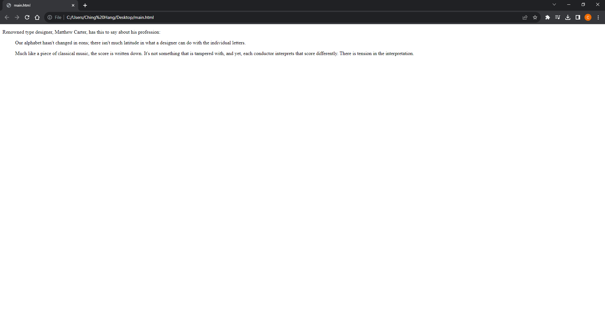
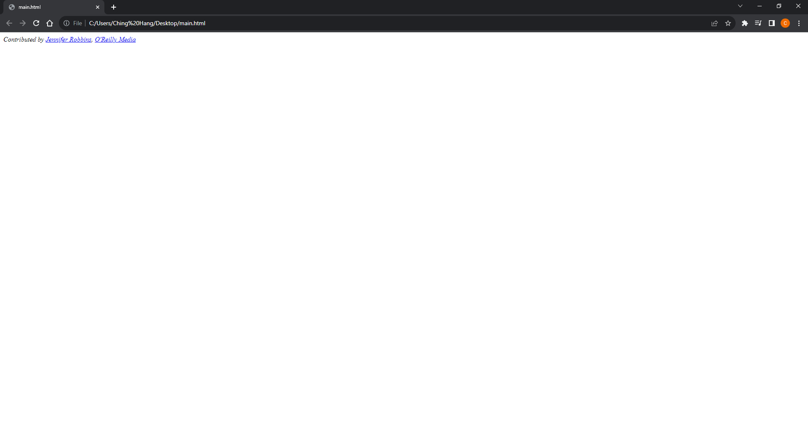
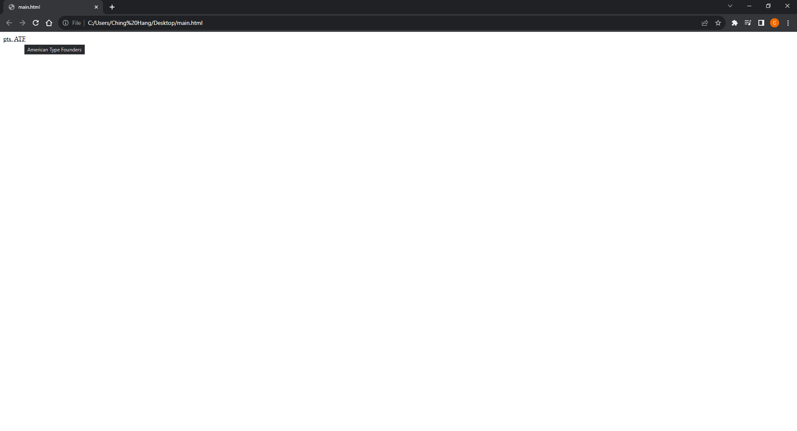
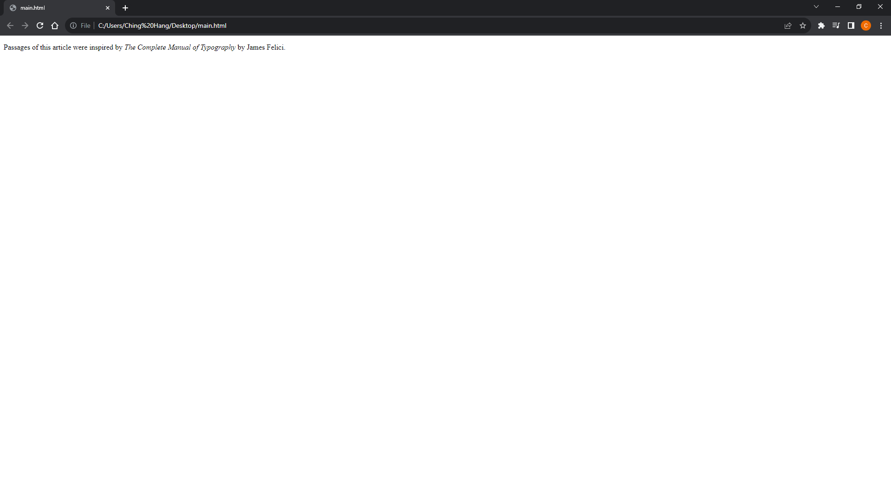
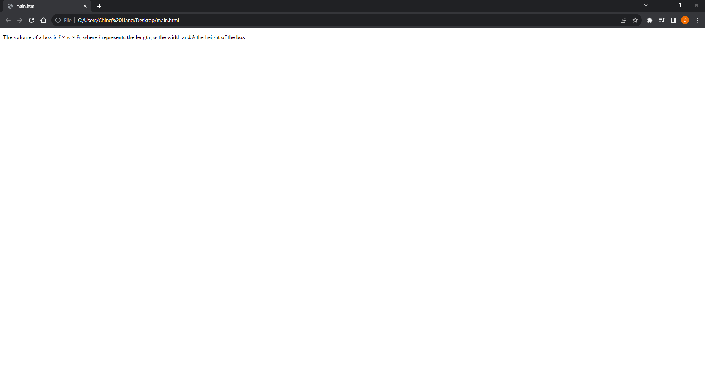
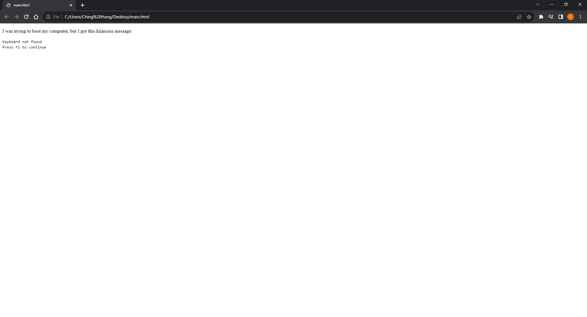
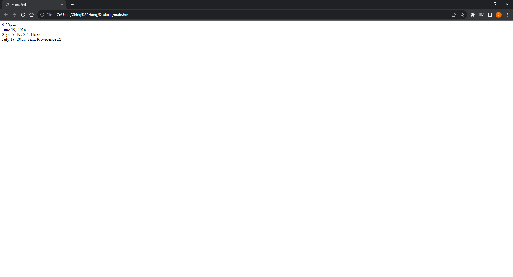
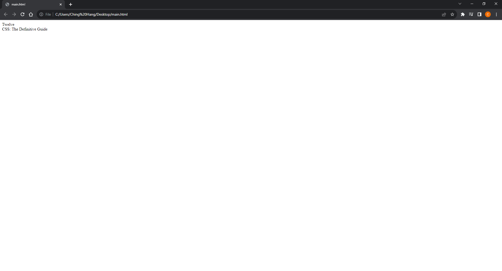

# [HTML and CSS Note](../../README.md) - Chapter 3 Information
| Chapter | Title |
| :-: | :- |
| 3.1 | [Long Quotations \<blockquote>](#31-long-quotations-blockquote) |
| 3.2 | [Short Quotations \<q>](#32-short-quotations-q) |
| 3.3 | [Addresses \<address>](#33-addresses-address) |
| 3.4 | [Abbreviations and Acronyms \<abbr>](#34-abbreviations-and-acronyms-abbr) |
| 3.5 | [Citations \<cite>](#35-citations-cite) |
| 3.6 | [Defining Terms \<dfn>](#36-defining-terms-dfn) |
| 3.7 | [Program Code Elements](#37-program-code-elements) |
|  | [\<code>](#code) |
|  | [\<var>](#var) |
|  | [\<samp>](#samp) |
|  | [\<kbd>](#kbd) |
| 3.8 | [Dates and Times \<time>](#38-dates-and-times-time) |
| 3.9 | [Data \<data>](#39-data-data) |

<br>

## 3.1 Long Quotations \<blockquote>
- A lengthy, block-level quotation
```html
<p>Renowned type designer, Matthew Carter, has this to say about his
profession:</p>

<blockquote>
    <p>Our alphabet hasn't changed in eons; there isn't much latitude in
    what a designer can do with the individual letters.</p>
    <p>Much like a piece of classical music, the score is written
    down. It's not something that is tampered with, and yet, each
    conductor interprets that score differently. There is tension in
    the interpretation.</p>
</blockquote>
```


<br>

## 3.2 Short Quotations \<q>
```html
<p>Matthew Carter says, <q>Our alphabet hasn't changed in eons.</q></p>
```


<br>

## 3.3 Addresses \<address>
- Contact information
```html
<address>
Contributed by <a href="../authors/robbins/">Jennifer Robbins</a>,
<a href="http://www.oreilly.com/">O'Reilly Media</a>
</address>
```


<br>

## 3.4 Abbreviations and Acronyms \<abbr>
- Marking up acronyms and abbreviations with the abbr element provides useful information for search engines, screen readers, and other devices.
```html
<abbr title="Points">pts.</abbr>
<abbr title="American Type Founders">ATF</abbr>
```


<br>

## 3.5 Citations \<cite>
- The cite element is used to identify a reference to another document, such as a book, magazine, article title, and so on.
```html
<p>Passages of this article were inspired by <cite>The Complete Manual
of Typography</cite> by James Felici.</p>
```


<br>

## 3.6 Defining Terms \<dfn>
- It is common to point out the first and defining instance of a word in a document in some fashion.
```html
<p><dfn>Script typefaces</dfn> are based on handwriting.</p>
```


<br>

## 3.7 Program Code Elements
### \<code>
- Code
```html
<p>
    The <code>push()</code> method adds one or more elements to the end of an array and returns the new length of the
    array.
</p>
```


### \<var>
- Variable
```html
<p>
  The volume of a box is <var>l</var> × <var>w</var> × <var>h</var>, where <var>l</var> represents the length,
  <var>w</var> the width and <var>h</var> the height of the box.
</p>
```


### \<samp>
- Program sample
```html
<p>I was trying to boot my computer, but I got this hilarious message:</p>

<p>
  <samp>Keyboard not found <br />Press F1 to continue</samp>
</p>
```


### \<kbd>
- User-entered keyboard strokes
```html
<p>Please press <kbd>Ctrl</kbd> + <kbd>Shift</kbd> + <kbd>R</kbd> to re-render an MDN page.</p>
```


<br>

## 3.8 Dates and Times \<time>
- The time element indicates dates, times, or date-time combos.
- It might be used to pass the date and time information to an application, such as saving
an event to a personal calendar.
- It might be used by search engines to find the most recently published articles.
- Or it could be used to restyle time information into an alternate format (e.g., changing 18:00 to 6 p.m.).

```html
<time datetime="21:30">9:30p.m.</time><br>
<time datetime="2016-06-19">June 19, 2016</time><br>
<time datetime="1970-09-05T01:11:00">Sept. 5, 1970, 1:11a.m.</time><br>
<time datetime="2015-07-19T08:00:00-05:00">July 19, 2015, 8am, Providence RI</time><br>
```


<br>

## 3.9 Data \<data>
- The data element is another tool for helping computers make sense of content.
- It can be used for all sorts of data, including dates, times, measurements, weights, microdata, and so on.
- The required value attribute provides the machine-readable information.
```html
<data value="12">Twelve</data><br>
<data value="978-1-449-39319-9">CSS: The Definitive Guide</data>
```


<br>
