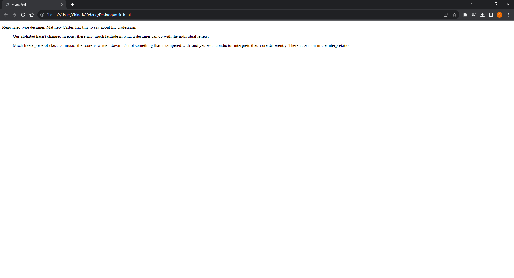

# [Kotlin Note](../../README.md) - Chapter 4 Lists
| Chapter | Title |
| :-: | :- |
| 4.1 | [Types of Lists](#41-types-of-lists) |
| 4.2 | [Unordered Lists](#42-unordered-lists) |
|  | [\<ul>](#ul) |
|  | [\<li>](#li) |
| 4.3 | [Ordered Lists](#43-ordered-lists) |
|  | [\<ol>](#ol) |
|  | [\<li>](#li-1) |
| 4.4 | [Description Lists](#44-description-lists) |
|  | [\<dl>](#dl) |
|  | [\<dt>](#dt) |
|  | [\<dd>](#dd) |

<br>

## 4.1 Types of Lists
1. Unordered Lists
    - Collections of items that appear in no particular order
2. Ordered Lists
    - Lists in which the sequence of the items is important
3. Description Lists
    - Lists that consist of name and value pairs, including but not limited to terms and definitions

<br>

## 4.2 Unordered Lists
```html
<ul>
    <li>Serif</li>
    <li>Sans-serif</li>
    <li>Script</li>
    <li>Display</li>
    <li>Dingbats</li>
</ul>
```


### \<ul>
- Unordered list

### \<li>
- List item within an unordered list

<br>

## 4.3 Ordered Lists
```html
<ol>
    <li>Gutenberg develops moveable type (1450s)</li>
    <li>Linotype is introduced (1890s)</li>
    <li>Photocomposition catches on (1950s)</li>
    <li>Type goes digital (1980s)</li>
</ol>
```


### \<ol>
- Ordered list

### \<li>
- List item within an ordered list

<br>

## 4.4 Description Lists
```html
<dl>
    <dt>Linotype</dt>
    <dd>Line-casting allowed type to be selected, used, then recirculated
    into the machine automatically. This advance increased the speed of
    typesetting and printing dramatically.</dd>

    <dt>Photocomposition</dt>
    <dd>Typefaces are stored on film then projected onto photo-sensitive
    paper. Lenses adjust the size of the type.</dd>

    <dt>Digital type</dt>
    <dd><p>Digital typefaces store the outline of the font shape in a
    format such as Postscript. The outline may be scaled to any size for
    output.</p>
    <p>Postscript emerged as a standard due to its support of
    graphics and its early support on the Macintosh computer and Apple
    laser printer.</p>
    </dd>
</dl>
```


### \<dl>
- A description list

### \<dt>
- A name, such as a term or label

### \<dd>
- A value, such as a description or definition

<br>
