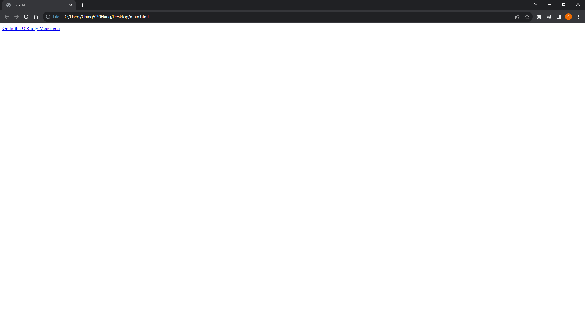
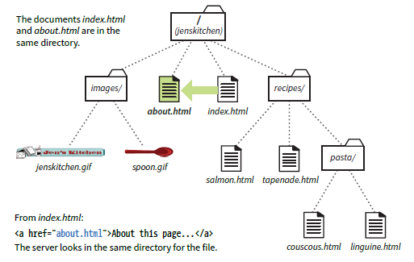
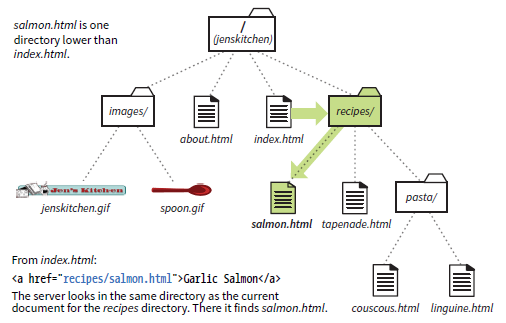
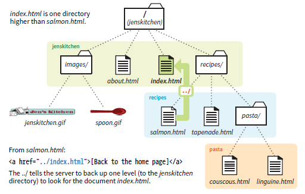
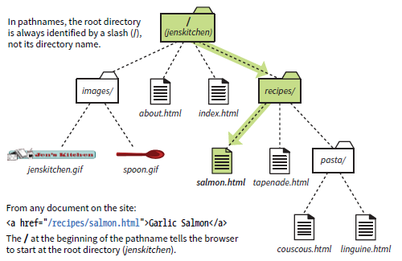
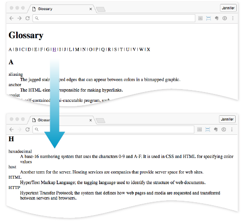

# [Kotlin Note](../../README.md) - Chapter 6 Links
| Chapter | Title |
| :-: | :- |
| 6.1 | [Links \<a>](#61-links-a) |
|  | [Attribute: href](#attribute-href) |
| 6.2 | [Types of URLs](#62-types-of-urls) |
| 6.3 | [Linking through Relative URLs](#63-linking-through-relative-urls) |
|  | [Linking within a Directory](#linking-within-a-directory) |
|  | [Linking to a Lower Directory](#linking-to-a-lower-directory) |
|  | [Linking to a Higher Directory](#linking-to-a-higher-directory) |
|  | [Linking with Site Root Relative Pathnames](#linking-with-site-root-relative-pathnames) |
| 6.4 | [Linking to a Speicifc Point in a Page](#64-linking-to-a-speicifc-point-in-a-page) |
|  | [Using Attribute: id](#using-attribute-id) |
| 6.5 | [Opening a New Browser Window](#65-opening-a-new-browser-window) |
|  | [Using Attribute: target="_blank"](#using-attribute-target_blank) |
|  | [Using Attribute: target="window-name"](#using-attribute-targetwindow-name) |
| 6.6 | [Mail Links](#66-mail-links) |
| 6.7 | [Telephone Links](#67-telephone-links) |

<br>

## 6.1 Links \<a>
### Attribute: href
- The href (hypertext reference) attribute provides the address of the page or resource (its URL) to the browser.
```html
<a href="http://www.oreilly.com">Go to the O'Reilly Media site</a>
```


<br>

## 6.2 Types of URLs
1. Absolute URLs
    - Absolute URLs provide the full URL for the document, including the protocol (http:// or https://), the domain name, and the pathname as necessary.
```html
href="http://www.oreilly.com/"
```

2. Relative URLs
    - Relative URLs describe the pathname to a file relative to the current document.
```html
href="recipes/index.html"
```

<br>

## 6.3 Linking through Relative URLs
### Linking within a Directory
```html
<a href="about.html">About the site...</a>
```


### Linking to a Lower Directory
```html
<li><a href="recipes/salmon.html">Garlic Salmon</a></li>
```


### Linking to a Higher Directory
```html
<p><a href="../index.html">[Back to home page]</a></p>
```


### Linking with Site Root Relative Pathnames
```html
<a href="/recipes/salmon.html">Garlic Salmon</a>
```


<br>

## 6.4 Linking to a Speicifc Point in a Page
### Using Attribute: id
```html
<h2 id="startH">H</h2>
<dl>
<dt>hexadecimal</dt>
```
```html
<a href="#startH">H</a>
```


<br>

## 6.5 Opening a New Browser Window
### Using Attribute: target="_blank"
- Setting target="_blank" always causes the browser to open a fresh window.
```html
<a href="http://www.oreilly.com" target="_blank">O'Reilly</a>
```

### Using Attribute: target="window-name"
- The browser opens on the specific window.
```html
<a href="http://www.oreilly.com" target="display">O'Reilly</a>
<a href="http://www.google.com" target="display">Google</a>
```

<br>

## 6.6 Mail Links
- When the user clicks a mailto link, the browser opens a new mail message preaddressed to that address in a designated mail program.
```html
<a href="mailto:alklecker@example.com">Contact Al Klecker</a>
```

<br>

## 6.7 Telephone Links
- When mobile users tap the link, what happens depends on the device:
    - Android launches the phone app.
    - BlackBerry and IE11 Mobile initiate the call immediately.
    - iOS launches a dialog box giving the option to call, message, or add the number to Contacts.
    - Desktop browsers may launch a dialog box to switch apps (for example, to FaceTime on Safari) or they may ignore the link.
```html
<a href="tel:+01-800-555-1212">Call us free at (800) 555-1212</a>
```

<br>
