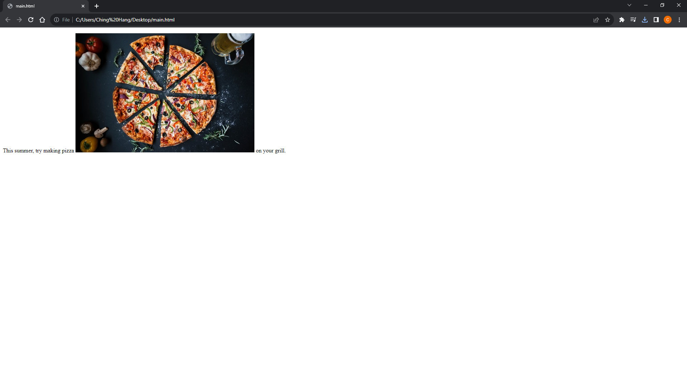
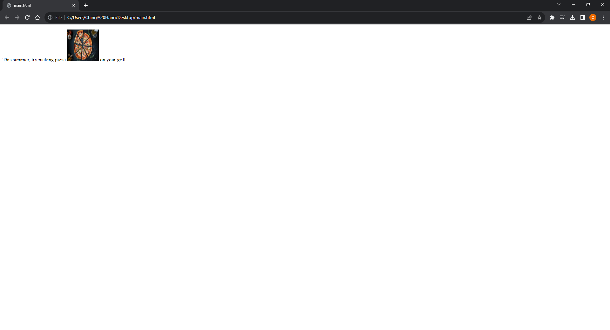
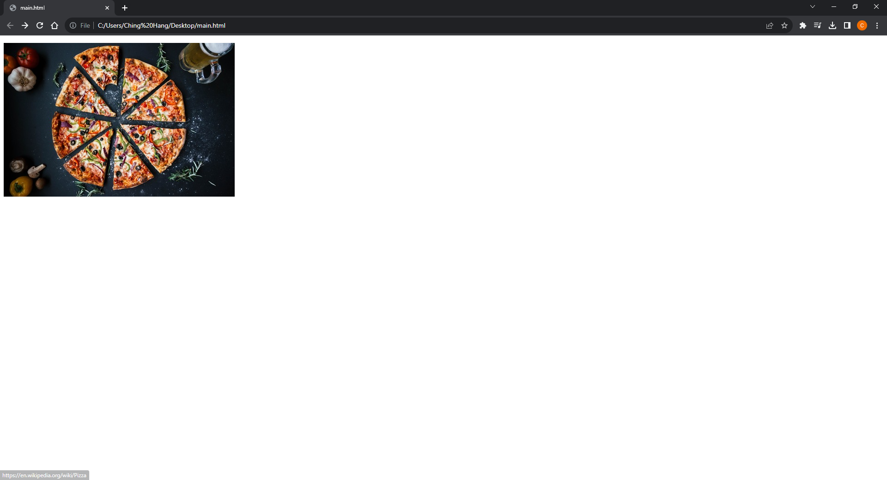
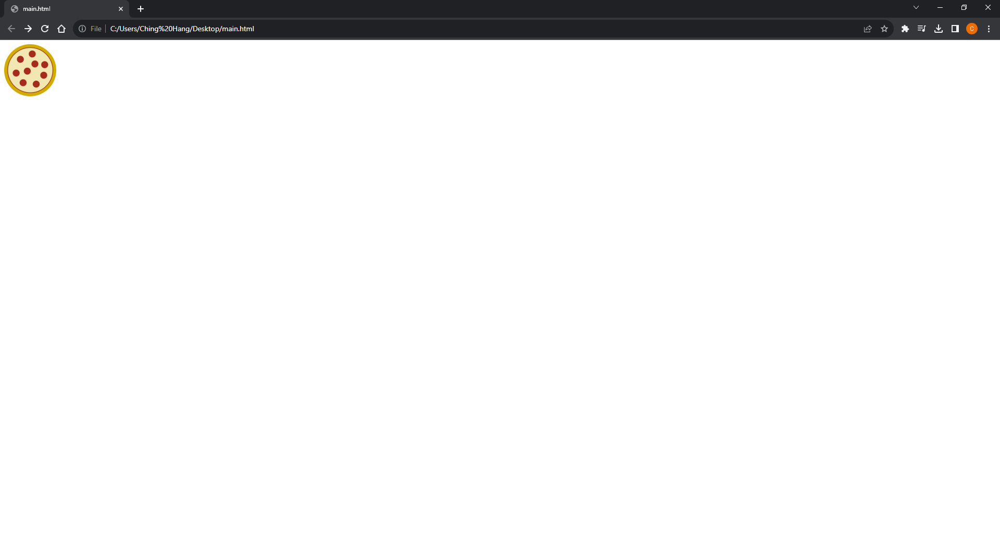

# [Kotlin Note](../../README.md) - Chapter 7 Images
| Chapter | Title |
| :-: | :- |
| 7.1 | [Images \](#71-images-img) |
|  | [Attribute: src](#attribute-src) |
|  | [Attribute: alt](#attribute-alt) |
| 7.2 | [Resizing Images](#72-resizing-images) |
|  | [Attribute: width](#attribute-width) |
|  | [Attribute: height](#attribute-height) |
| 7.3 | [Image Links](#73-image-links) |
| 7.4 | [SVG Images](#74-svg-images) |
|  | [Using \](#using-img) |
|  | [Using \<svg>](#using-svg) |
|  | [Using \<object>](#using-object) |

<br>

## 7.1 Images \
- Adds an inline image
```html
<p>This summer, try making pizza 
on your grill.</p>
```


### Attribute: src
- Source (location) of the image

### Attribute: alt
- Alternative text

<br>

## 7.2 Resizing Images
```html
<p>This summer, try making pizza 
        on your grill.</p>
```


### Attribute: width
- Image width in pixels

### Attribute: height
- Image height in pixels

<br>

## 7.3 Image Links
```html
<p><a href="https://en.wikipedia.org/wiki/Pizza"></a></p>
```


<br>

## 7.4 SVG Images
### Using \
```html

```


### Using \<svg>
```html
<svg xmlns="http://www.w3.org/2000/svg" viewBox="0 0 72 72" width="100" height="100">
    <circle fill="#D4AB00" cx="36" cy="36" r="36"/>
    <circle opacity=".7" fill="#FFF" stroke="#8A291C" cx="36.1" cy="35.9"
    r="31.2"/>
    <circle fill="#A52C1B" cx="38.8" cy="13.5" r="4.8"/>
    <circle fill="#A52C1B" cx="22.4" cy="20.9" r="4.8"/>
    <circle fill="#A52C1B" cx="32" cy="37.2" r="4.8"/>
    <circle fill="#A52C1B" cx="16.6" cy="39.9" r="4.8"/>
    <circle fill="#A52C1B" cx="26.2" cy="53.3" r="4.8"/>
    <circle fill="#A52C1B" cx="42.5" cy="27.3" r="4.8"/>
    <circle fill="#A52C1B" cx="44.3" cy="55.2" r="4.8"/>
    <circle fill="#A52C1B" cx="54.7" cy="42.9" r="4.8"/>
    <circle fill="#A52C1B" cx="56" cy="28.3" r="4.8"/>
</svg>
```


### Using \<object>
- The opening object tag specifies the media type (an svg+xml image) and points to the file to be used with the data attribute.
- The object element comes with its own fallback mechanism—any content within the object gets rendered if the media specified with data can’t be displayed.
- In this case, a PNG version of the image will be placed with an img if the .svg is not supported or fails to load.
```html
<object type="image/svg+xml" data="pizza.svg">
    
</object>
```


<br>
