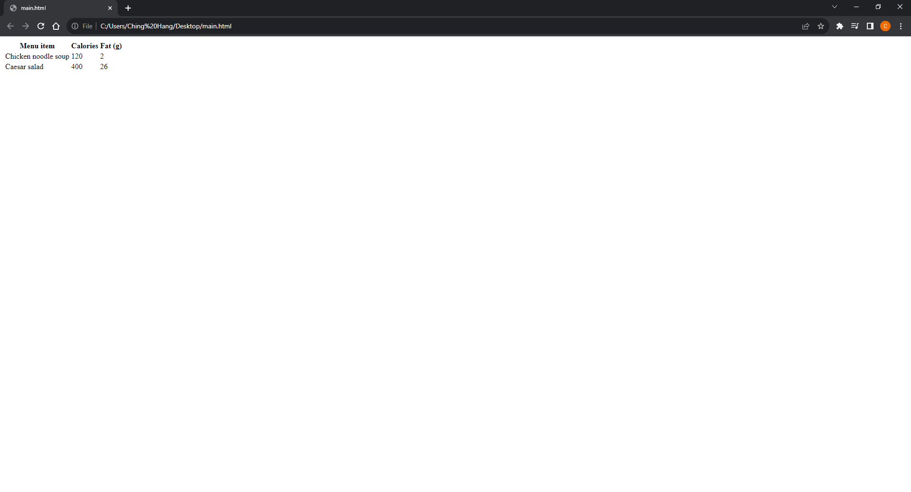
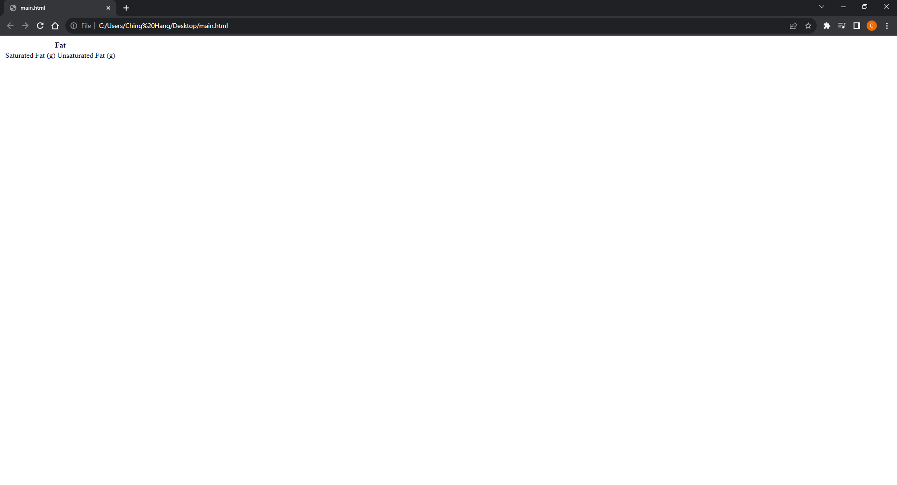
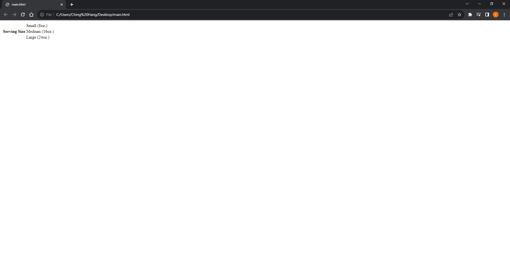
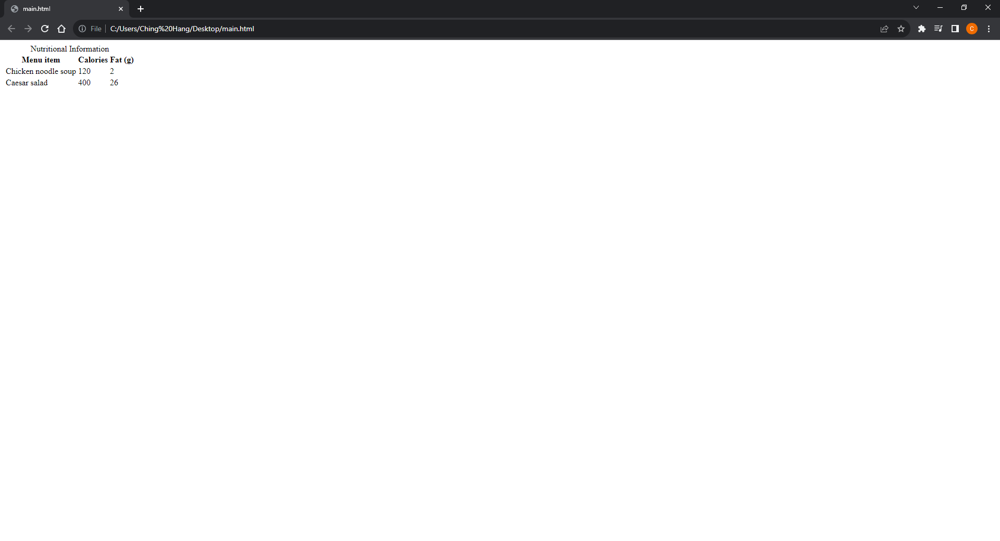

# [HTML and CSS Note](../../README.md) - Chapter 8 Tables
| Chapter | Title |
| :-: | :- |
| 8.1 | [Tables](#81-tables) |
|  | [\<table>](#table) |
|  | [\<tr>](#tr) |
|  | [\<th>](#th) |
|  | [\<td>](#td) |
| 8.2 | [Spanning Cells](#82-spanning-cells) |
|  | [Attribute: colspan](#attribute-colspan) |
|  | [Attribute: rowspan](#attribute-rowspan) |
| 8.3 | [Table Titles \<caption>](#83-table-titles-caption) |
| 8.4 | [Tables with Row Group Elements](#84-tables-with-row-group-elements) |
|  | [\<thead>](#thead) |
|  | [\<tbody>](#tbody) |
|  | [\<tfoot>](#tfoot) |
| 8.5 | [Tables with Column Group Elements](#85-tables-with-column-group-elements) |
|  | [\<colgroup>](#colgroup) |
|  | [\<col>](#col) |

<br>

## 8.1 Tables
```html
<table>
    <tr>
        <th>Menu item</th>
        <th>Calories</th>
        <th>Fat (g)</th>
    </tr>
    <tr>
        <td>Chicken noodle soup</td>
        <td>120</td>
        <td>2</td>
    </tr>
    <tr>
        <td>Caesar salad</td>
        <td>400</td>
        <td>26</td>
    </tr>
</table>
```


### \<table>
- Tabular content (rows and columns)

### \<tr>
- Table row

### \<th>
- Table header

### \<td>
- Table cell data

<br>

## 8.2 Spanning Cells
### Attribute: colspan
- Column spans, created with the colspan attribute in the td or th element, stretch a cell to the right to span over the subsequent columns.
```html
<table>
    <tr>
        <th colspan="2">Fat</th>
    </tr>
    <tr>
        <td>Saturated Fat (g)</td>
        <td>Unsaturated Fat (g)</td>
    </tr>
</table>
```


### Attribute: rowspan
- Row spans, created with the rowspan attribute, work just like column spans, but they cause the cell to span downward over several rows.
```html
<table>
    <tr>
        <th rowspan="3">Serving Size</th>
        <td>Small (8oz.)</td>
    </tr>
    <tr>
        <td>Medium (16oz.)</td>
    </tr>
    <tr>
        <td>Large (24oz.)</td>
    </tr>
</table>
```


<br>

## 8.3 Table Titles \<caption>
- Title or description to be displayed with the table
```html
<table>
    <caption>Nutritional Information</caption>
    <tr>
        <th>Menu item</th>
        <th>Calories</th>
        <th>Fat (g)</th>
    </tr>
    <tr>
        <td>Chicken noodle soup</td>
        <td>120</td>
        <td>2</td>
    </tr>
    <tr>
        <td>Caesar salad</td>
        <td>400</td>
        <td>26</td>
    </tr>
</table>
```


<br>

## 8.4 Tables with Row Group Elements
```html
<table>
    <thead>
        <!-- headers in these rows-->
        <tr></tr>
        <tr></tr>
        <tr></tr>
    <thead>
    <tbody>
        <!-- data -->
        <tr></tr>
        <tr></tr>
        <tr></tr>
        <tr></tr>
        <tr></tr>
        <tr></tr>
    </tbody>
    <tfoot>
        <!-- footnote -->
        <tr></tr>
    </tfoot>
</table>
```

### \<thead>
- Table header row group

### \<tbody>
- Table body row group

### \<tfoot>
- Table footer row group

<br>

## 8.5 Tables with Column Group Elements
- Note that the colgroup elements contain no content—they only provide an indication of semantically relevant column structure.
- The empty col elements are used as handles for scripts or styles, but are not required.

```html
<table>
    <caption>…</caption>
    <colgroup></colgroup>
    <colgroup span="2"></colgroup>
    <colgroup span="2"></colgroup>
    <!-- rest of table... -->
```
```html
    <colgroup></colgroup>
    <colgroup>
        <col class="start">
        <col class="end">
    </colgroup>
    <colgroup>
        <col class="start">
        <col class="end">
    </colgroup>
```

### \<colgroup>
- A semantically related group of columns

### \<col>
- One column in a column group

<br>
