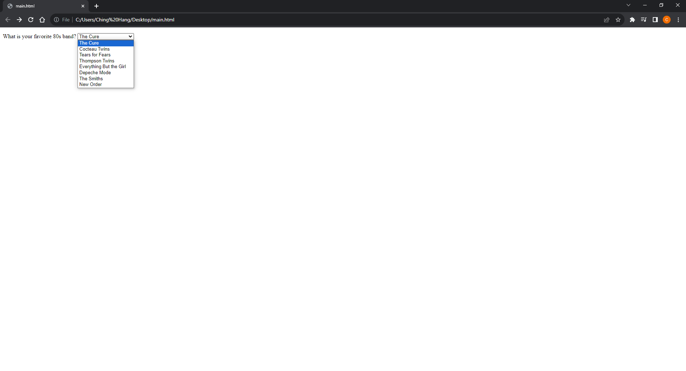
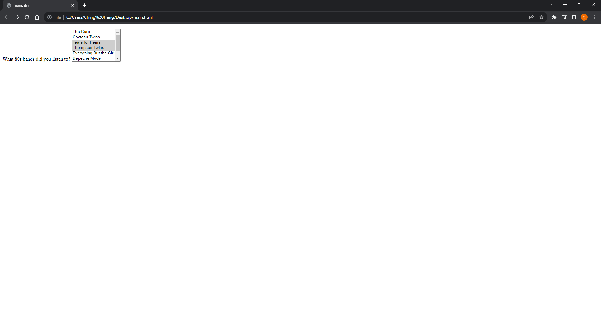

# [HTML and CSS Note](../../README.md) - Chapter 9 Forms
| Chapter | Title |
| :-: | :- |
| 9.1 | [Forms \<form>](#91-forms-form) |
| 9.2 | [Text-Entry Controls](#92-text-entry-controls) |
|  | [Single-Line Text Field \<input type="text">](#single-line-text-field-input-typetext) |
|  | [Multiline Text-Entry Field \<input type="textarea">](#multiline-text-entry-field-input-typetextarea) |
| 9.3 | [Specialized Text-Entry Controls](#93-specialized-text-entry-controls) |
|  | [Password Fields \<input type="password">](#password-fields-input-typepassword) |
|  | [Search Fields \<input type="search">](#search-fields-input-typesearch) |
|  | [Email Address Fields \<input type="email">](#email-address-fields-input-typeemail) |
|  | [Telephone Number Fields \<input type="tel">](#telephone-number-fields-input-typetel) |
|  | [URL Fields \<input type="url">](#url-fields-input-typeurl) |
| 9.4 | [Buttons](#94-buttons) |
|  | [Submit Buttons \<input type="submit">](#submit-buttons-input-typesubmit) |
|  | [Reset Buttons \<input type="reset">](#reset-buttons-input-typereset) |
|  | [Image Buttons \<input type="image">](#image-buttons-input-typeimage) |
|  | [Custom Buttons \<input type="button">](#custom-buttons-input-typebutton) |
|  | [Button Elements \<button>](#button-elements-button) |
| 9.5 | [Radio and Checkbox Buttons](#95-radio-and-checkbox-buttons) |
|  | [Radio Buttons \<input type="radio">](#radio-buttons-input-typeradio) |
|  | [Checkbox Buttons \<input type="checkbox">](#checkbox-buttons-input-typecheckbox) |
| 9.6 | [Menus](#96-menus) |
|  | [Drop-Down Menus](#drop-down-menus) |
|  | [Scrolling Menus](#scrolling-menus) |
|  | [Grouping Menu Options \<optgroup>](#grouping-menu-options-optgroup) |
|  | [Data Menus \<datalist>](#data-menus-datalist) |
| 9.7 | [File Selection and Upload Control \<input type="file">](#97-file-selection-and-upload-control-input-typefile) |
| 9.8 | [Hidden Controls \<input type="hidden">](#98-hidden-controls-input-typehidden) |
| 9.9 | [Date and Time Constrols](#99-date-and-time-constrols) |
|  | [Date Input Control \<input type="date">](#date-input-control-input-typedate) |
|  | [Time Input Control \<input type="time">](#time-input-control-input-typetime) |
|  | [Date and Time Input Control \<input type="datetime-local">](#date-and-time-input-control-input-typedatetime-local) |
|  | [Month Input Control \<input type="month">](#month-input-control-input-typemonth) |
|  | [Week Input Control \<input type="week">](#week-input-control-input-typeweek) |
| 9.10 | [Numerical Controls](#910-numerical-controls) |
|  | [Number Input \<input type="number">](#number-input-input-typenumber) |
|  | [Slider Input \<input type="range">](#slider-input-input-typerange) |
| 9.11 | [Color Picker Control \<input type="color">](#911-color-picker-control-input-typecolor) |
| 9.12 | [Progress Bars \<progress>](#912-progress-bars-progress) |
| 9.13 | [Meters \<meter>](#913-meters-meter) |
| 9.14 | [Outputs \<output>](#914-outputs-output) |
| 9.15 | [Labels \<label>](#915-labels-label) |
| 9.16 | [Fieldsets and Legends](#916-fieldsets-and-legends) |

<br>

## 9.1 Forms \<form>
- Interactive form
```html
<form action="/mailinglist.php" method="POST">
    <fieldset>
        <legend>Join our email list</legend>
        <p>Get news about the band such as tour dates and special MP3
        releases sent to your own in-box.</p>
        <ol>
            <li><label for="firstlast">Name:</label>
            <input type="text" name="fullname" id="firstlast"></li>
            <li><label for="email">Email:</label>
            <input type="text" name="email" id="email"></li>
        </ol>
        <input type="submit" value="Submit">
    </fieldset>
</form>
```

- Attribute: action
    - The action attribute provides the location (URL) of the application or script that will be used to process the form.
- Attribute: method
    - The method attribute specifies how the information should be sent to the server.
        1. method="GET"
        2. method="POST"
- Attribute: name
    - The name attribute provides the variable name for the control.
    - All form control elements must include a name attribute so the form processing application can sort the information.
    - You may include a name attribute for submit and reset button elements, but they are not required, because they have special functions (submitting or resetting the form) not related to data collection.
```html
<textarea name="comment" rows="4" cols="45" placeholder="Leave us a comment."></textarea>
```

<br>

## 9.2 Text-Entry Controls
### Single-Line Text Field \<input type="text">
```html
<li><label>Favorite color: <input type="text" name="favcolor"
value="Red" maxlength="50"></label></li>
```


- Attribute: name
    - The name attribute is required for indicating the variable name.
- Attribute: value
    - The value attribute specifies default text that appears in the field when the form is loaded.
- Attribute: maxlength
    - You can set a maximum character limit using the maxlength attribute if the form-processing program you are using requires it.
- Attribute: minlength
    - The minlength attribute specifies the minimum number of characters.
- Attribute: size
    - The size attribute specifies the length of the input field in number of visible characters.

### Multiline Text-Entry Field \<input type="textarea">
```html
<p><label>Official contest entry: <br>
<em>Tell us why you love the band. Five winners will get backstage
passes!</em><br>
<textarea name="contest_entry" rows="5" cols="50">The band is totally awesome!</textarea></label></p>
```


- Attribute: rows
    - rows specifies the number of lines the text area should display.
- Attribute: cols
    - cols specifies the width in number of characters.

<br>

## 9.3 Specialized Text-Entry Controls
### Password Fields \<input type="password">
```html
<li><label for="form-pswd">Password:</label><br>
<input type="password" name="pswd" maxlength="12" id="form-pswd"></li>
```


<br>

### Search Fields \<input type="search">
```html
<input type="search">
```


### Email Address Fields \<input type="email">
```html
<input type="email">
```


### Telephone Number Fields \<input type="tel">
```html
<input type="tel">
```


### URL Fields \<input type="url">
```html
<input type="url">
```


<br>

## 9.4 Buttons
### Submit Buttons \<input type="submit">
```html
<input type="submit">
```


### Reset Buttons \<input type="reset">
```html
<input type="reset">
```


### Image Buttons \<input type="image">
```html
<input type="image" src="pizza.jpg" width="50" height="50">
```


<br>

### Custom Buttons \<input type="button">
```html
<input type="button">
```


### Button Elements \<button>
```html
<button>Submit</button>
```


<br>

## 9.5 Radio and Checkbox Buttons
### Radio Buttons \<input type="radio">
```html
<p>How old are you?</p>
<ol>
    <li><input type="radio" name="age" value="under24" checked> under 24</li>
    <li><input type="radio" name="age" value="25-34"> 25 to 34</li>
    <li><input type="radio" name="age" value="35-44"> 35 to 44</li>
    <li><input type="radio" name="age" value="over45"> 45+</li>
</ol>
```


### Checkbox Buttons \<input type="checkbox">
```html
<p>What type of music do you listen to?</p>
<ul>
    <li><input type="checkbox" name="genre" value="punk" checked> Punk rock</li>
    <li><input type="checkbox" name="genre" value="indie" checked> Indie rock</li>
    <li><input type="checkbox" name="genre" value="hiphop"> Hip Hop</li>
    <li><input type="checkbox" name="genre" value="rockabilly">Rockabilly</li>
</ul>
```


<br>

## 9.6 Menus
- \<select>
    - Menu control
- \<option>
    - An option within a menu
- \<optgroup>
    - A logical grouping of options within a menu

### Drop-Down Menus
```html
<p>What is your favorite 80s band?
<select name="EightiesFave">
    <option>The Cure</option>
    <option>Cocteau Twins</option>
    <option>Tears for Fears</option>
    <option>Thompson Twins</option>
    <option value="EBTG">Everything But the Girl</option>
    <option>Depeche Mode</option>
    <option>The Smiths</option>
    <option>New Order</option>
</select>
</p>
```


### Scrolling Menus
```html
<p>What 80s bands did you listen to?
<select name="EightiesBands" size="6" multiple>
    <option>The Cure</option>
    <option>Cocteau Twins</option>
    <option selected>Tears for Fears</option>
    <option selected>Thompson Twins</option>
    <option value="EBTG">Everything But the Girl</option>
    <option>Depeche Mode</option>
    <option>The Smiths</option>
    <option>New Order</option>
</select>
</p>
```


### Grouping Menu Options \<optgroup>
```html
<select name="icecream" size="7" multiple>
    <optgroup label="traditional">
        <option>vanilla</option>
        <option>chocolate</option>
    </optgroup>
    <optgroup label="fancy">
        <option>Super praline</option>
        <option>Nut surprise</option>
        <option>Candy corn</option>
    </optgroup>
</select>
```


### Data Menus \<datalist>
```html
<p>Education completed: <input type="text" list="edulevel" name="education">
<datalist id="edulevel">
    <option value="High School">
    <option value="Bachelors Degree">
    <option value="Masters Degree">
    <option value="PhD">
</datalist>
```


<br>

## 9.7 File Selection and Upload Control \<input type="file">
```html
<form action="/client.php" method="POST" enctype="multipart/form-data">
    <label>Send a photo to be used as your online icon <em>(optional)</em><br>
    <input type="file" name="photo"></label>
</form>
```


<br>

## 9.8 Hidden Controls \<input type="hidden">
- There may be times when you need to send information to the form processing application that does not come from the user.
- In these instances, you can use a hidden form control that sends data when the form is submitted, but is not visible when the form is displayed in a browser.
```html
<input type="hidden" name="success-link" value="http://www.example.com/thankyou.html">
```


<br>

## 9.9 Date and Time Constrols
### Date Input Control \<input type="date">
```html
<input type="date">
```


### Time Input Control \<input type="time">
```html
<input type="time">
```


### Date and Time Input Control \<input type="datetime-local">
```html
<input type="datetime-local">
```


### Month Input Control \<input type="month">
```html
<input type="month">
```


### Week Input Control \<input type="week">
```html
<input type="week">
```


<br>

## 9.10 Numerical Controls
### Number Input \<input type="number">
```html
<label>Number of guests <input type="number" name="guests" min="1" max="6"></label>
```


### Slider Input \<input type="range">
```html
<label>Satisfaction (0 to 10) <input type="range" name="satisfaction" min="0" max="10" step="1"></label>
```


<br>

## 9.11 Color Picker Control \<input type="color">
```html
<label>Your favorite color: <input type="color" name="favorite"></label>
```


<br>

## 9.12 Progress Bars \<progress>
```html
<p>Percent downloaded: <progress max="100" id="fave">0</progress></p>
```


<br>

## 9.13 Meters \<meter>
```html
<meter min="0" max="100" name="volume" value="60">60%</meter>
```


<br>

## 9.14 Outputs \<output>
```html
<form onsubmit="return false" oninput="o.value = a.valueAsNumber + b.valueAsNumber">
    <input name=a type=number step=any> + <input name=b type=number step=any> =
    <output name=o for="a b"></output>
</form>
```


<br>

## 9.15 Labels \<label>
- Attaches information to form controls
```html
<ul>
    <li><label><input type="checkbox" name="genre" value="punk"> Punk rock</label></li>
    <li><label><input type="checkbox" name="genre" value="indie"> Indie rock</label></li>
    <li><label><input type="checkbox" name="genre" value="hiphop"> Hip Hop</label></li>
    <li><label><input type="checkbox" name="genre" value="rockabilly">Rockabilly</label></li>
</ul>
```


<br>

## 9.16 Fieldsets and Legends
```html
<fieldset>
    <legend>Mailing List Sign-up</legend>
    <ul>
        <li><label>Add me to your mailing list <input type="radio" name="list" value="yes" checked></label></li>
        <li><label>No thanks <input type="radio" name="list" value="no">
        </label></li>
    </ul>
</fieldset>
<fieldset>
    <legend>Customer Information</legend>
    <ul>
        <li><label>Full name: <input type="text" name="fullname"></label>
        </li>
        <li><label>Email: <input type="text" name="email"></label></li>
        <li><label>State: <input type="text" name="state"></label></li>
    </ul>
</fieldset>
```


- \<fieldset>
    - Groups related controls and labels
- \<legend>
    - Assigns a caption to a fieldset

<br>
