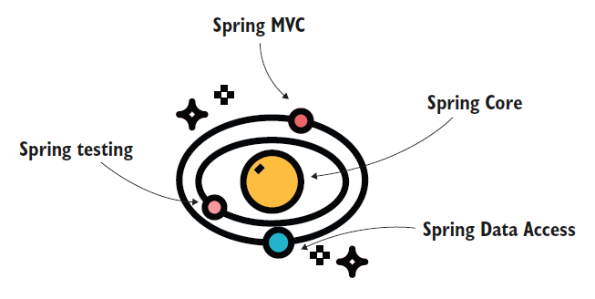
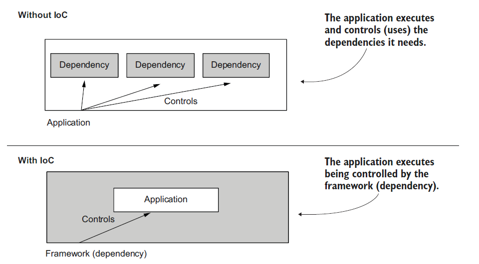

# [Spring Note](../../README.md) - Chapter 1 Spring in the real world
| Chapter | Title |
| :-: | :- |
| 1.1 | [Application Framework](#11-application-framework) |
| 1.2 | [Spring Ecosystem](#12-spring-ecosystem) |
| 1.3 | [Inversion of Control (IoC)](#13-inversion-of-control-ioc) |
|  | [IoC Container](#ioc-container) |
| 1.4 | [Spring Boot](#14-spring-boot) |
| 1.5 | [When Not to Use Frameworks](#15-when-not-to-use-frameworks) |

 

## 1.1 Application Framework
- The Spring framework (shortly, Spring) is an application framework that is part of the Java ecosystem.
- An application framework is a set of common software functionalities that provides a foundation structure for developing an application.
- An application framework eases the effort of writing an application by taking out the effort of
writing all the program code from scratch.

 

## 1.2 Spring Ecosystem
1. Spring Core
2. Spring MVC (Model-View-Controller)
3. Spring Data Access
4. Spring Testing

 

## 1.3 Inversion of Control (IoC)
- Spring works based on the principle inversion of control (IoC).
- When using this principle, instead of allowing the app to control the execution, we give control to some other piece of software—in our case, the Spring framework.
- Through configurations, we instruct the framework on how to manage the code we write, which defines the logic of the app.
- Here’s where the “inversion” in IoC comes from: you don’t let the app control the execution by its own code and use dependencies.
- Instead, we allow the framework (the dependency) to control the app and its code.

### IoC Container
- The IoC container glues Spring components and components of your application to the framework together
- Using the IoC container, to which you often refer as the Spring context, you make certain objects known to Spring, which enables the framework to use them in the way you configured.

 

## 1.4 Spring Boot
- Spring Boot is a project part of the Spring ecosystem that introduces the concept of “convention over configuration.”
- The main idea of this concept is that instead of setting up all the configurations of a framework yourself, Spring Boot offers you a default configuration that you can customize as needed.
- The result, in general, is that you write less code because you follow known conventions and your app differs from others in few or small ways.
- So instead of writing all the configurations for each and every app, it’s more efficient to start with a default configuration and only change what’s different from the convention.

 

## 1.5 When Not to Use Frameworks
1. You need to implement a particular functionality with a footprint as small as
possible. By footprint, I mean the storage memory occupied by the app’s files.
2. Specific security requirements force you to implement only custom code in
your app without making use of any open source framework.
3. You’d have to make so many customizations over the framework that you’d
write more code than if you’d simply not used it at all.
4. You already have a functional app, and by changing it to use a framework you
don’t gain any benefit.

 
