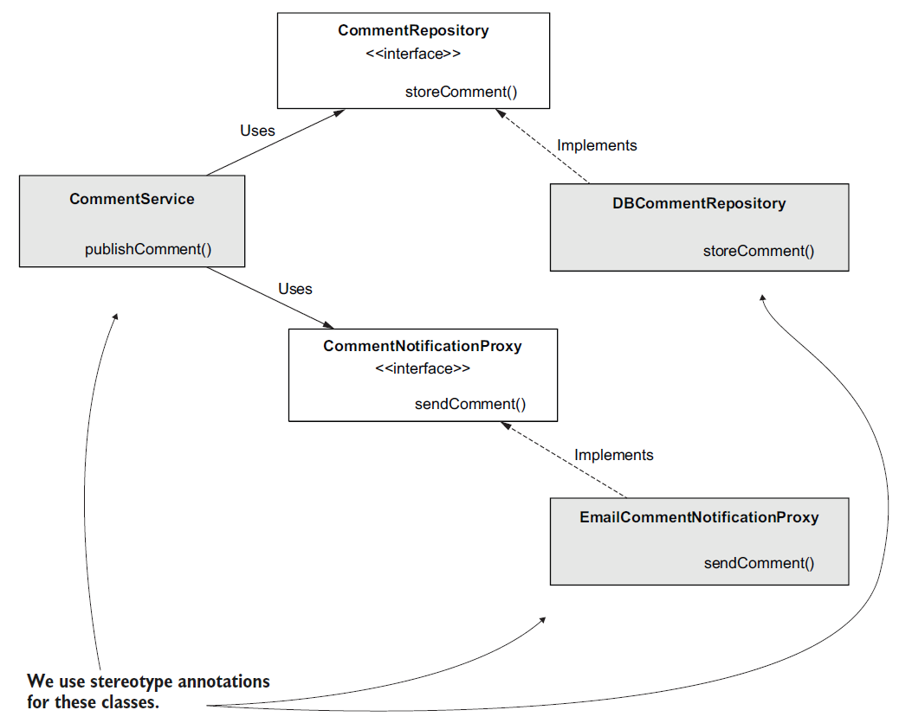
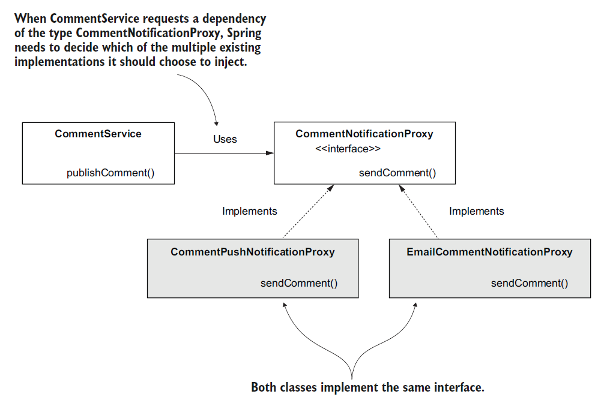
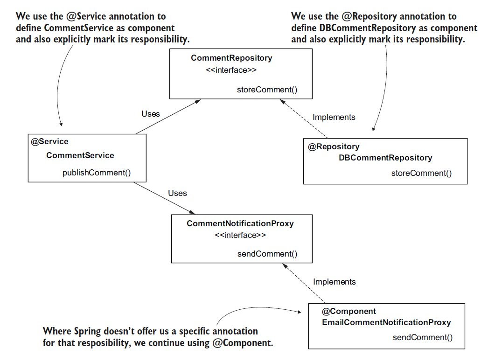

# [Spring Note](../../README.md) - Chapter 4 The Spring context: Using abstractions
| Chapter | Title |
| :-: | :- |
| 4.1 | [Single Implementation of an Abstraction](#41-single-implementation-of-an-abstraction) |
| 4.2 | [Multple Implementations of an Abstraction](#42-multple-implementations-of-an-abstraction) |
|  | [Using @Qualifier](#using-qualifier) |
| 4.3 | [Using @Service and @Repository to Replace @Component](#43-using-service-and-repository-to-replace-component) |

<br />

## 4.1 Single Implementation of an Abstraction
System Design Diagram



Comment.java
```Java
public class Comment {

    private String author;
    private String text;

    public String getAuthor() {
        return author;
    }

    public void setAuthor(String author) {
        this.author = author;
    }

    public String getText() {
        return text;
    }

    public void setText(String text) {
        this.text = text;
    }
}
```

CommentRepository.java
```Java
public interface CommentRepository {

    void storeComment(Comment comment);
}
```

DBCommentRepository.java
```Java
@Component
public class DBCommentRepository implements CommentRepository {

    @Override
    public void storeComment(Comment comment) {
        System.out.println("Storing comment: " + comment.getText());
    }
}
```

CommentNotificationProxy.java
```Java
public interface CommentNotificationProxy {

    void sendComment(Comment comment);
}
```

EmailCommentNotificationProxy.java
```Java
@Component
public class EmailCommentNotificationProxy implements CommentNotificationProxy {

    @Override
    public void sendComment(Comment comment) {
        System.out.println("Sending notification for comment: " + comment.getText());
    }
}
```

CommentService.java
```Java
@Component
public class CommentService {

    private final CommentRepository commentRepository;
    private final CommentNotificationProxy commentNotificationProxy;

    @Autowired
    public CommentService(CommentRepository commentRepository, CommentNotificationProxy commentNotificationProxy) {
        this.commentRepository = commentRepository;
        this.commentNotificationProxy = commentNotificationProxy;
    }

    public void publishComment(Comment comment) {
        commentRepository.storeComment(comment);
        commentNotificationProxy.sendComment(comment);
    }
}
```

ProjectConfig.java
```Java
@Configuration
@ComponentScan
public class ProjectConfig {

}
```

Main.java
```Java
public class Main {

    public static void main(String[] args) {
        var context = new AnnotationConfigApplicationContext(ProjectConfig.class);

        var comment = new Comment();
        comment.setAuthor("Laurentiu");
        comment.setText("Demo comment");

        var commentService = context.getBean(CommentService.class);
        commentService.publishComment(comment);
    }
}
```

<br />

## 4.2 Multple Implementations of an Abstraction
### Using @Qualifier
System Design Diagram



Comment.java
```Java
public class Comment {

    private String author;
    private String text;

    public String getAuthor() {
        return author;
    }

    public void setAuthor(String author) {
        this.author = author;
    }

    public String getText() {
        return text;
    }

    public void setText(String text) {
        this.text = text;
    }
}
```

CommentRepository.java
```Java
public interface CommentRepository {

    void storeComment(Comment comment);
}
```

DBCommentRepository.java
```Java
@Component
public class DBCommentRepository implements CommentRepository {

    @Override
    public void storeComment(Comment comment) {
        System.out.println("Storing comment: " + comment.getText());
    }
}
```

CommentNotificationProxy.java
```Java
public interface CommentNotificationProxy {

    void sendComment(Comment comment);
}
```

EmailCommentNotificationProxy.java
```Java
@Component
@Qualifier("EMAIL")
public class EmailCommentNotificationProxy implements CommentNotificationProxy {

    @Override
    public void sendComment(Comment comment) {
        System.out.println("Sending notification for comment: " + comment.getText());
    }
}
```

CommentPushNotificationProxy.java
```Java
@Component
@Qualifier("PUSH")
public class CommentPushNotificationProxy implements CommentNotificationProxy {

    @Override
    public void sendComment(Comment comment) {
        System.out.println("Sending push notification for comment: " + comment.getText());
    }
}
```

CommentService.java
```Java
@Component
public class CommentService {

    private final CommentRepository commentRepository;
    private final CommentNotificationProxy commentNotificationProxy;

    @Autowired
    public CommentService(CommentRepository commentRepository, @Qualifier("PUSH") CommentNotificationProxy commentNotificationProxy) {
        this.commentRepository = commentRepository;
        this.commentNotificationProxy = commentNotificationProxy;
    }

    public void publishComment(Comment comment) {
        commentRepository.storeComment(comment);
        commentNotificationProxy.sendComment(comment);
    }
}
```

ProjectConfig.java
```Java
@Configuration
@ComponentScan
public class ProjectConfig {

}
```

Main.java
```Java
public class Main {

    public static void main(String[] args) {
        var context = new AnnotationConfigApplicationContext(ProjectConfig.class);

        var comment = new Comment();
        comment.setAuthor("Laurentiu");
        comment.setText("Demo comment");

        var commentService = context.getBean(CommentService.class);
        commentService.publishComment(comment);
    }
}
```

<br />

## 4.3 Using @Service and @Repository to Replace @Component
- Spring offers us the @Service annotation to mark a component that takes the responsibility of a service and the @Repository annotation to mark a component that implements a repository responsibility.
- All three (@Component, @Service, and @Repository) are stereotype annotations and instruct Spring to create and add an instance of the annotated class to its context.
- This way, you explicitly mark the object’s responsibility and make this aspect more visible for any developer reading the class.

System Design Diagram



Comment.java
```Java
public class Comment {

    private String author;
    private String text;

    public String getAuthor() {
        return author;
    }

    public void setAuthor(String author) {
        this.author = author;
    }

    public String getText() {
        return text;
    }

    public void setText(String text) {
        this.text = text;
    }
}
```

CommentRepository.java
```Java
public interface CommentRepository {

    void storeComment(Comment comment);
}
```

DBCommentRepository.java
```Java
@Repository
public class DBCommentRepository implements CommentRepository {

    @Override
    public void storeComment(Comment comment) {
        System.out.println("Storing comment: " + comment.getText());
    }
}
```

CommentNotificationProxy.java
```Java
public interface CommentNotificationProxy {

    void sendComment(Comment comment);
}
```

EmailCommentNotificationProxy.java
```Java
@Component
@Qualifier("EMAIL")
public class EmailCommentNotificationProxy implements CommentNotificationProxy {

    @Override
    public void sendComment(Comment comment) {
        System.out.println("Sending notification for comment: " + comment.getText());
    }
}
```

CommentPushNotificationProxy.java
```Java
@Component
@Qualifier("PUSH")
public class CommentPushNotificationProxy implements CommentNotificationProxy {

    @Override
    public void sendComment(Comment comment) {
        System.out.println("Sending push notification for comment: " + comment.getText());
    }
}
```

CommentService.java
```Java
@Service
public class CommentService {

    private final CommentRepository commentRepository;
    private final CommentNotificationProxy commentNotificationProxy;

    @Autowired
    public CommentService(CommentRepository commentRepository, @Qualifier("PUSH") CommentNotificationProxy commentNotificationProxy) {
        this.commentRepository = commentRepository;
        this.commentNotificationProxy = commentNotificationProxy;
    }

    public void publishComment(Comment comment) {
        commentRepository.storeComment(comment);
        commentNotificationProxy.sendComment(comment);
    }
}
```

ProjectConfig.java
```Java
@Configuration
@ComponentScan
public class ProjectConfig {

}
```

Main.java
```Java
public class Main {

    public static void main(String[] args) {
        var context = new AnnotationConfigApplicationContext(ProjectConfig.class);

        var comment = new Comment();
        comment.setAuthor("Laurentiu");
        comment.setText("Demo comment");

        var commentService = context.getBean(CommentService.class);
        commentService.publishComment(comment);
    }
}
```

<br />
