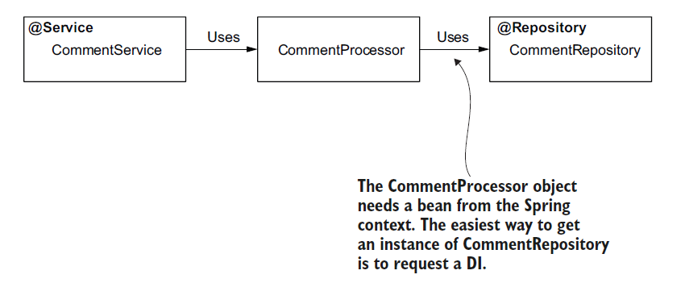

# [Spring Note](../../README.md) - Chapter 5 The Spring context: Bean scopes and life cycle
| Chapter | Title |
| :-: | :- |
| 5.1 | [Spring Scopes](#51-spring-scopes) |
|  | [Singleton](#singleton) |
|  | [Prototype](#prototype) |
|  | [Request Scope](#request-scope) |
|  | [Session Scope](#session-scope) |
|  | [Application Scope](#application-scope) |
| 5.2 | [Singleton](#52-singleton) |
|  | [Race Condition](#race-condition) |
|  | [Eager and Lazy Instantlation](#eager-and-lazy-instantlation) |
|  | [Using @Lazy to Implement the Lazy Instantlation](#using-lazy-to-implement-the-lazy-instantlation) |
| 5.3 | [Prototype-Scoped Bean](#53-prototype-scoped-bean) |
|  | [Using @Bean and @Scope(BeanDefinition.SCOPE_PROTOTYPE)](#using-bean-and-scopebeandefinitionscope_prototype) |
|  | [Using @Component and @Scope(BeanDefinition.SCOPE_PROTOTYPE)](#using-component-and-scopebeandefinitionscope_prototype) |

<br />

## 5.1 Spring Scopes
1. Singleton
2. Prototype
3. Request Scope
4. Session Scope
5. Application Scope

### Singleton
- The default bean scope in Spring, for which the framework uniquely identifies each instance with a name in the context.

### Prototype
- The bean scope in Spring, for which the framework only manages the type and creates a new instance of that class every time someone requests it (directly from the context or through wiring or auto-wiring).

### Request Scope
- Spring creates an instance of the bean class for every HTTP request.
- The instance exists only for that specific HTTP request.

### Session Scope
- Spring creates an instance and keeps the instance in the server’s memory for the full HTTP session.
- Spring links the instance in the context with the client’s session.

### Application Scope
- The instance is unique in the app’s context, and it’s available while the app is running.

<br />

## 5.2 Singleton
- The singleton bean scope defines Spring’s default approach for managing the beans in its context.
- Spring creates a singleton bean when it loads the context and assigns the bean a name (sometimes also referred to as bean ID).
- We name this scope singleton because you always get the same instance when you refer to a specific bean.
- But be careful! You can have more instances of the same type in the Spring context if they have different names.
- For Spring, the singleton concept allows multiple instances of the same type, and singleton means
unique per name but not unique per app.

### Race Condition
- Because the singleton bean scope assumes that multiple components of the app can share an object instance, the most important thing to consider is that these beans must be immutable.
- Most often, a real-world app executes actions on multiple threads (e.g., any web app).
- In such a scenario, multiple threads share the same object instance.
- If these threads change the instance, you encounter a race-condition scenario.
- A race condition is a situation that can happen in multithreaded architectures when multiple threads try to change a shared resource.
- In case of a race condition, the developer needs to properly synchronize the threads to avoid unexpected execution results or errors.
- If you want mutable singleton beans (whose attributes change), you need to make these beans concurrent by yourself (mainly by employing thread synchronization).
- But singleton beans aren’t designed to be synchronized.
- They’re commonly used to define an app’s backbone class design and delegate responsibilities one to another.
- Technically, synchronization is possible, but it’s not a good practice.
- Synchronizing the thread on a concurrent instance can dramatically affect the app’s performance.
- In most cases, you will find other means to solve the same problem and avoid thread concurrency.

### Eager and Lazy Instantlation
- In most cases, Spring creates all singleton beans when it initializes the context—this is Spring’s default behavior.
- We’ve used only this default behavior, which is also called eager instantiation.
- With lazy instantiation, Spring doesn’t create the singleton instances when it creates the context.
- Instead, it creates each instance the first time someone refers to the bean.

### Using @Lazy to Implement the Lazy Instantlation
CommentService.java
```Java
@Service
@Lazy
public class CommentService {

    public CommentService() {
        System.out.println("CommentService instance created!");
    }
}
```

ProjectConfig.java
```Java
@Configuration
@ComponentScan
public class ProjectConfig {

}
```

Main.java
```Java
public class Main {

    public static void main(String[] args) {
        var context = new AnnotationConfigApplicationContext(ProjectConfig.class);

        System.out.println("Before retrieving the CommentService");
        var service = context.getBean(CommentService.class);
        System.out.println("After retrieving the CommentService");
    }
}
```

<br />

## 5.3 Prototype-Scoped Bean
- Every time you request a reference to a prototype-scoped bean, Spring creates a new object
instance.
- For prototype beans, Spring doesn’t create and manage an object instance directly.
- The framework manages the object’s type and creates a new instance every time someone requests a reference to the bean.
- With prototype beans, we no longer have concurrency problems because each thread that requests the bean gets a different instance, so defining mutable prototype beans is not a problem.

### Using @Bean and @Scope(BeanDefinition.SCOPE_PROTOTYPE)
CommentService.java
```Java
public class CommentService {

    public CommentService() {
        System.out.println("CommentService instance created!");
    }
}
```

ProjectConfig.java
```Java
@Configuration
public class ProjectConfig {

    @Bean
    @Scope(BeanDefinition.SCOPE_PROTOTYPE)
    public CommentService commentService() {
        return new CommentService();
    }
}
```

Main.java
```Java
public class Main {

    public static void main(String[] args) {
        var context = new AnnotationConfigApplicationContext(ProjectConfig.class);

        var cs1 = context.getBean(CommentService.class);
        var cs2 = context.getBean(CommentService.class);

        System.out.println(cs1 == cs2);
    }
}
```

### Using @Component and @Scope(BeanDefinition.SCOPE_PROTOTYPE)
System Design Diagram



Comment.java
```Java
public class Comment {

    private String author;
    private String text;

    public String getAuthor() {
        return author;
    }

    public void setAuthor(String author) {
        this.author = author;
    }

    public String getText() {
        return text;
    }

    public void setText(String text) {
        this.text = text;
    }
}
```

CommentRepository.java
```Java
public interface CommentRepository {

    void storeComment(Comment comment);
}
```

DBCommentRepository.java
```Java
@Repository
public class DBCommentRepository implements CommentRepository {

    @Override
    public void storeComment(Comment comment) {
        System.out.println("Storing comment: " + comment.getText());
    }
}
```

CommentProcessor.java
```Java
@Component
@Scope(BeanDefinition.SCOPE_PROTOTYPE)
public class CommentProcessor {

    private final CommentRepository commentRepository;
    private Comment comment;

    @Autowired
    public CommentProcessor(CommentRepository commentRepository) {
        this.commentRepository = commentRepository;
    }

    public Comment getComment() {
        return comment;
    }

    public void setComment(Comment comment) {
        this.comment = comment;
    }

    public void processComment() {
        System.out.println("Processing comment: " + comment.getText());
    }

    public void validateComment() {
        System.out.println("Validating comment: " + comment.getText());
    }

    public void storeComment() {
        commentRepository.storeComment(comment);
    }
}
```

CommentService.java
```Java
@Service
public class CommentService {

    private final ApplicationContext context;

    @Autowired
    public CommentService(ApplicationContext context) {
        this.context = context;
    }

    public void sendComment(Comment comment) {
        CommentProcessor commentProcessor = context.getBean(CommentProcessor.class);

        commentProcessor.setComment(comment);
        commentProcessor.processComment();
        commentProcessor.validateComment();
        commentProcessor.storeComment();

        System.out.println("The comment is sent");
    }
}
```

ProjectConfig.java
```Java
@Configuration
@ComponentScan
public class ProjectConfig {

}
```

Main.java
```Java
public class Main {

    public static void main(String[] args) {
        var context = new AnnotationConfigApplicationContext(ProjectConfig.class);

        var comment = new Comment();
        comment.setAuthor("Laurentiu");
        comment.setText("Demo comment");

        var commentService = context.getBean(CommentService.class);
        commentService.sendComment(comment);
    }
}
```

<br />
