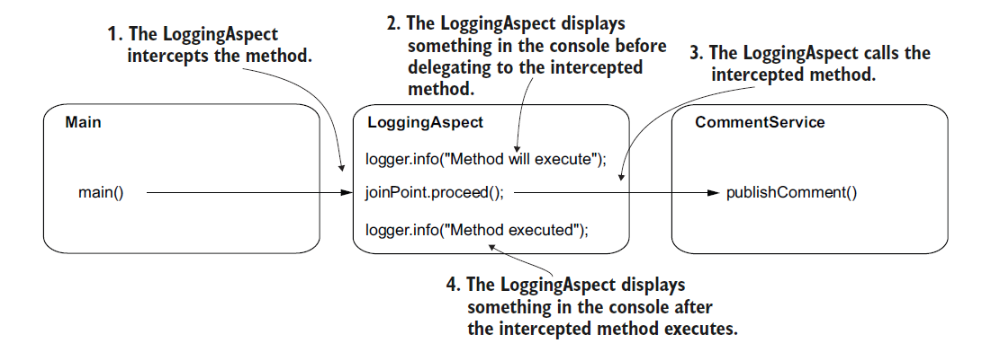

# [Spring Note](../../README.md) - Chapter 6 Using aspects with Spring AOP
| Chapter | Title |
| :-: | :- |
| 6.1 | [Aspect-Oriented Programming (AOP)](#61-aspect-oriented-programming-aop) |
| 6.2 | [Desiging an Aspect](#62-desiging-an-aspect) |
| 6.3 | [Weaving](#63-weaving) |
| 6.4 | [Implementing Aspects with Spring AOP](#64-implementing-aspects-with-spring-aop) |
|  | [Spring Aspect Dependency](#spring-aspect-dependency) |
|  | [Using @Aspect and @EnableAspectJAutoProxy to Implement an Aspect](#using-aspect-and-enableaspectjautoproxy-to-implement-an-aspect) |
| 6.5 | [AspectJ Pointcut Expression](#65-aspectj-pointcut-expression) |
| 6.6 | [Getting the Intercepted Method’s Parameters and the Returned Value](#66-getting-the-intercepted-methods-parameters-and-the-returned-value) |
| 6.7 | [Altering the Intercepted Method’s Parameters and the Returned Value](#67-altering-the-intercepted-methods-parameters-and-the-returned-value) |
| 6.8 | [Aspect with Custom Annotation](#68-aspect-with-custom-annotation) |
|  | [Using @Retention and @Target to Define a Custom Annotation](#using-retention-and-target-to-define-a-custom-annotation) |
|  | [Using @annotation to Replace an AspectJ Pointcut Expression](#using-annotation-to-replace-an-aspectj-pointcut-expression) |
| 6.9 | [Other Advice Annotations](#69-other-advice-annotations) |
|  | [Using @Before](#using-before) |
|  | [Using @AfterReturning](#using-afterreturning) |
|  | [Using @AfterThrowing](#using-afterthrowing) |
|  | [Using @After](#using-after) |
| 6.10 | [Multiple Aspects](#610-multiple-aspects) |
|  | [Using @Order](#using-order) |

<br />

## 6.1 Aspect-Oriented Programming (AOP)
- Aspects are a way the framework intercepts method calls and possibly alters the execution
of methods.
- You can affect the execution of specific method calls you select.
- This technique helps you extract part of the logic belonging to the executing method.

<br />

## 6.2 Desiging an Aspect
When designing an aspect, you define the following:
1. What code you want Spring to execute when you call specific methods. This is named an aspect.
2. When the app should execute this logic of the aspect (e.g., before or after the method call, instead of the method call). This is named the advice.
3. Which methods the framework needs to intercept and execute the aspect for them. This is named a pointcut.

Example of Desiging an Aspect


<br />

## 6.3 Weaving
- Spring won’t directly give you an instance reference for the bean when you request it from the context.
- Instead, Spring gives you an object that calls the aspect logic instead of the actual method.
- We say that Spring gives you a proxy object instead of the real bean.
- You will now receive the proxy instead of the bean anytime you get the bean from the context, either if you directly use the getBean() method of the context or if you use DI.
- This approach is named weaving.

Differences between without Aspect and with Aspect


- You observe that calling an aspected method assumes you call the method through the proxy object
provided by Spring.
- The proxy applies the aspect logic and delegates the call to the
actual method.

<br />

## 6.4 Implementing Aspects with Spring AOP
### Spring Aspect Dependency
```XML
<dependency>
    <groupId>org.springframework</groupId>
    <artifactId>spring-aspects</artifactId>
    <version>6.0.11</version>
</dependency>
```

### Using @Aspect and @EnableAspectJAutoProxy to Implement an Aspect
System Design Diagram



Comment.java
```Java
public class Comment {

    private String author;
    private String text;

    public String getAuthor() {
        return author;
    }

    public void setAuthor(String author) {
        this.author = author;
    }

    public String getText() {
        return text;
    }

    public void setText(String text) {
        this.text = text;
    }
}
```

CommentService.java
```Java
@Service
public class CommentService {

    private Logger logger = Logger.getLogger(CommentService.class.getName());

    public void publicComment(Comment comment) {
        logger.info("Publishing comment: " + comment.getText());
    }
}
```

LoggingAspect.java
```Java
@Component
@Aspect
public class LoggingAspect {

    private Logger logger = Logger.getLogger(LoggingAspect.class.getName());

    @Around("execution(* org.example.services.*.*(..))")
    public void log(ProceedingJoinPoint joinPoint) throws Throwable {
        logger.info("Method will execute");
        joinPoint.proceed();
        logger.info("Method executed");
    }
}
```

ProjectConfig.java
```Java
@Configuration
@ComponentScan
@EnableAspectJAutoProxy
public class ProjectConfig {

}
```

Main.java
```Java
public class Main {

    public static void main(String[] args) {
        var context = new AnnotationConfigApplicationContext(ProjectConfig.class);

        var comment = new Comment();
        comment.setAuthor("Natasha");
        comment.setText("Demo comment");

        var commentService = context.getBean(CommentService.class);
        commentService.publicComment(comment);
    }
}
```

<br />

## 6.5 AspectJ Pointcut Expression
Example of AspectJ Pointcut Expression


<br />

## 6.6 Getting the Intercepted Method’s Parameters and the Returned Value
System Design Diagram


Comment.java
```Java
public class Comment {

    private String author;
    private String text;

    public String getAuthor() {
        return author;
    }

    public void setAuthor(String author) {
        this.author = author;
    }

    public String getText() {
        return text;
    }

    public void setText(String text) {
        this.text = text;
    }

    @Override
    public String toString() {
        return "Comment{text='" + text + "', author='" + author + "'}";
    }
}
```

CommentService.java
```Java
@Service
public class CommentService {

    private Logger logger = Logger.getLogger(CommentService.class.getName());

    public String publicComment(Comment comment) {
        logger.info("Publishing comment: " + comment.getText());
        return "SUCCESS";
    }
}
```

LoggingAspect.java
```Java
@Component
@Aspect
public class LoggingAspect {

    private Logger logger = Logger.getLogger(LoggingAspect.class.getName());

    @Around("execution(* org.example.services.*.*(..))")
    public Object log(ProceedingJoinPoint joinPoint) throws Throwable {
        String methodName = joinPoint.getSignature().getName();
        Object[] arguments = joinPoint.getArgs();

        logger.info("Method " + methodName + " with parameters " + Arrays.asList(arguments) + " will execute");

        Object returnedByMethod = joinPoint.proceed();

        logger.info("Method executed and returned " + returnedByMethod);

        return returnedByMethod;
    }
}
```

ProjectConfig.java
```Java
@Configuration
@ComponentScan
@EnableAspectJAutoProxy
public class ProjectConfig {

}
```

Main.java
```Java
public class Main {

    private static Logger logger = Logger.getLogger(Main.class.getName());

    public static void main(String[] args) {
        var context = new AnnotationConfigApplicationContext(ProjectConfig.class);

        var comment = new Comment();
        comment.setAuthor("Natasha");
        comment.setText("Demo comment");

        var commentService = context.getBean(CommentService.class);
        String value = commentService.publicComment(comment);
        logger.info(value);
    }
}
```

<br />

## 6.7 Altering the Intercepted Method’s Parameters and the Returned Value
System Design Diagram


Comment.java
```Java
public class Comment {

    private String author;
    private String text;

    public String getAuthor() {
        return author;
    }

    public void setAuthor(String author) {
        this.author = author;
    }

    public String getText() {
        return text;
    }

    public void setText(String text) {
        this.text = text;
    }

    @Override
    public String toString() {
        return "Comment{text='" + text + "', author='" + author + "'}";
    }
}
```

CommentService.java
```Java
@Service
public class CommentService {

    private Logger logger = Logger.getLogger(CommentService.class.getName());

    public String publicComment(Comment comment) {
        logger.info("Publishing comment: " + comment.getText());
        return "SUCCESS";
    }
}
```

LoggingAspect.java
```Java
@Component
@Aspect
public class LoggingAspect {

    private Logger logger = Logger.getLogger(LoggingAspect.class.getName());

    @Around("execution(* org.example.services.*.*(..))")
    public Object log(ProceedingJoinPoint joinPoint) throws Throwable {
        String methodName = joinPoint.getSignature().getName();
        Object[] arguments = joinPoint.getArgs();

        logger.info("Method " + methodName + " with parameters " + Arrays.asList(arguments) + " will execute");

        Comment comment = new Comment();
        comment.setText("Some other text!");
        Object[] newArguments = { comment };

        Object returnedByMethod = joinPoint.proceed(newArguments);

        logger.info("Method executed and returned " + returnedByMethod);

        return "FAILED";
    }
}
```

ProjectConfig.java
```Java
@Configuration
@ComponentScan
@EnableAspectJAutoProxy
public class ProjectConfig {

}
```

Main.java
```Java
public class Main {

    private static Logger logger = Logger.getLogger(Main.class.getName());

    public static void main(String[] args) {
        var context = new AnnotationConfigApplicationContext(ProjectConfig.class);

        var comment = new Comment();
        comment.setAuthor("Natasha");
        comment.setText("Demo comment");

        var commentService = context.getBean(CommentService.class);
        String value = commentService.publicComment(comment);
        logger.info(value);
    }
}
```

<br />

## 6.8 Aspect with Custom Annotation
### Using @Retention and @Target to Define a Custom Annotation
ToLog.java
```Java
@Retention(RetentionPolicy.RUNTIME)
@Target(ElementType.METHOD)
public @interface ToLog {

}
```

### Using @annotation to Replace an AspectJ Pointcut Expression
Comment.java
```Java
public class Comment {

    private String author;
    private String text;

    public String getAuthor() {
        return author;
    }

    public void setAuthor(String author) {
        this.author = author;
    }

    public String getText() {
        return text;
    }

    public void setText(String text) {
        this.text = text;
    }

    @Override
    public String toString() {
        return "Comment{text='" + text + "', author='" + author + "'}";
    }
}
```

CommentService.java
```Java
@Service
public class CommentService {

    private Logger logger = Logger.getLogger(CommentService.class.getName());

    public String publicComment(Comment comment) {
        logger.info("Publishing comment: " + comment.getText());
        return "SUCCESS";
    }

    @ToLog
    public void deleteComment(Comment comment) {
        logger.info("Deleting comment: " + comment.getText());
    }

    public void editComment(Comment comment) {
        logger.info("Editing comment: " + comment.getText());
    }
}
```

LoggingAspect.java
```Java
@Component
@Aspect
public class LoggingAspect {

    private Logger logger = Logger.getLogger(LoggingAspect.class.getName());

    @Around("@annotation(ToLog)")
    public void log(ProceedingJoinPoint joinPoint) throws Throwable {
        logger.info("Method will execute");
        joinPoint.proceed();
        logger.info("Method executed");
    }
}
```

ProjectConfig.java
```Java
@Configuration
@ComponentScan
@EnableAspectJAutoProxy
public class ProjectConfig {

}
```

Main.java
```Java
public class Main {

    public static void main(String[] args) {
        var context = new AnnotationConfigApplicationContext(ProjectConfig.class);

        var comment = new Comment();
        comment.setAuthor("Natasha");
        comment.setText("Demo comment");

        var commentService = context.getBean(CommentService.class);
        commentService.publicComment(comment);
        commentService.deleteComment(comment);
        commentService.editComment(comment);
    }
}
```

<br />

## 6.9 Other Advice Annotations
### Using @Before
- Calls the method defining the aspect logic before the execution of the intercepted method.

### Using @AfterReturning
- Calls the method defining the aspect logic after the method successfully returns, and provides the returned value as a parameter to the aspect method. The aspect method isn’t called if the intercepted method throws an exception.

ToLog.java
```Java
@Retention(RetentionPolicy.RUNTIME)
@Target(ElementType.METHOD)
public @interface ToLog {

}
```

Comment.java
```Java
public class Comment {

    private String author;
    private String text;

    public String getAuthor() {
        return author;
    }

    public void setAuthor(String author) {
        this.author = author;
    }

    public String getText() {
        return text;
    }

    public void setText(String text) {
        this.text = text;
    }

    @Override
    public String toString() {
        return "Comment{text='" + text + "', author='" + author + "'}";
    }
}
```

CommentService.java
```Java
@Service
public class CommentService {

    private Logger logger = Logger.getLogger(CommentService.class.getName());

    public String publicComment(Comment comment) {
        logger.info("Publishing comment: " + comment.getText());
        return "SUCCESS";
    }

    @ToLog
    public void deleteComment(Comment comment) {
        logger.info("Deleting comment: " + comment.getText());
    }

    public void editComment(Comment comment) {
        logger.info("Editing comment: " + comment.getText());
    }
}
```

LoggingAspect.java
```Java
@Component
@Aspect
public class LoggingAspect {

    private Logger logger = Logger.getLogger(LoggingAspect.class.getName());

    @AfterReturning(value = "@annotation(ToLog)", returning = "returnedValue")
    public void log(Object returnedValue) {
        logger.info("Method executed and returned " + returnedValue);
    }
}
```

ProjectConfig.java
```Java
@Configuration
@ComponentScan
@EnableAspectJAutoProxy
public class ProjectConfig {

}
```

Main.java
```Java
public class Main {

    public static void main(String[] args) {
        var context = new AnnotationConfigApplicationContext(ProjectConfig.class);

        var comment = new Comment();
        comment.setAuthor("Natasha");
        comment.setText("Demo comment");

        var commentService = context.getBean(CommentService.class);
        commentService.publicComment(comment);
        commentService.deleteComment(comment);
        commentService.editComment(comment);
    }
}
```

### Using @AfterThrowing
- Calls the method defining the aspect logic if the intercepted method throws an exception, and provides the exception instance as a parameter to the aspect method.

### Using @After
- Calls the method defining the aspect logic only after the intercepted method execution, whether the method successfully returned or threw an exception.

<br />

## 6.10 Multiple Aspects
- By default, Spring doesn’t guarantee the order in which two aspects in the same execution chain are called.
- If the execution order is not relevant, then you just need to define the aspects and leave the framework to execute them in whatever order.
- If you need to define the aspects’ execution order, you can use the @Order annotation.
- This annotation receives an ordinal (a number) representing the order in the execution chain for a specific aspect.
- The smaller the number, the earlier that aspect executes.
- If two values are the same, the order of execution is again not defined.

### Using @Order
System Design Diagram


ToLog.java
```Java
@Retention(RetentionPolicy.RUNTIME)
@Target(ElementType.METHOD)
public @interface ToLog {

}
```

Comment.java
```Java
public class Comment {

    private String author;
    private String text;

    public String getAuthor() {
        return author;
    }

    public void setAuthor(String author) {
        this.author = author;
    }

    public String getText() {
        return text;
    }

    public void setText(String text) {
        this.text = text;
    }

    @Override
    public String toString() {
        return "Comment{text='" + text + "', author='" + author + "'}";
    }
}
```

CommentService.java
```Java
@Service
public class CommentService {

    private Logger logger = Logger.getLogger(CommentService.class.getName());

    @ToLog
    public String publicComment(Comment comment) {
        logger.info("Publishing comment: " + comment.getText());
        return "SUCCESS";
    }
}
```

LoggingAspect.java
```Java
@Component
@Aspect
@Order(2)
public class LoggingAspect {

    private Logger logger = Logger.getLogger(LoggingAspect.class.getName());

    @Around(value = "@annotation(ToLog)")
    public Object log(ProceedingJoinPoint joinPoint) throws Throwable {
        logger.info("Login Aspect: Calling the intercepted method");

        Object returnValue = joinPoint.proceed();

        logger.info("Logging Aspect: Method executed and returned " + returnValue);

        return returnValue;
    }
}
```

SecurityAspect.java
```Java
@Component
@Aspect
@Order(1)
public class SecurityAspect {

    private Logger logger = Logger.getLogger(SecurityAspect.class.getName());

    @Around(value = "@annotation(ToLog)")
    public Object log(ProceedingJoinPoint joinPoint) throws Throwable {
        logger.info("Security Aspect: Calling the intercepted method");

        Object returnValue = joinPoint.proceed();

        logger.info("Security Aspect: Method executed and returned " + returnValue);

        return returnValue;
    }
}
```

ProjectConfig.java
```Java
@Configuration
@ComponentScan
@EnableAspectJAutoProxy
public class ProjectConfig {

}
```

Main.java
```Java
public class Main {

    public static void main(String[] args) {
        var context = new AnnotationConfigApplicationContext(ProjectConfig.class);

        var comment = new Comment();
        comment.setAuthor("Natasha");
        comment.setText("Demo comment");

        var commentService = context.getBean(CommentService.class);
        commentService.publicComment(comment);
    }
}
```
<br />
