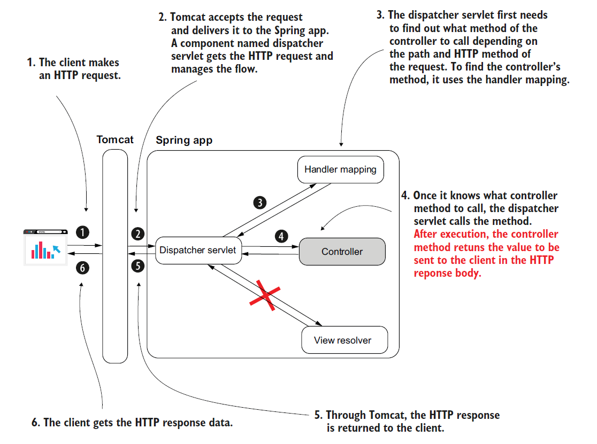
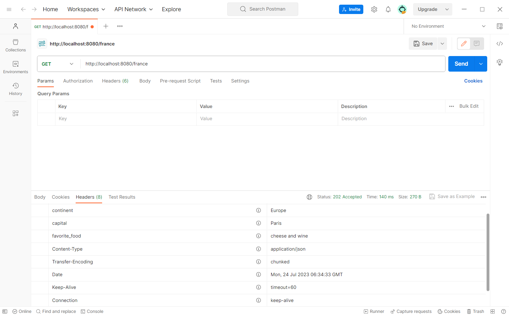

# [Spring Note](../../README.md) - Chapter 10 Implementing REST services
| Chapter | Title |
| :-: | :- |
| 10.1 | [Using REST Services to Exchange Data between Apps](#101-using-rest-services-to-exchange-data-between-apps) |
| 10.2 | [REST Endpoint](#102-rest-endpoint) |
|  | [Using @ResponseBody to Send Data through the Response Body](#using-responsebody-to-send-data-through-the-response-body) |
|  | [Using @RestController to Replace @Controller and @ResponseBody](#using-restcontroller-to-replace-controller-and-responsebody) |
| 10.3 | [HTTP Response](#103-http-response) |
| 10.4 | [Sending Data through a Response Body](#104-sending-data-through-a-response-body) |
|  | [Sending an Object](#sending-an-object) |
|  | [Sending a List of Objects](#sending-a-list-of-objects) |
| 10.5 | [Sending Data through a Response Header, Status, and Body](#105-sending-data-through-a-response-header-status-and-body) |
|  | [Using Response Entity to Send Data](#using-response-entity-to-send-data) |
| 10.6 | [HTTP Response Exceptions](#106-http-response-exceptions) |
|  | [Using Try and Catch to Catch an Exception](#using-try-and-catch-to-catch-an-exception) |
|  | [Using @RestControllerAdvice and @ExceptionHandler to Catch an Exception ](#using-restcontrolleradvice-and-exceptionhandler-to-catch-an-exception) |
| 10.7 | [Using the Request Body to Send Data](#107-using-the-request-body-to-send-data) |

<br />

## 10.1 Using REST Services to Exchange Data between Apps
- REST endpoints are simply a way for implementing communication between two apps.
- REST endpoints are as simple as implementing a controller action mapped to an HTTP method and a path.
- An app calls this controller action through HTTP.
- Because it’s how an app exposes a service through a web protocol, we call this endpoint a web service.



REST Endpoint Issues
1. If the controller’s action takes a long time to complete, the HTTP call to the endpoint might time out and break the communication.
2. Sending a large quantity of data in one call (through the HTTP request) might cause the call to time out and break the communication. Sending more than a few megabytes through a REST call usually isn’t the right choice.
3. Too many concurrent calls on an endpoint exposed by a backend component might put too much pressure on the app and cause it to fail.
4. The network supports the HTTP calls, and the network is never 100% reliable. There’s always a chance a REST endpoint call might fail because of the network.

<br />

## 10.2 REST Endpoint
### Using @ResponseBody to Send Data through the Response Body
HelloController.java
```Java
@Controller
public class HelloController {

    @GetMapping("/hello")
    @ResponseBody
    public String hello() {
        return "Hello!";
    }

    @GetMapping("/ciao")
    @ResponseBody
    public String ciao() {
        return "Ciao!";
    }
}
```

SpringStartHereApplication.java
```Java
@SpringBootApplication
public class SpringStartHereApplication {

    public static void main(String[] args) {
        SpringApplication.run(SpringStartHereApplication.class, args);
    }
}
```

URL: http://localhost:8080/hello


URL: http://localhost:8080/ciao


### Using @RestController to Replace @Controller and @ResponseBody
HelloController.java
```Java
@RestController
public class HelloController {

    @GetMapping("/hello")
    public String hello() {
        return "Hello!";
    }

    @GetMapping("/ciao")
    public String ciao() {
        return "Ciao!";
    }
}
```

SpringStartHereApplication.java
```Java
@SpringBootApplication
public class SpringStartHereApplication {

    public static void main(String[] args) {
        SpringApplication.run(SpringStartHereApplication.class, args);
    }
}
```

<br />

## 10.3 HTTP Response
1. Response Headers
    - Short pieces of data in the response (usually not more than a few words long).
2. Response Body
    - A larger amount of data the backend needs to send in the response.
3. Response Status
    - A short representation of the request’s result.

<br />

## 10.4 Sending Data through a Response Body
- By default, Spring creates a string representation of the object and formats it as JSON.
- JavaScript Object Notation (JSON) is a simple way to format strings as attribute-value pairs.

### Sending an Object
Country.java
```Java
public class Country {

    private String name;
    private int population;

    public String getName() {
        return name;
    }

    public void setName(String name) {
        this.name = name;
    }

    public int getPopulation() {
        return population;
    }

    public void setPopulation(int population) {
        this.population = population;
    }

    public static Country of(String name, int population) {
        Country country = new Country();
        country.name = name;
        country.population = population;
        return country;
    }
}
```

CountryController.java
```Java
@RestController
public class CountryController {

    @GetMapping("/france")
    public Country france() {
        Country c = Country.of("France", 67);
        return c;
    }
}
```

SpringStartHereApplication.java
```Java
@SpringBootApplication
public class SpringStartHereApplication {

    public static void main(String[] args) {
        SpringApplication.run(SpringStartHereApplication.class, args);
    }
}
```

URL: http://localhost:8080/france


### Sending a List of Objects
Country.java
```Java
public class Country {

    private String name;
    private int population;

    public String getName() {
        return name;
    }

    public void setName(String name) {
        this.name = name;
    }

    public int getPopulation() {
        return population;
    }

    public void setPopulation(int population) {
        this.population = population;
    }

    public static Country of(String name, int population) {
        Country country = new Country();
        country.name = name;
        country.population = population;
        return country;
    }
}
```

CountryController.java
```Java
@RestController
public class CountryController {

    @GetMapping("/france")
    public Country france() {
        Country c = Country.of("France", 67);
        return c;
    }

    @GetMapping("/all")
    public List<Country> countries() {
        Country c1 = Country.of("France", 67);
        Country c2 = Country.of("Spain", 47);

        return List.of(c1, c2);
    }
}
```

SpringStartHereApplication.java
```Java
@SpringBootApplication
public class SpringStartHereApplication {

    public static void main(String[] args) {
        SpringApplication.run(SpringStartHereApplication.class, args);
    }
}
```

URL: http://localhost:8080/all


## 10.5 Sending Data through a Response Header, Status, and Body
By default, Spring sets some common HTTP statuses:
1. 200 OK
    - if no exception was thrown on the server side while processing the request.
2. 404 Not Found
    - if the requested resource doesn’t exist.
3. 400 Bad Request
    - if a part of the request could not be matched with the way the server expected the data.
4. 500 Error on server
    - if an exception was thrown on the server side for any reason while processing the request. Usually,for this kind of exception, the client can’t do anything, and it’s expected someone should solve the problem on the backend.

### Using Response Entity to Send Data
Country.java
```Java
public class Country {

    private String name;
    private int population;

    public String getName() {
        return name;
    }

    public void setName(String name) {
        this.name = name;
    }

    public int getPopulation() {
        return population;
    }

    public void setPopulation(int population) {
        this.population = population;
    }

    public static Country of(String name, int population) {
        Country country = new Country();
        country.name = name;
        country.population = population;
        return country;
    }
}
```

CountryController.java
```Java
@RestController
public class CountryController {

    @GetMapping("/france")
    public ResponseEntity<Country> france() {
        Country c = Country.of("France", 67);
        return ResponseEntity
                .status(HttpStatus.ACCEPTED)
                .header("continent", "Europe")
                .header("capital", "Paris")
                .header("favorite_food", "cheese and wine")
                .body(c);
    }
}
```

SpringStartHereApplication.java
```Java
@SpringBootApplication
public class SpringStartHereApplication {

    public static void main(String[] args) {
        SpringApplication.run(SpringStartHereApplication.class, args);
    }
}
```

URL: http://localhost:8080/france




<br />

## 10.6 HTTP Response Exceptions
### Using Try and Catch to Catch an Exception


NotEnoughMoneyException.java
```Java
public class NotEnoughMoneyException extends RuntimeException {

}
```

PaymentDetails.java
```Java
public class PaymentDetails {

    private double amount;

    public double getAmount() {
        return amount;
    }

    public void setAmount(double amount) {
        this.amount = amount;
    }
}
```

ErrorDetails.java
```Java
public class ErrorDetails {

    private String message;

    public String getMessage() {
        return message;
    }

    public void setMessage(String message) {
        this.message = message;
    }
}
```

PaymentService.java
```Java
@Service
public class PaymentService {

    public PaymentDetails processPayment() {
        throw new NotEnoughMoneyException();
    }
}
```

PaymentController.java
```Java
@RestController
public class PaymentController {

    private final PaymentService paymentService;

    @Autowired
    public PaymentController(PaymentService paymentService) {
        this.paymentService = paymentService;
    }

    @PostMapping("/payment")
    public ResponseEntity<?> makePayment() {
        try {
            PaymentDetails paymentDetails = paymentService.processPayment();

            return ResponseEntity
                    .status(HttpStatus.ACCEPTED)
                    .body(paymentDetails);
        } catch (NotEnoughMoneyException e) {
            ErrorDetails errorDetails = new ErrorDetails();
            errorDetails.setMessage("Not enough money to make the payment");
            return ResponseEntity
                    .badRequest()
                    .body(errorDetails);
        }
    }
}
```

SpringStartHereApplication.java
```Java
@SpringBootApplication
public class SpringStartHereApplication {

    public static void main(String[] args) {
        SpringApplication.run(SpringStartHereApplication.class, args);
    }
}
```

URL: http://localhost:8080/payment


<br />

### Using @RestControllerAdvice and @ExceptionHandler to Catch an Exception 
System Design Diagram


NotEnoughMoneyException.java
```Java
public class NotEnoughMoneyException extends RuntimeException {

}
```

PaymentDetails.java
```Java
public class PaymentDetails {

    private double amount;

    public double getAmount() {
        return amount;
    }

    public void setAmount(double amount) {
        this.amount = amount;
    }
}
```

ErrorDetails.java
```Java
public class ErrorDetails {

    private String message;

    public String getMessage() {
        return message;
    }

    public void setMessage(String message) {
        this.message = message;
    }
}
```

PaymentService.java
```Java
@Service
public class PaymentService {

    public PaymentDetails processPayment() {
        throw new NotEnoughMoneyException();
    }
}
```

PaymentController.java
```Java
@RestController
public class PaymentController {

    private final PaymentService paymentService;

    @Autowired
    public PaymentController(PaymentService paymentService) {
        this.paymentService = paymentService;
    }

    @PostMapping("/payment")
    public ResponseEntity<PaymentDetails> makePayment() {
        PaymentDetails paymentDetails = paymentService.processPayment();

        return ResponseEntity
                .status(HttpStatus.ACCEPTED)
                .body(paymentDetails);
    }
}
```

ExceptionControllerAdvice.java
```Java
@RestControllerAdvice
public class ExceptionControllerAdvice {

    @ExceptionHandler(NotEnoughMoneyException.class)
    public ResponseEntity<ErrorDetails> exceptionNotEnoughMoneyHandler() {
        ErrorDetails errorDetails = new ErrorDetails();
        errorDetails.setMessage("Not enough money to make the payment");
        return ResponseEntity
                .badRequest()
                .body(errorDetails);
    }
}
```

SpringStartHereApplication.java
```Java
@SpringBootApplication
public class SpringStartHereApplication {

    public static void main(String[] args) {
        SpringApplication.run(SpringStartHereApplication.class, args);
    }
}
```

<br />

## 10.7 Using the Request Body to Send Data
- By default, Spring assumes you used JSON to represent the parameter you annotated and will try to decode the JSON string into an instance of your parameter type.
- In the case Spring cannot decode the JSON-formatted string into that type, the app sends back a response with the status “400 Bad Request.”

PaymentDetails.java
```Java
public class PaymentDetails {

    private double amount;

    public double getAmount() {
        return amount;
    }

    public void setAmount(double amount) {
        this.amount = amount;
    }
}
```

PaymentController.java
```Java
@RestController
public class PaymentController {

    private static Logger logger = Logger.getLogger(PaymentController.class.getName());

    @PostMapping("/payment")
    public ResponseEntity<PaymentDetails> makePayment(@RequestBody PaymentDetails paymentDetails) {
        logger.info("Received payment " + paymentDetails.getAmount());

        return ResponseEntity
                .status(HttpStatus.ACCEPTED)
                .body(paymentDetails);
    }
}
```

SpringStartHereApplication.java
```Java
@SpringBootApplication
public class SpringStartHereApplication {

    public static void main(String[] args) {
        SpringApplication.run(SpringStartHereApplication.class, args);
    }
}
```

URL: http://localhost:8080/payment


<br />
