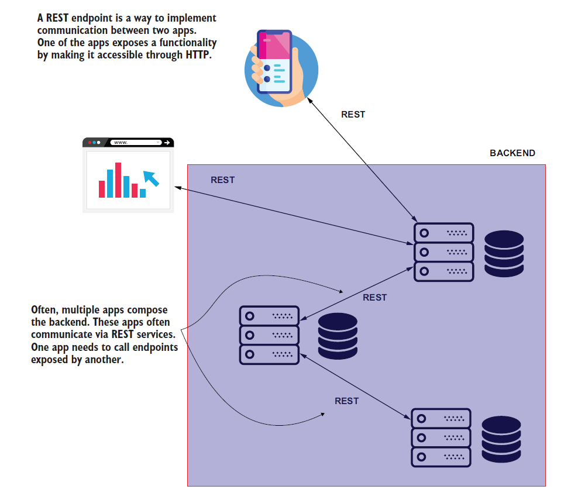
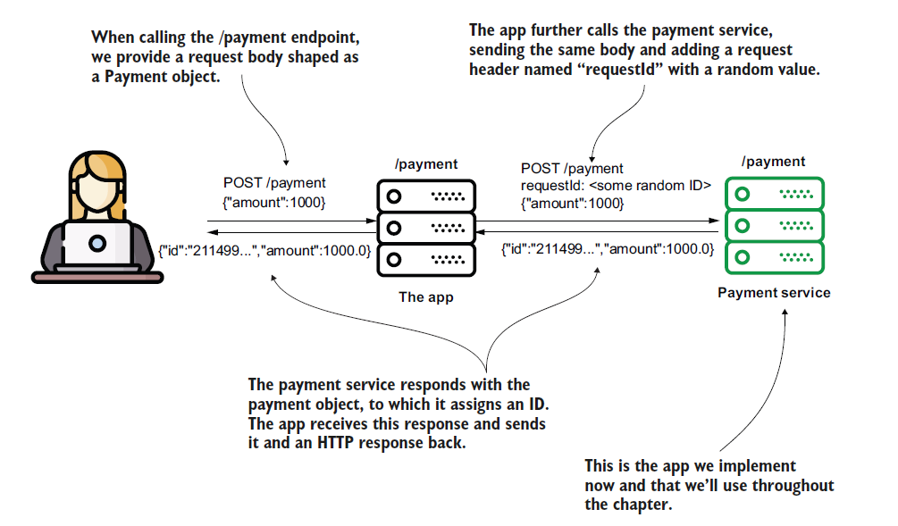
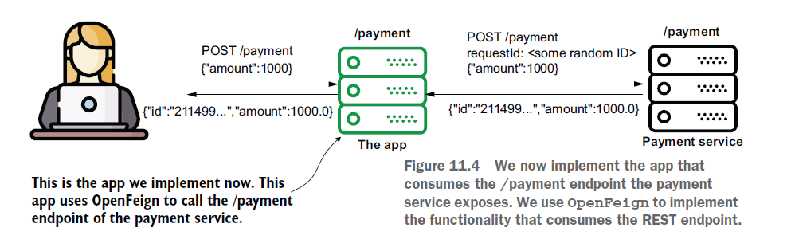
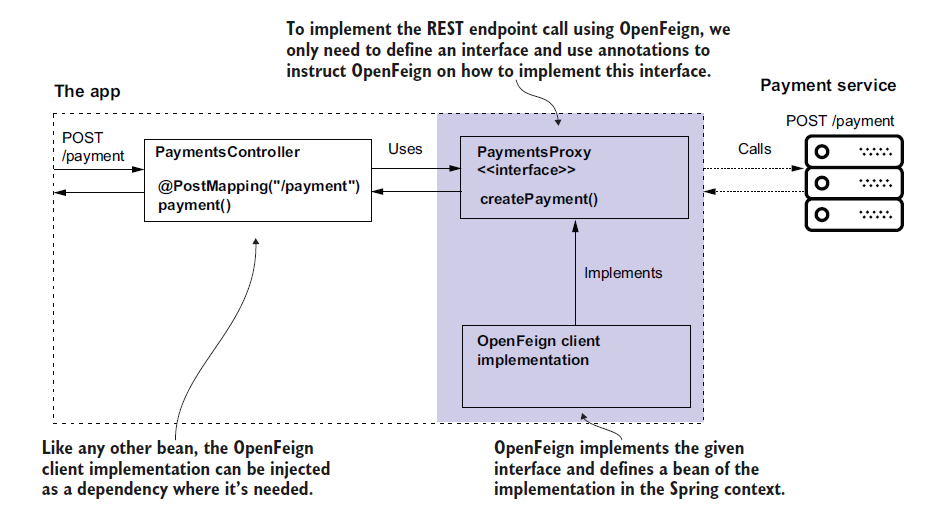
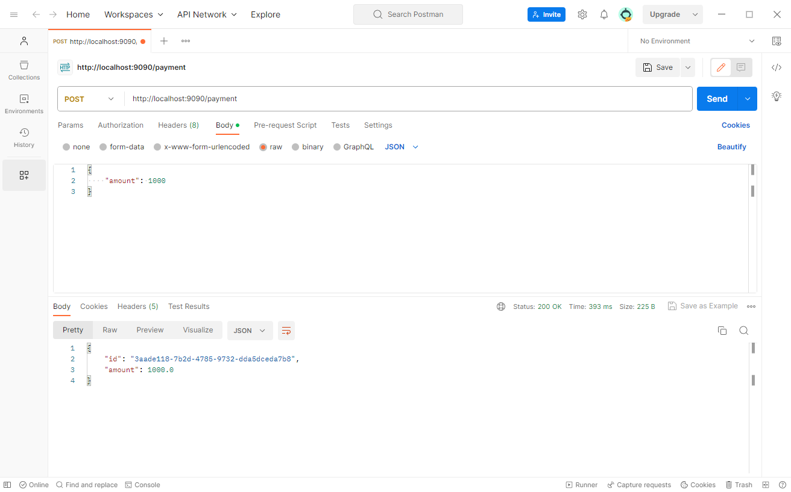
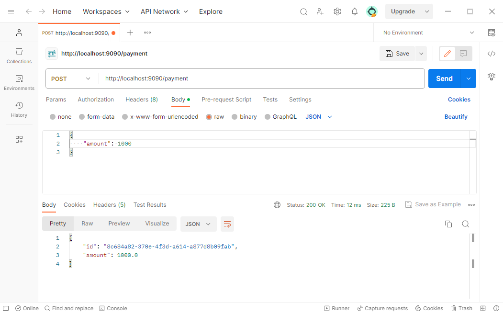
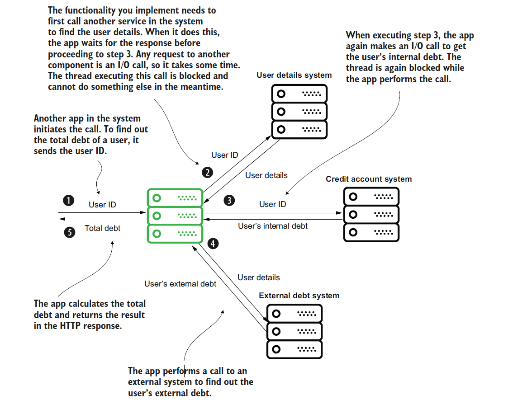
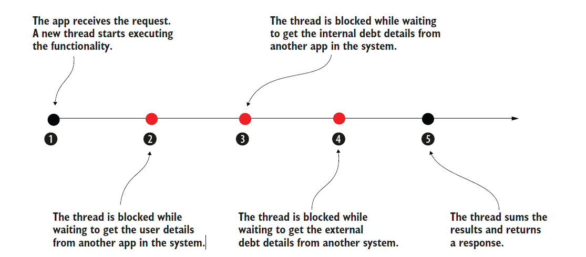
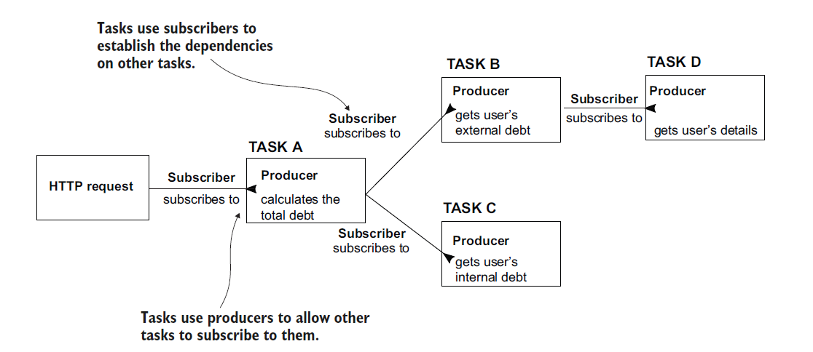

# [Spring Note](../../README.md) - Chapter 11 Consuming REST endpoints
| Chapter | Title |
| :-: | :- |
| 11.1 | [REST Endpoint Communication](#111-rest-endpoint-communication) |
| 11.2 | [Consuming REST Endpoints](#112-consuming-rest-endpoints) |
| 11.3 | [REST Endpoint as a Server](#113-rest-endpoint-as-a-server) |
| 11.4 | [REST Endpoint as a Client](#114-rest-endpoint-as-a-client) |
| 11.5 | [Using OpenFeign to Implement a REST Endpoint as a Client](#115-using-openfeign-to-implement-a-rest-endpoint-as-a-client) |
|  | [Spring Cloud Starter Openfeign Dependency](#spring-cloud-starter-openfeign-dependency) |
|  | [Using @FeignClient](#using-feignclient) |
| 11.6 | [Using RestTemplate to Implement a REST Endpoint as a Client](#116-using-resttemplate-to-implement-a-rest-endpoint-as-a-client) |
| 11.7 | [Using WebClient to Implement a REST Endpoint as a Client](#117-using-webclient-to-implement-a-rest-endpoint-as-a-client) |
|  | [Nonreactive App](#nonreactive-app) |
|  | [Reactive App](#reactive-app) |
|  | [Spring Boot Starter Webflux Dependency](#spring-boot-starter-webflux-dependency) |
|  | [Using WebClient](#using-webclient) |

<br />

## 11.1 REST Endpoint Communication
- REST services are a common way to implement the communication between two system components.
- The client of a web app can call the backend, and so can another backend component.
- In a backend solution composed of multiple services (see appendix A), these components need to “speak” to exchange data, so when you implement such a service using Spring, you need to know how to call a REST endpoint exposed by another service.

REST Endpoint Communication Diagram



<br />

## 11.2 Consuming REST Endpoints
1. OpenFeign
    - A tool offered by the Spring Cloud project. I recommend developers
use this feature in new apps for consuming REST endpoints.
2. RestTemplate
    - A well-known tool developers have used since Spring 3 to call REST endpoints. RestTemplate is often used today in Spring apps. However, as we’ll discuss in this chapter, OpenFeign is a better alternative to RestTemplate, so if you work on a new app, you’ll probably avoid RestTemplate and use Open-Feign instead.
3. WebClient
    - A Spring feature presented as an alternative to RestTemplate. This feature uses a different programming approach named reactive programming, which we’ll discuss at the end of this chapter.

<br />

## 11.3 REST Endpoint as a Server
System Design Diagram



Payment.java
```Java
public class Payment {

    private String id;
    private double amount;

    public String getId() {
        return id;
    }

    public void setId(String id) {
        this.id = id;
    }

    public double getAmount() {
        return amount;
    }

    public void setAmount(double amount) {
        this.amount = amount;
    }
}
```

PaymentsController.java
```Java
@RestController
public class PaymentsController {

    private static Logger logger = Logger.getLogger(PaymentsController.class.getName());

    @PostMapping("/payment")
    public ResponseEntity<Payment> createPayment(@RequestHeader String requestId, @RequestBody Payment payment) {
        logger.info("Received request with ID " + requestId + " ; Payment Amount: " + payment.getAmount());

        payment.setId(UUID.randomUUID().toString());

        return ResponseEntity
                .status(HttpStatus.OK)
                .header("requestId", requestId)
                .body(payment);
    }
}
```

SpringStartHereApplication.java
```Java
@SpringBootApplication
public class SpringStartHereApplication {

    public static void main(String[] args) {
        SpringApplication.run(SpringStartHereApplication.class, args);
    }
}
```

<br />

## 11.4 REST Endpoint as a Client
System Deisgn Diagram



<br />

## 11.5 Using OpenFeign to Implement a REST Endpoint as a Client
System Deisgn Diagram



### Spring Cloud Starter Openfeign Dependency
pom.xml
```XML
<dependency>
	<groupId>org.springframework.cloud</groupId>
	<artifactId>spring-cloud-starter-openfeign</artifactId>
	<version>4.0.3</version>
</dependency>
```

### Using @FeignClient
Payment.java
```Java
public class Payment {

    private String id;
    private double amount;

    public String getId() {
        return id;
    }

    public void setId(String id) {
        this.id = id;
    }

    public double getAmount() {
        return amount;
    }

    public void setAmount(double amount) {
        this.amount = amount;
    }
}
```

PaymentsProxy.java
```Java
@FeignClient(name = "payments", url = "${name.service.url}")
public interface PaymentsProxy {

    @PostMapping("/payment")
    Payment createPayment(@RequestHeader String requestId, @RequestBody Payment payment);
}
```

PaymentsController.java
```Java
@RestController
public class PaymentsController {

    private final  PaymentsProxy paymentsProxy;

    @Autowired
    public PaymentsController(PaymentsProxy paymentsProxy) {
        this.paymentsProxy = paymentsProxy;
    }

    @PostMapping("/payment")
    public Payment createPayment(@RequestBody Payment payment) {
        String requestId = UUID.randomUUID().toString();
        return paymentsProxy.createPayment(requestId, payment);
    }
}
```

ProjectConfig.java
```Java
@Configuration
@EnableFeignClients
public class ProjectConfig {

}
```

SpringStartHere2Application.java
```Java
@SpringBootApplication
public class SpringStartHere2Application {

	public static void main(String[] args) {
		SpringApplication.run(SpringStartHere2Application.class, args);
	}
}
```

application.properties
```properties
server.port=9090
name.service.url=localhost:8080
```

URL: http://localhost:9090/payment



<br />

## 11.6 Using RestTemplate to Implement a REST Endpoint as a Client
Payment.java
```Java
public class Payment {

    private String id;
    private double amount;

    public String getId() {
        return id;
    }

    public void setId(String id) {
        this.id = id;
    }

    public double getAmount() {
        return amount;
    }

    public void setAmount(double amount) {
        this.amount = amount;
    }
}
```

PaymentsProxy.java
```Java
@Component
public class PaymentsProxy {

    @Value("${name.service.url}")
    private String paymentsServiceUrl;

    public Payment createPayment(Payment payment) {
        String uri = paymentsServiceUrl + "/payment";

        HttpHeaders httpHeaders = new HttpHeaders();
        httpHeaders.add("requestId", UUID.randomUUID().toString());
        HttpEntity<Payment> httpEntity = new HttpEntity<>(payment, httpHeaders);

        RestTemplate restTemplate = new RestTemplate();
        ResponseEntity<Payment> responseEntity =
                restTemplate.exchange(
                        uri,
                        HttpMethod.POST,
                        httpEntity,
                        Payment.class);

        return responseEntity.getBody();
    }
}
```

PaymentsController.java
```Java
@RestController
public class PaymentsController {

    private final  PaymentsProxy paymentsProxy;

    @Autowired
    public PaymentsController(PaymentsProxy paymentsProxy) {
        this.paymentsProxy = paymentsProxy;
    }

    @PostMapping("/payment")
    public Payment createPayment(@RequestBody Payment payment) {
        return paymentsProxy.createPayment(payment);
    }
}
```

SpringStartHere2Application.java
```Java
@SpringBootApplication
public class SpringStartHere2Application {

	public static void main(String[] args) {
		SpringApplication.run(SpringStartHere2Application.class, args);
	}
}
```

application.properties
```properties
server.port=9090
name.service.url=http://localhost:8080
```

URL: http://localhost:9090/payment



<br />

## 11.7 Using WebClient to Implement a REST Endpoint as a Client
- WebClient is a tool used in different apps and is built on a methodology we call a reactive approach.
- Spring’s documentation recommends using WebClient, but that’s only a valid recommendation for reactive apps.
- If you aren’t writing a reactive app, use OpenFeign instead.
- Like anything else in software, it fits well for some cases, but might complicate things for others.
- Choosing WebClient to implement the REST endpoint calls is strongly coupled to making your app reactive.

### Nonreactive App
- In a nonreactive app, a thread executes a business flow.
- Multiple tasks compose a business flow, but these tasks are not independent.
- The same thread executes all the tasks composing a flow.

Example of a Nonreactive App




- The app creates a new thread for each request, and this thread executes the steps one by one.
- The thread has to wait for a step to finish before proceeding to the next one and is blocked every time it waits for the app to perform an I/O call.

Two significant issues
1. The thread is idle while an I/O call blocks it. Instead of using the thread, we allow it to stay and occupy the app’s memory. We consume resources without gaining any benefit. With such an approach, you could have cases where the app gets 10 requests simultaneously, but all the threads are idle simultaneously while waiting for details from other systems.

2. Some of the tasks don’t depend on one another. For example, the app could execute step 2 and step 3 at the same time. There’s no reason for the app to wait for step 2 to end before executing step 3. The app just needs, in the end, the result of both to calculate the total debt.

### Reactive App
- Reactive apps change the idea of having one atomic flow in which one thread executes all its tasks from the beginning to the end.
- With reactive apps, we think of tasks as independent, and multiple threads can collaborate to complete a flow composed of multiple tasks.
- Using this approach, you don’t need one thread per each request.
- You can solve multiple requests with fewer threads because the threads don’t have to stay idle.
- When blocked on a certain task, the thread leaves it and works on some other task that isn’t blocked.
- Technically, in a reactive app, we implement a flow by defining the tasks and the dependencies between them.
- The reactive app specification offers us two components: the producer and the subscriber to implement the dependencies between tasks.
- A task returns a producer to allow other tasks to subscribe to it, marking the dependency they have on the task.
- A task uses a subscriber to attach to a producer of another task and consume that task’s result once it ends.

Example of a Reactive App



### Spring Boot Starter Webflux Dependency
pom.xml
```XML
<dependency>
	<groupId>org.springframework.boot</groupId>
	<artifactId>spring-boot-starter-webflux</artifactId>
</dependency>
```

### Using WebClient
Payment.java
```Java
public class Payment {

    private String id;
    private double amount;

    public String getId() {
        return id;
    }

    public void setId(String id) {
        this.id = id;
    }

    public double getAmount() {
        return amount;
    }

    public void setAmount(double amount) {
        this.amount = amount;
    }
}
```

PaymentsProxy.java
```Java
@Component
public class PaymentsProxy {

    @Value("${name.service.url}")
    private String paymentsServiceUrl;

    public Mono<Payment> createPayment(String requestId, Payment payment) {
        String uri = paymentsServiceUrl + "/payment";

        WebClient webClient = WebClient.builder().build();

        return webClient.post()
                .uri(uri)
                .header("requestId", requestId)
                .body(Mono.just(payment), Payment.class)
                .retrieve()
                .bodyToMono(Payment.class);
    }
}
```

PaymentsController.java
```Java
@RestController
public class PaymentsController {

    private final  PaymentsProxy paymentsProxy;

    @Autowired
    public PaymentsController(PaymentsProxy paymentsProxy) {
        this.paymentsProxy = paymentsProxy;
    }

    @PostMapping("/payment")
    public Mono<Payment> createPayment(@RequestBody Payment payment) {
        String requestId = UUID.randomUUID().toString();
        return paymentsProxy.createPayment(requestId, payment);
    }
}
```

SpringStartHere2Application.java
```Java
@SpringBootApplication
public class SpringStartHere2Application {

	public static void main(String[] args) {
		SpringApplication.run(SpringStartHere2Application.class, args);
	}
}
```

application.properties
```properties
server.port=9090
name.service.url=http://localhost:8080
```

URL: http://localhost:9090/payment


<br />
