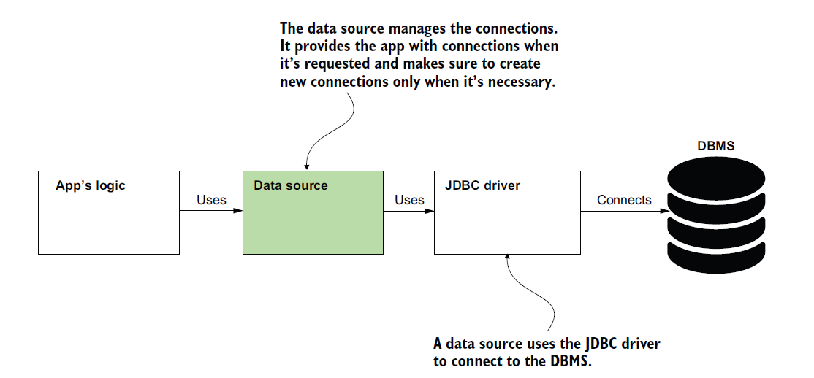
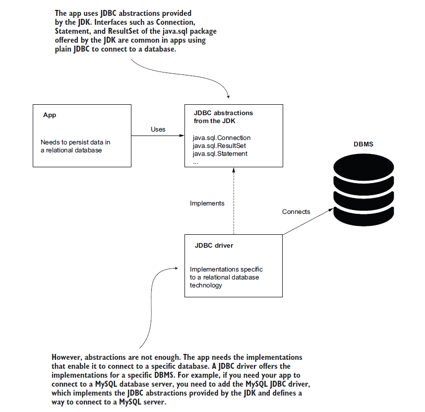
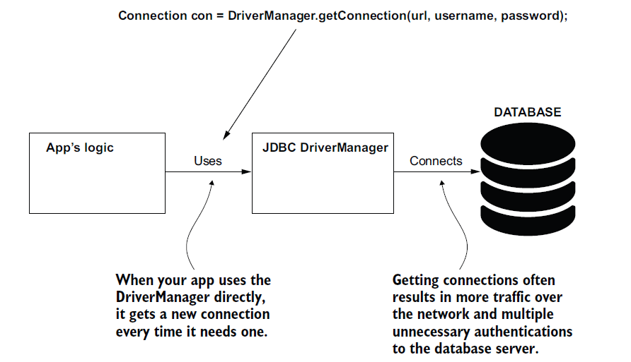
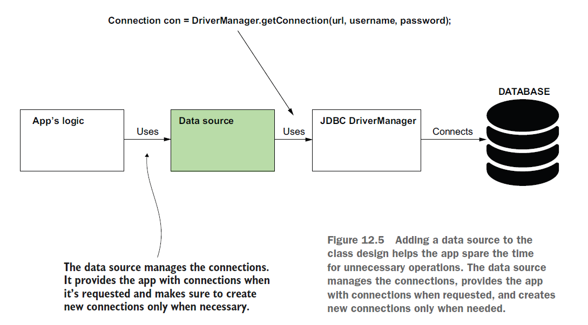
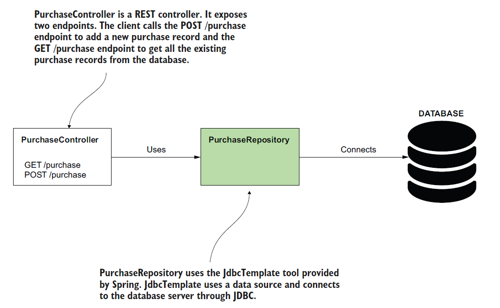
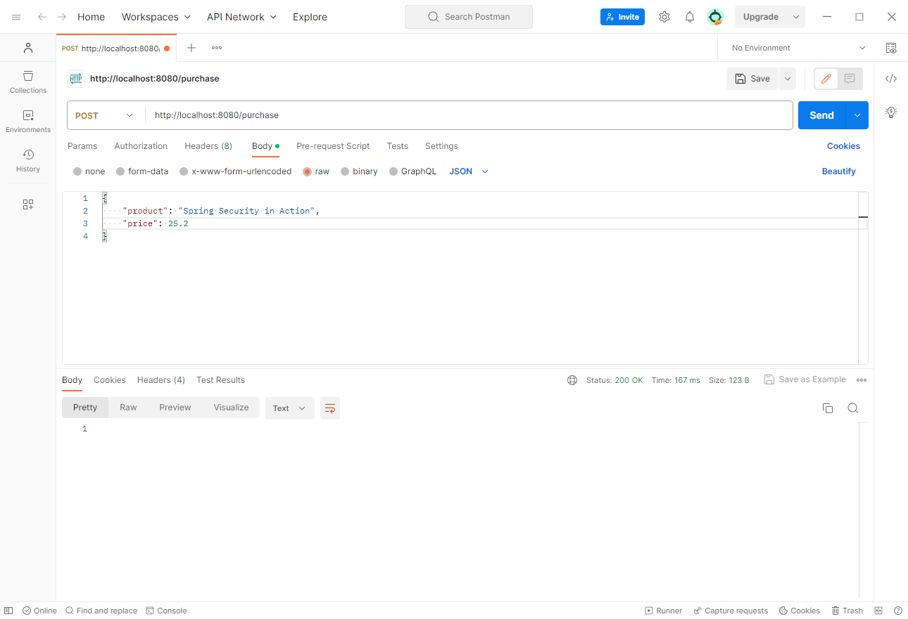
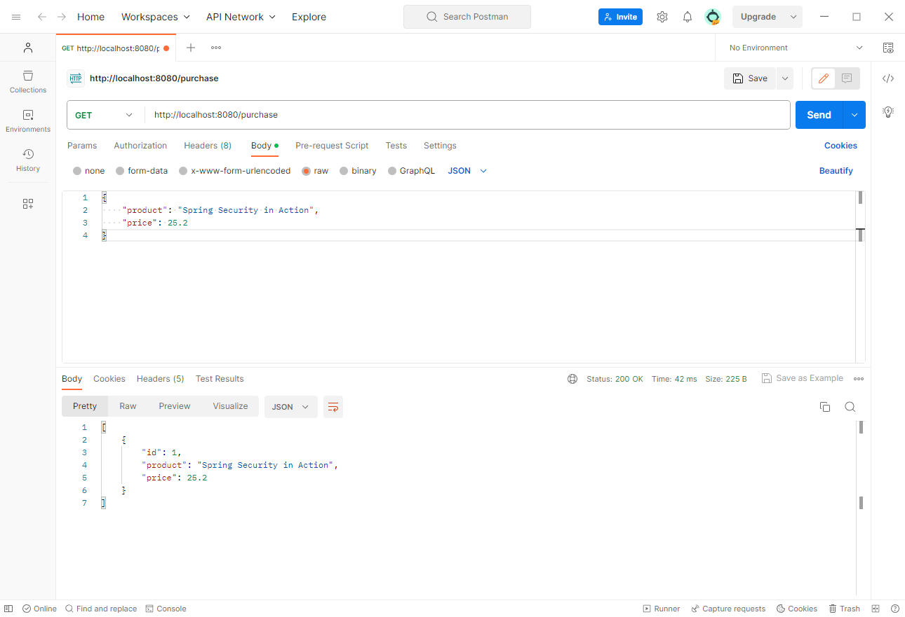
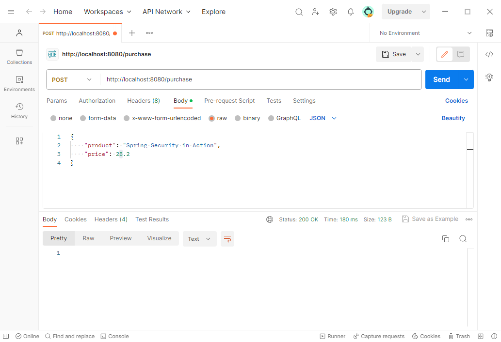
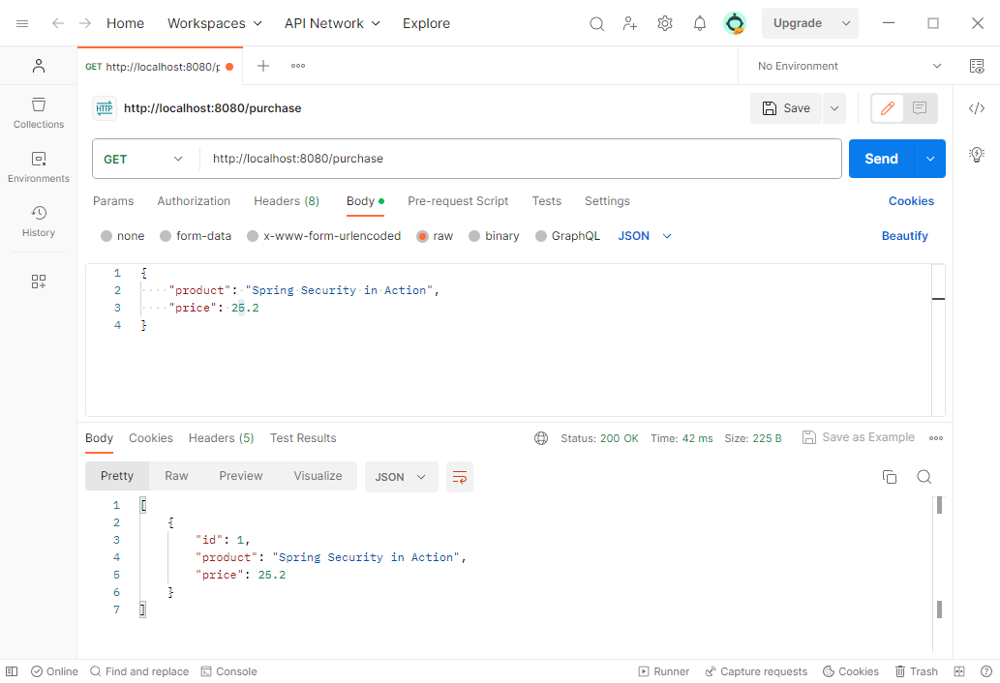

# [Spring Note](../../README.md) - Chapter 12 Using data sources in Spring apps
| Chapter | Title |
| :-: | :- |
| 12.1 | [Data Source](#121-data-source) |
| 12.2 | [Java Database Connectivity (JDBC)](#122-java-database-connectivity-jdbc) |
|  | [Connect to a Database without Data Source](#connect-to-a-database-without-data-source) |
|  | [Connect to a Database with Data Source](#connect-to-a-database-with-data-source) |
| 12.3 | [JdbcTemplate and H2 Database](#123-jdbctemplate-and-h2-database) |
|  | [Spring Boot Starter JDBC Dependency](#spring-boot-starter-jdbc-dependency) |
|  | [H2 Database Dependency](#h2-database-dependency) |
|  | [Using RowMapper to Get an Object from a Row](#using-rowmapper-to-get-an-object-from-a-row) |
| 12.4 | [MySQL](#124-mysql) |
|  | [MySQL Connector Dependency](#mysql-connector-dependency) |
|  | [Using MySQL](#using-mysql) |

<br />

## 12.1 Data Source
- The data source (figure 12.2) is a component that manages connections to the server handling the database (the database management system, also known as DBMS).
- DBMS is software whose responsibility is to allow you to efficiently manage persisted data (add, change, retrieve) while keeping it secure.
- A DBMS manages the data in databases. A database is a persistent collection of data.

Data Source Diagram



- Without an object taking the responsibility of a data source, the app would need to request a new connection for each operation with the data.
- This approach is not realistic in a production scenario because communicating through the network for establishing a new connection for each operation would dramatically slow down the
application and cause performance issues.
- The data source makes sure your app only requests a new connection when it really needs it, improving the app’s performance.

<br />

## 12.2 Java Database Connectivity (JDBC)
- In a Java app, the language’s capabilities to connect to a relational database is named Java Database Connectivity (JDBC).
- JDBC offers you a way to connect to a DBMS to work with a database.
- However, the JDK doesn’t provide a specific implementation for working with a particular technology (such as MySQL, Postgres, or Oracle).
- The JDK only gives you the abstractions for objects an app needs to work with a relational database.
- To gain the implementation of this abstraction and enable your app to connect to a certain DBMS technology, you add a runtime dependency named the JDBC driver.
- Every technology vendor provides the JDBC driver you need to add to your app to enable it to connect to that specific technology.
- The JDBC driver is not something that comes either from the JDK or from a framework such as Spring.

JDBC Diagram



- The JDBC driver gives you a way to obtain a connection to the DBMS.
- A first option is to use the JDBC driver directly and implement your app to require a connection each time it needs to execute a new operation on the persisted data.

### Connect to a Database without Data Source



- But requesting a new connection and authenticating each operation again and again for each is a waste of
resources and time for both the client and the database server.
- A data source object can efficiently manage the connections to minimize the number of unnecessary operations.
- Instead of using the JDBC driver manager directly, we use a data source to retrieve and manage the connections.

### Connect to a Database with Data Source



- For Java apps, you have multiple choices for data source implementations, but the most commonly used today is the HikariCP (Hikari connection pool) data source.
- The convention configuration of Spring Boot also considers HikariCP the default data source implementation too.

<br />

## 12.3 JdbcTemplate and H2 Database
- JdbcTemplate is the simplest of the tools Spring offers for using a relational database, but it’s an excellent choice for small apps as it doesn’t force you to use any other specific persistence framework.
- JdbcTemplate is the best Spring choice to implement a persistence layer when you don’t want your app to have any other dependency.
- H2 (an in-memory) database is an excellent tool we use both for examples and application tests when we want to test an app’s functionality but exclude its dependency on a database.



### Spring Boot Starter JDBC Dependency
pom.xml
```XML
<dependency>
	<groupId>org.springframework.boot</groupId>
	<artifactId>spring-boot-starter-jdbc</artifactId>
</dependency>
```

### H2 Database Dependency
pom.xml
```XML
<dependency>
    <groupId>com.h2database</groupId>
    <artifactId>h2</artifactId>
    <scope>runtime</scope>
</dependency>
```

### Using RowMapper to Get an Object from a Row
Purchase.java
```Java
public class Purchase {

    private int id;
    private String product;
    private BigDecimal price;

    public int getId() {
        return id;
    }

    public void setId(int id) {
        this.id = id;
    }

    public String getProduct() {
        return product;
    }

    public void setProduct(String product) {
        this.product = product;
    }

    public BigDecimal getPrice() {
        return price;
    }

    public void setPrice(BigDecimal price) {
        this.price = price;
    }
}
```

PurchaseRepository.java
```Java
@Repository
public class PurchaseRepository {

    private final JdbcTemplate jdbcTemplate;

    @Autowired
    public PurchaseRepository(JdbcTemplate jdbcTemplate) {
        this.jdbcTemplate = jdbcTemplate;
    }

    public void storePurchase(Purchase purchase) {
        String sql = "INSERT INTO purchase VALUES (DEFAULT, ?, ?)";
        jdbcTemplate.update(sql, purchase.getProduct(), purchase.getPrice());
    }

    public List<Purchase> findAllPurchases() {
        String sql = "SELECT * FROM purchase";

        RowMapper<Purchase> purchaseRowMapper = (r, i) -> {
            Purchase rowObject = new Purchase();
            rowObject.setId(r.getInt("id"));
            rowObject.setProduct(r.getString("product"));
            rowObject.setPrice(r.getBigDecimal("price"));
            return rowObject;
        };

        return jdbcTemplate.query(sql, purchaseRowMapper);
    }
}
```

PurchaseController.java
```Java
@RestController
@RequestMapping("/purchase")
public class PurchaseController {

    private final PurchaseRepository purchaseRepository;

    @Autowired
    public PurchaseController(PurchaseRepository purchaseRepository) {
        this.purchaseRepository = purchaseRepository;
    }

    @PostMapping
    public void storePurchase(@RequestBody Purchase purchase) {
        purchaseRepository.storePurchase(purchase);
    }

    @GetMapping
    private List<Purchase> findPurchases() {
        return purchaseRepository.findAllPurchases();
    }
}
```

SpringStartHereApplication.java
```Java
@SpringBootApplication
public class SpringStartHereApplication {

    public static void main(String[] args) {
        SpringApplication.run(SpringStartHereApplication.class, args);
    }
}
```

schema.sql
```SQL
CREATE TABLE IF NOT EXISTS purchase (
    id INT AUTO_INCREMENT PRIMARY KEY,
    product VARCHAR(50) NOT NULL,
    price DOUBLE NOT NULL
);
```

URL: http://localhost:8080/purchase

POST



GET



<br />

## 12.4 MySQL
### MySQL Connector Dependency
pom.xml
```XML
<dependency>
	<groupId>mysql</groupId>
	<artifactId>mysql-connector-java</artifactId>
	<version>8.0.33</version>
	<scope>runtime</scope>
</dependency>
```

### Using MySQL
Purchase.java
```Java
public class Purchase {

    private int id;
    private String product;
    private BigDecimal price;

    public int getId() {
        return id;
    }

    public void setId(int id) {
        this.id = id;
    }

    public String getProduct() {
        return product;
    }

    public void setProduct(String product) {
        this.product = product;
    }

    public BigDecimal getPrice() {
        return price;
    }

    public void setPrice(BigDecimal price) {
        this.price = price;
    }
}
```

PurchaseRepository.java
```Java
@Repository
public class PurchaseRepository {

    private final JdbcTemplate jdbcTemplate;

    @Autowired
    public PurchaseRepository(JdbcTemplate jdbcTemplate) {
        this.jdbcTemplate = jdbcTemplate;
    }

    public void storePurchase(Purchase purchase) {
        String sql = "INSERT INTO purchase VALUES (DEFAULT, ?, ?)";
        jdbcTemplate.update(sql, purchase.getProduct(), purchase.getPrice());
    }

    public List<Purchase> findAllPurchases() {
        String sql = "SELECT * FROM purchase";

        RowMapper<Purchase> purchaseRowMapper = (r, i) -> {
            Purchase rowObject = new Purchase();
            rowObject.setId(r.getInt("id"));
            rowObject.setProduct(r.getString("product"));
            rowObject.setPrice(r.getBigDecimal("price"));
            return rowObject;
        };

        return jdbcTemplate.query(sql, purchaseRowMapper);
    }
}
```

PurchaseController.java
```Java
@RestController
@RequestMapping("/purchase")
public class PurchaseController {

    private final PurchaseRepository purchaseRepository;

    @Autowired
    public PurchaseController(PurchaseRepository purchaseRepository) {
        this.purchaseRepository = purchaseRepository;
    }

    @PostMapping
    public void storePurchase(@RequestBody Purchase purchase) {
        purchaseRepository.storePurchase(purchase);
    }

    @GetMapping
    private List<Purchase> findPurchases() {
        return purchaseRepository.findAllPurchases();
    }
}
```

ProjectConfig.java
```Java
@Configuration
public class ProjectConfig {

    @Value("${spring.sql.url}")
    private String datasourceUrl;

    @Value("${spring.sql.username}")
    private String datasourceUsername;

    @Value("${spring.sql.password}")
    private String datasourcePassword;

    @Bean
    public DataSource dataSource() {
        HikariDataSource dataSource = new HikariDataSource();

        dataSource.setJdbcUrl(datasourceUrl);
        dataSource.setUsername(datasourceUsername);
        dataSource.setPassword(datasourcePassword);
        dataSource.setConnectionTimeout(1000);

        return dataSource;
    }
}
```

SpringStartHereApplication.java
```Java
@SpringBootApplication
public class SpringStartHereApplication {

    public static void main(String[] args) {
        SpringApplication.run(SpringStartHereApplication.class, args);
    }
}
```

schema.sql
```SQL
CREATE TABLE IF NOT EXISTS purchase (
    id INT AUTO_INCREMENT PRIMARY KEY,
    product VARCHAR(50) NOT NULL,
    price DOUBLE NOT NULL
);
```

application.properties
```properties
spring.sql.url=jdbc:mysql://localhost:3306/purchase_data
useLegacyDatetimeCode=false&serverTimezone=UTC

spring.sql.username=root
spring.sql.password=123456
spring.sql.init.mode=always
```

URL: http://localhost:8080/purchase

POST



GET



<br />
