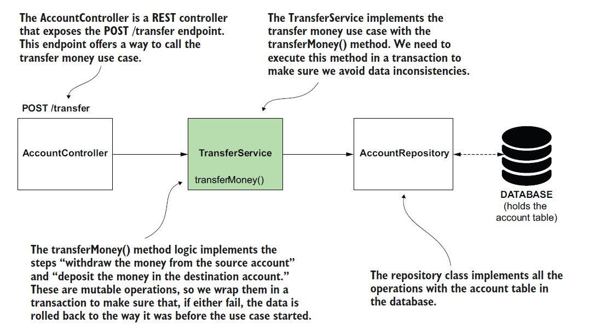

# [Spring Note](../../README.md) - Chapter 13 Using transactions in Spring apps
| Chapter | Title |
| :-: | :- |
| 13.1 | [Transactions](#131-transactions) |
|  | [Example of a Transaction](#example-of-a-transaction) |
| 13.2 | [Spring Transactions](#132-spring-transactions) |
|  | [Spring Transaction Aspect](#spring-transaction-aspect) |
|  | [Warning with Spring Transaction Aspect](#warning-with-spring-transaction-aspect) |
| 13.3 | [Using @Transactional to Implement a Transaction](#133-using-transactional-to-implement-a-transaction) |
| 13.4 | [Testing Rolls Backs of a Transaction](#134-testing-rolls-backs-of-a-transaction) |

<br />

## 13.1 Transactions
- A transaction is a defined set of mutable operations (operations that change data) that can either correctly execute them altogether or not at all.
- We refer to this as atomicity.
- Transactions are essential in apps because they ensure the data remains consistent if any step of the use case fails when the app already changed data.

### Example of a Transaction
Consider a (simplified) transfer money functionality consisting of two steps:
1. Withdraw money from the source account.
2. Deposit money into the destination account.


- We can start a transaction before step 1 and close the transaction after step 2.
- In such a case, if both steps successfully execute, when the transaction ends (after step 2), the app persists the changes made by both steps.
- We also say, in this case, that the transaction “commits.”
- The “commit” operation happens when the transaction ends and all the steps are successfully executed, so the app persists the data changes.

Commit
- The successful end of a transaction when the app stores all the changes made by the transaction's mutable operations.

Rollback
- The transaction ends with rollback when the app restores the data to the way it looked at the beginning of the transaction to avoid data inconsistencies.

<br />

## 13.2 Spring Transactions
- In fact, a Spring AOP aspect lies behind the scenes of a transaction.
- An aspect is a piece of code that intercepts specific methods’ execution in a way that you define.
- In most cases today, we use annotations to mark the methods whose execution an aspect should intercept and alter.
- For Spring transactions, things aren’t different.
- To mark a method we want Spring to wrap in a transaction, we use an annotation named @Transactional.
- Behind the scenes, Spring configures an aspect (you don’t implement this aspect yourself; Spring provides it) and applies the transaction logic for the operations executed by that method.

### Spring Transaction Aspect


- Spring knows to rollback a transaction if the method throws a runtime exception.

### Warning with Spring Transaction Aspect


- The transactional method should throw the exception further so that the aspect knows it should rollback the changes.
- If the method treats the exception in its logic and doesn’t throw the exception further, the aspect can’t know the exception occurred.

<br />

## 13.3 Using @Transactional to Implement a Transaction
System Design Diagram



Control Flow Diagram


Account.java
```Java
public class Account {

    private long id;
    private String name;
    private BigDecimal amount;

    public long getId() {
        return id;
    }

    public void setId(long id) {
        this.id = id;
    }

    public String getName() {
        return name;
    }

    public void setName(String name) {
        this.name = name;
    }

    public BigDecimal getAmount() {
        return amount;
    }

    public void setAmount(BigDecimal amount) {
        this.amount = amount;
    }
}
```

AccountRowMapper.java
```Java
public class AccountRowMapper implements RowMapper<Account> {
    @Override
    public Account mapRow(ResultSet r, int i) throws SQLException {
        Account account = new Account();
        account.setId(r.getInt("id"));
        account.setName(r.getString("name"));
        account.setAmount(r.getBigDecimal("amount"));
        return account;
    }
}
```

AccountRepository.java
```Java
@Repository
public class AccountRepository {

    private final JdbcTemplate jdbcTemplate;

    @Autowired
    public AccountRepository(JdbcTemplate jdbcTemplate) {
        this.jdbcTemplate = jdbcTemplate;
    }

    public Account findAccountById(long id) {
        String sql = "SELECT * FROM account WHERE id = ?";
        return jdbcTemplate.queryForObject(sql, new AccountRowMapper(), id);
    }

    public void changeAmount(long id, BigDecimal amount) {
        String sql = "UPDATE account SET amount = ? WHERE id = ?";
        jdbcTemplate.update(sql, amount, id);
    }

    public List<Account> findAllAccounts() {
        String sql = "SELECT * FROM account";
        return jdbcTemplate.query(sql, new AccountRowMapper());
    }
}
```

TransferService.java
```Java
@Service
public class TransferService {

    private final AccountRepository accountRepository;

    @Autowired
    public TransferService(AccountRepository accountRepository) {
        this.accountRepository = accountRepository;
    }

    @Transactional
    public void transferMoney(long idSender, long idReceiver, BigDecimal amount) {
        Account sender = accountRepository.findAccountById(idSender);
        Account receiver = accountRepository.findAccountById(idReceiver);

        BigDecimal senderNewAmount = sender.getAmount().subtract(amount);
        BigDecimal receiverNewAmount = receiver.getAmount().add(amount);

        accountRepository.changeAmount(idSender, senderNewAmount);
        accountRepository.changeAmount(idReceiver, receiverNewAmount);
    }

    public List<Account> getAllAccounts() {
        return accountRepository.findAllAccounts();
    }
}
```

TransferRequest.java
```Java
public class TransferRequest {

    private long senderAccountId;
    private long receiverAccountId;
    private BigDecimal amount;

    public long getSenderAccountId() {
        return senderAccountId;
    }

    public void setSenderAccountId(long senderAccountId) {
        this.senderAccountId = senderAccountId;
    }

    public long getReceiverAccountId() {
        return receiverAccountId;
    }

    public void setReceiverAccountId(long receiverAccountId) {
        this.receiverAccountId = receiverAccountId;
    }

    public BigDecimal getAmount() {
        return amount;
    }

    public void setAmount(BigDecimal amount) {
        this.amount = amount;
    }
}
```

AccountController.java
```Java
@RestController
public class AccountController {

    private final TransferService transferService;

    @Autowired
    public AccountController(TransferService transferService) {
        this.transferService = transferService;
    }

    @PostMapping("/transfer")
    public void transferMoney(@RequestBody TransferRequest request) {
        transferService.transferMoney(
                request.getSenderAccountId(),
                request.getReceiverAccountId(),
                request.getAmount());
    }

    @GetMapping("/accounts")
    public List<Account> getAllAccounts() {
        return transferService.getAllAccounts();
    }
}
```

SpringStartHereApplication.java
```Java
@SpringBootApplication
public class SpringStartHereApplication {

    public static void main(String[] args) {
        SpringApplication.run(SpringStartHereApplication.class, args);
    }
}
```

schema.sql
```SQL
CREATE TABLE account (
    id INT NOT NULL AUTO_INCREMENT PRIMARY KEY,
    name VARCHAR(50) NOT NULL,
    amount DOUBLE NOT NULL
);

INSERT INTO account VALUES (DEFAULT, 'Helen Down', 1000);
INSERT INTO account VALUES (DEFAULT, 'Peter Read', 1000);
```

URL: http://localhost:8080/accounts

GET


URL: http://localhost:8080/transfer

POST


URL: http://localhost:8080/accounts

GET


<br />

## 13.4 Testing Rolls Backs of a Transaction
Account.java
```Java
public class Account {

    private long id;
    private String name;
    private BigDecimal amount;

    public long getId() {
        return id;
    }

    public void setId(long id) {
        this.id = id;
    }

    public String getName() {
        return name;
    }

    public void setName(String name) {
        this.name = name;
    }

    public BigDecimal getAmount() {
        return amount;
    }

    public void setAmount(BigDecimal amount) {
        this.amount = amount;
    }
}
```

AccountRowMapper.java
```Java
public class AccountRowMapper implements RowMapper<Account> {
    @Override
    public Account mapRow(ResultSet r, int i) throws SQLException {
        Account account = new Account();
        account.setId(r.getInt("id"));
        account.setName(r.getString("name"));
        account.setAmount(r.getBigDecimal("amount"));
        return account;
    }
}
```

AccountRepository.java
```Java
@Repository
public class AccountRepository {

    private final JdbcTemplate jdbcTemplate;

    @Autowired
    public AccountRepository(JdbcTemplate jdbcTemplate) {
        this.jdbcTemplate = jdbcTemplate;
    }

    public Account findAccountById(long id) {
        String sql = "SELECT * FROM account WHERE id = ?";
        return jdbcTemplate.queryForObject(sql, new AccountRowMapper(), id);
    }

    public void changeAmount(long id, BigDecimal amount) {
        String sql = "UPDATE account SET amount = ? WHERE id = ?";
        jdbcTemplate.update(sql, amount, id);
    }

    public List<Account> findAllAccounts() {
        String sql = "SELECT * FROM account";
        return jdbcTemplate.query(sql, new AccountRowMapper());
    }
}
```

TransferService.java
```Java
@Service
public class TransferService {

    private final AccountRepository accountRepository;

    @Autowired
    public TransferService(AccountRepository accountRepository) {
        this.accountRepository = accountRepository;
    }

    @Transactional
    public void transferMoney(long idSender, long idReceiver, BigDecimal amount) {
        Account sender = accountRepository.findAccountById(idSender);
        Account receiver = accountRepository.findAccountById(idReceiver);

        BigDecimal senderNewAmount = sender.getAmount().subtract(amount);
        BigDecimal receiverNewAmount = receiver.getAmount().add(amount);

        accountRepository.changeAmount(idSender, senderNewAmount);
        accountRepository.changeAmount(idReceiver, receiverNewAmount);

        throw new RuntimeException("Oh no! Something went wrong!");
    }

    public List<Account> getAllAccounts() {
        return accountRepository.findAllAccounts();
    }
}
```

TransferRequest.java
```Java
public class TransferRequest {

    private long senderAccountId;
    private long receiverAccountId;
    private BigDecimal amount;

    public long getSenderAccountId() {
        return senderAccountId;
    }

    public void setSenderAccountId(long senderAccountId) {
        this.senderAccountId = senderAccountId;
    }

    public long getReceiverAccountId() {
        return receiverAccountId;
    }

    public void setReceiverAccountId(long receiverAccountId) {
        this.receiverAccountId = receiverAccountId;
    }

    public BigDecimal getAmount() {
        return amount;
    }

    public void setAmount(BigDecimal amount) {
        this.amount = amount;
    }
}
```

AccountController.java
```Java
@RestController
public class AccountController {

    private final TransferService transferService;

    @Autowired
    public AccountController(TransferService transferService) {
        this.transferService = transferService;
    }

    @PostMapping("/transfer")
    public void transferMoney(@RequestBody TransferRequest request) {
        transferService.transferMoney(
                request.getSenderAccountId(),
                request.getReceiverAccountId(),
                request.getAmount());
    }

    @GetMapping("/accounts")
    public List<Account> getAllAccounts() {
        return transferService.getAllAccounts();
    }
}
```

SpringStartHereApplication.java
```Java
@SpringBootApplication
public class SpringStartHereApplication {

    public static void main(String[] args) {
        SpringApplication.run(SpringStartHereApplication.class, args);
    }
}
```

schema.sql
```SQL
CREATE TABLE account (
    id INT NOT NULL AUTO_INCREMENT PRIMARY KEY,
    name VARCHAR(50) NOT NULL,
    amount DOUBLE NOT NULL
);

INSERT INTO account VALUES (DEFAULT, 'Helen Down', 1000);
INSERT INTO account VALUES (DEFAULT, 'Peter Read', 1000);
```

URL: http://localhost:8080/accounts

GET


URL: http://localhost:8080/transfer

POST


URL: http://localhost:8080/accounts

GET


<br />
