# [Spring Note](../../README.md) - Chapter 14 Implementing data persistence with Spring Data
| Chapter | Title |
| :-: | :- |
| 14.1 | [Spring Data](#141-spring-data) |
|  | [Problems with Different Types of Database](#problems-with-different-types-of-database) |
|  | [More Complicated Situation with JDBC and Hibernate](#more-complicated-situation-with-jdbc-and-hibernate) |
|  | [Benefits of Spring Data](#benefits-of-spring-data) |
|  | [Spring Data Offers](#spring-data-offers)
| 14.2 | [Spring Data Interfaces](#142-spring-data-interfaces) |
|  | [Repository](#repository) |
|  | [CrudRepository](#crudrepository) |
|  | [PagingAndSortingRepository](#pagingandsortingrepository) |
|  | [Reasons for Providing Multiple Interfaces](#reasons-for-providing-multiple-interfaces) |
|  | [JpaRepository](#jparepository) |
|  | [MongoRepository](#mongorepository) |
|  | [JpaRepository and MongoRepository](#jparepository-and-mongorepository) |
| 14.3 | [Spring Data JDBC](#143-spring-data-jdbc) |
|  | [Spring Boot Starter Data JDBC Dependency](#spring-boot-starter-data-jdbc-dependency) |
|  | [Using Spring Data JDBC and H2](#using-spring-data-jdbc-and-h2) |

<br />

## 14.1 Spring Data
- Spring Data is a Spring ecosystem project that simplifies the persistence layer’s development by providing implementations according to the persistence technology we use.
- This way, we only need to write a few lines of code to define the repositories of our Spring app.

Spring Data Diagram

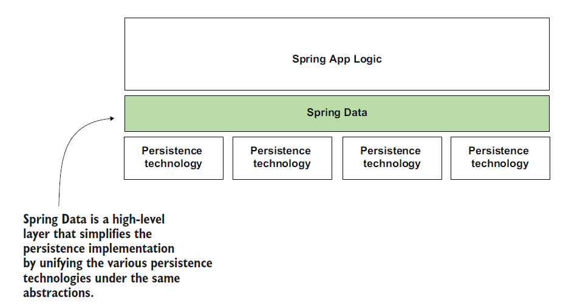

### Problems with Different Types of Database
- Each alternative has its own way of implementing the app’s repositories.
- Sometimes, you even have more options to implement the app’s persistence layer for one technology (such as JDBC).
- For example, with JDBC, you can use JdbcTemplate, as you learned in chapter 12, but you could work directly with the JDK interfaces (Statement, PreparedStatement, ResultSet, and so on).
- Having so many ways to implement the app’s persistence capabilities adds complexity.

Different Types of Database

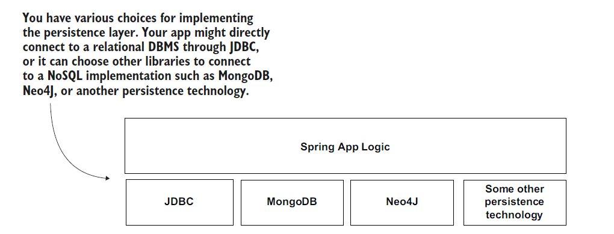

### More Complicated Situation with JDBC and Hibernate
- Sometimes apps use frameworks built on top of JDBC, such as Hibernate.
- The variety in choices makes implementing a persistence layer complex.
- We want to eliminate this complexity from our apps, and, as you’ll learn, Spring Data helps us do this.

JDBC and Hibernate

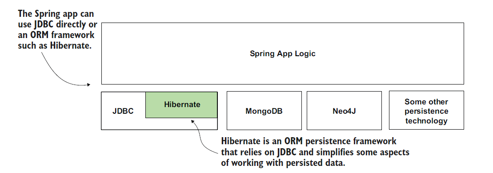

### Benefits of Spring Data
- Spring Data simplifies the implementation of the persistence layer by doing the following:
    1. Providing a common set of abstractions (interfaces) for various persistence technologies. This way, you use a similar approach for implementing the persistence for different technologies.
    2. Allowing the user to implement the persistence operations using only the abstractions, for which Spring Data provides the implementations. This way, you write less code, so you more quickly implement the app’s capabilities. With less written code, the app also becomes easier to understand and maintain.

Benefits of Spring Data

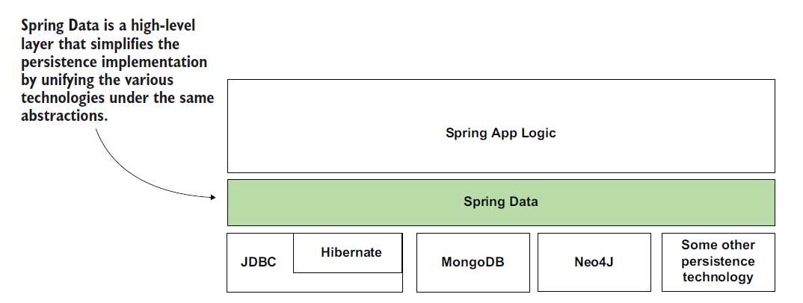

### Spring Data Offers
- The Spring Data project offers different modules for one technology or another.
- These modules are independent of one another, and you can add them to your project using different Maven dependencies.
- So, when you implement an app, you don’t use the Spring Data dependency.
- There is no such thing as one Spring Data dependency.
- The Spring Data project provides one Maven dependency for each persistence fashion it supports.
- For example, you can use the Spring Data JDBC module to connect to the DMBS directly through JDBC, or use the Spring Data Mongo module to connect to a MongoDB database.

Spring Data JDBC and JDBC

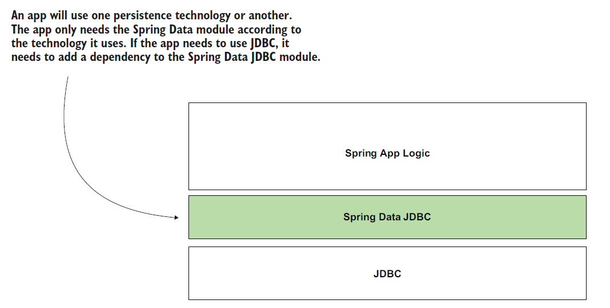

<br />

## 14.2 Spring Data Interfaces
- Spring Data provides a common set of interfaces (contracts) you extend to define the app’s persistence capabilities.
    1. Repository
    2. CrudRepository
    3. PagingAndSortingRepository

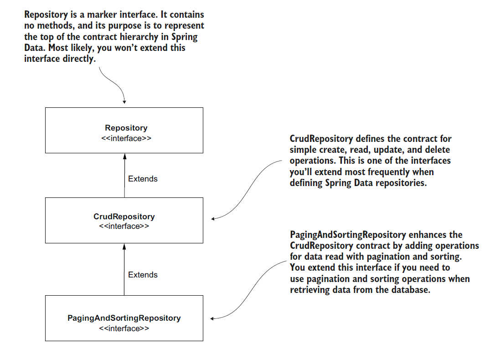

### Repository
- Repository is the most abstract contract.
- If you extend this contract, your app recognizes the interface you write as a particular Spring Data repository.
- Still, you won’t inherit any predefined operations (such as adding a new record, retrieving all the records, or getting a record by its primary key).
- The Repository interface doesn’t declare any method (it is a marker interface).

### CrudRepository
- CrudRepository is the simplest Spring Data contract that also provides some persistence capabilities.
- If you extend this contract to define your app’s persistence capabilities, you get the simplest operations for creating, retrieving, updating, and deleting records.

### PagingAndSortingRepository
- PagingAndSortingRepository extends CrudRepository and adds operations related to sorting the records or retrieving them in chunks of a specific number (pages).

### Reasons for Providing Multiple Interfaces
- By implementing multiple contracts that extend each other instead of providing you one “fat” contract
with all the operations, Spring Data gives your app the possibility to implement only
the operations it needs.
- This approach is a known principle called interface segregation.
- For example, if your app only needs to use CRUD operations, it extends the CrudRepository contract.
- Your app won’t get the operations related to sorting and paging records, making your app simpler.

Repository uses CrudRepository Interface

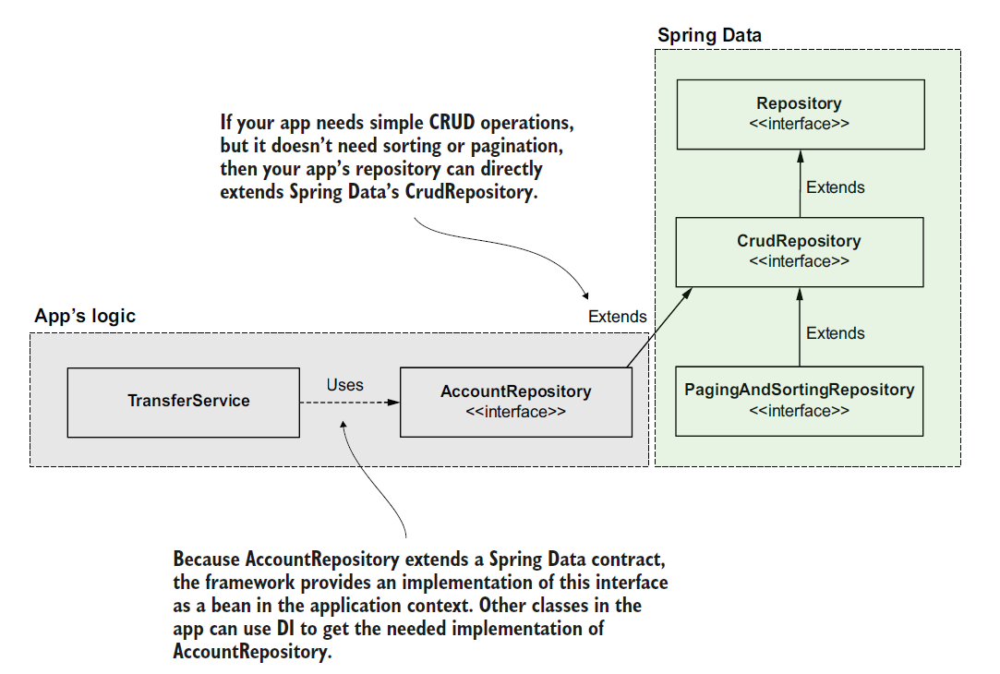

Repository uses PagingAndSortingRepository Interface

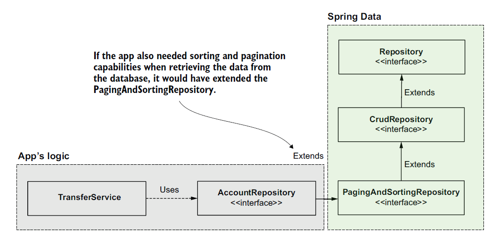

### JpaRepository
- Some Spring Data modules might provide specific contracts to the technology they represent.
- For example, using Spring Data JPA, you also can extend the JpaRepository interface directly.
- The JpaRepository interface is a contract more particular than PagingAndSortingRepository.
- This contract adds operations applicable only when using specific technologies like Hibernate that
implement the Jakarta Persistence API (JPA) specification.

### MongoRepository
- Another example is using a NoSQL technology such as MongoDB.
- To use Spring Data with MongoDB, you would need to add the Spring Data Mongo module to your app, which also provides a particular contract named MongoRepository that adds operations specific to this persistence technology.

### JpaRepository and MongoRepository
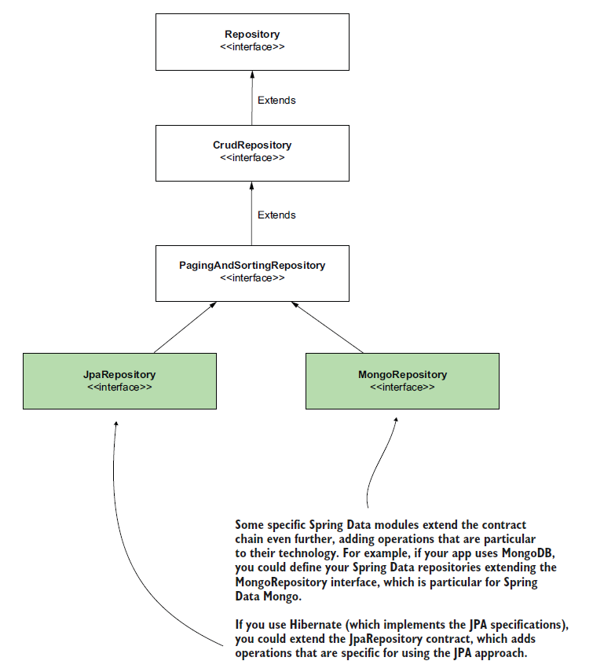

<br />

## 14.3 Spring Data JDBC
### Spring Boot Starter Data JDBC Dependency
pom.xml
```XML
<dependency>
	<groupId>org.springframework.boot</groupId>
	<artifactId>spring-boot-starter-data-jdbc</artifactId>
</dependency>
```

### Using Spring Data JDBC and H2
Account.java
```Java
public class Account {

    @Id
    private long id;
    private String name;
    private BigDecimal amount;

    public long getId() {
        return id;
    }

    public void setId(long id) {
        this.id = id;
    }

    public String getName() {
        return name;
    }

    public void setName(String name) {
        this.name = name;
    }

    public BigDecimal getAmount() {
        return amount;
    }

    public void setAmount(BigDecimal amount) {
        this.amount = amount;
    }
}
```

TransferRequest.java
```Java
public class TransferRequest {

    private long senderAccountId;
    private long receiverAccountId;
    private BigDecimal amount;

    public long getSenderAccountId() {
        return senderAccountId;
    }

    public void setSenderAccountId(long senderAccountId) {
        this.senderAccountId = senderAccountId;
    }

    public long getReceiverAccountId() {
        return receiverAccountId;
    }

    public void setReceiverAccountId(long receiverAccountId) {
        this.receiverAccountId = receiverAccountId;
    }

    public BigDecimal getAmount() {
        return amount;
    }

    public void setAmount(BigDecimal amount) {
        this.amount = amount;
    }
}
```

TransferService.java
```Java
@Service
public class TransferService {

    private final AccountRepository accountRepository;

    @Autowired
    public TransferService(AccountRepository accountRepository) {
        this.accountRepository = accountRepository;
    }

    @Transactional
    public void transferMoney(long idSender, long idReceiver, BigDecimal amount) {
        Account sender = accountRepository.findById(idSender)
                .orElseThrow(() -> new AccountNotFoundException());
        Account receiver = accountRepository.findById(idReceiver)
                .orElseThrow(() -> new AccountNotFoundException());

        BigDecimal senderNewAmount = sender.getAmount().subtract(amount);
        BigDecimal receiverNewAmount = receiver.getAmount().add(amount);

        accountRepository.changeAmount(idSender, senderNewAmount);
        accountRepository.changeAmount(idReceiver, receiverNewAmount);
    }

    public Iterable<Account> getAllAccounts() {
        return accountRepository.findAll();
    }

    public List<Account> findAccountsByName(String name) {
        return accountRepository.findAccountsByName(name);
    }
}
```

AccountRepository.java
```Java
public interface AccountRepository extends CrudRepository<Account, Long> {

    @Query("SELECT * FROM account WHERE name = :name")
    List<Account> findAccountsByName(String name);

    @Modifying
    @Query(value = "UPDATE account SET amount = :amount WHERE id = :id")
    void changeAmount(long id, BigDecimal amount);
}
```

AccountNotFoundException.java
```Java
public class AccountNotFoundException extends RuntimeException {

}
```

AccountController.java
```Java
@RestController
public class AccountController {

    private final TransferService transferService;

    @Autowired
    public AccountController(TransferService transferService) {
        this.transferService = transferService;
    }

    @PostMapping("/transfer")
    public void transferMoney(@RequestBody TransferRequest request) {
        transferService.transferMoney(
                request.getSenderAccountId(),
                request.getReceiverAccountId(),
                request.getAmount());
    }

    @GetMapping("/accounts")
    public Iterable<Account> getAllAccounts(@RequestParam(required = false) String name) {
        if (name == null) {
            return transferService.getAllAccounts();
        } else {
            return transferService.findAccountsByName(name);
        }
    }
}
```

SpringStartHereApplication.java
```Java
@SpringBootApplication
public class SpringStartHereApplication {

    public static void main(String[] args) {
        SpringApplication.run(SpringStartHereApplication.class, args);
    }
}
```

schema.sql
```SQL
CREATE TABLE account (
    id INT NOT NULL AUTO_INCREMENT PRIMARY KEY,
    name VARCHAR(50) NOT NULL,
    amount DOUBLE NOT NULL
);

INSERT INTO account VALUES (DEFAULT, 'Jane Down', 1000);
INSERT INTO account VALUES (DEFAULT, 'John Read', 1000);
```

URL: http://localhost:8080/accounts

GET

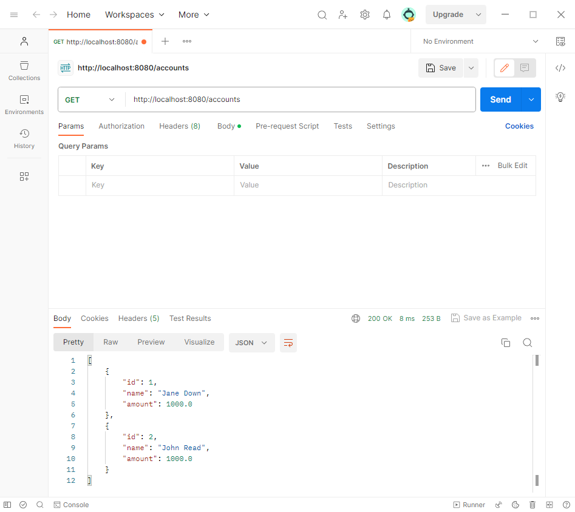

URL: http://localhost:8080/accounts

POST

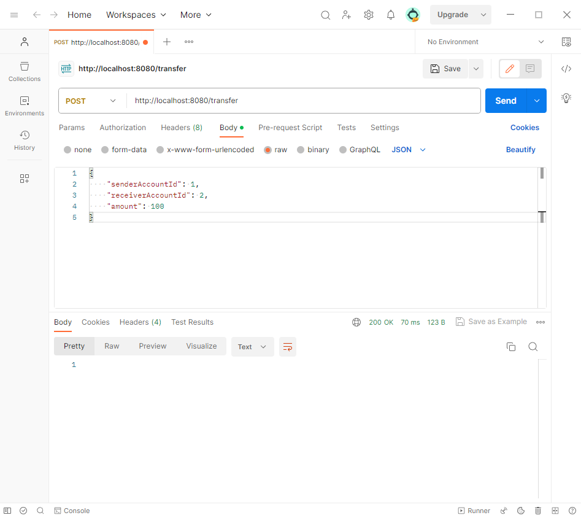

URL: http://localhost:8080/transfer

GET

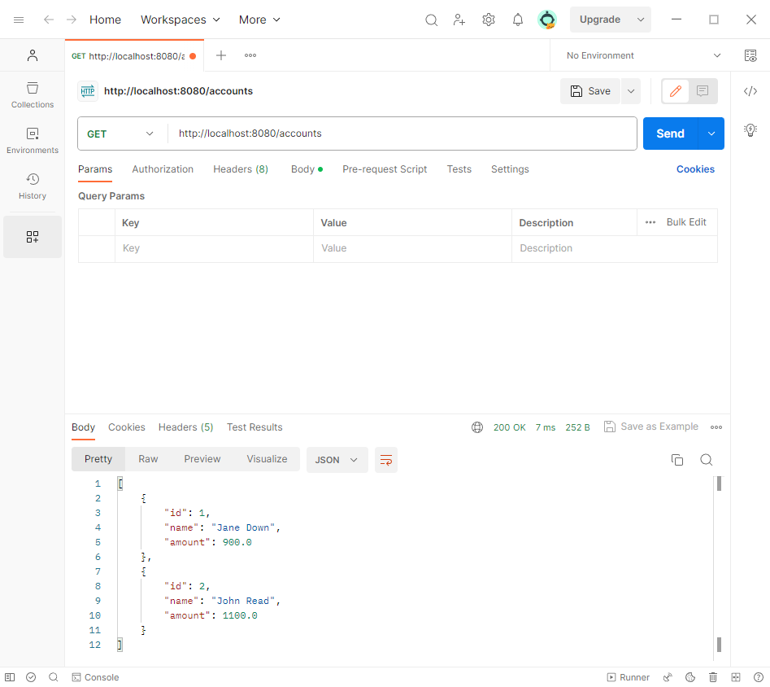

<br />
