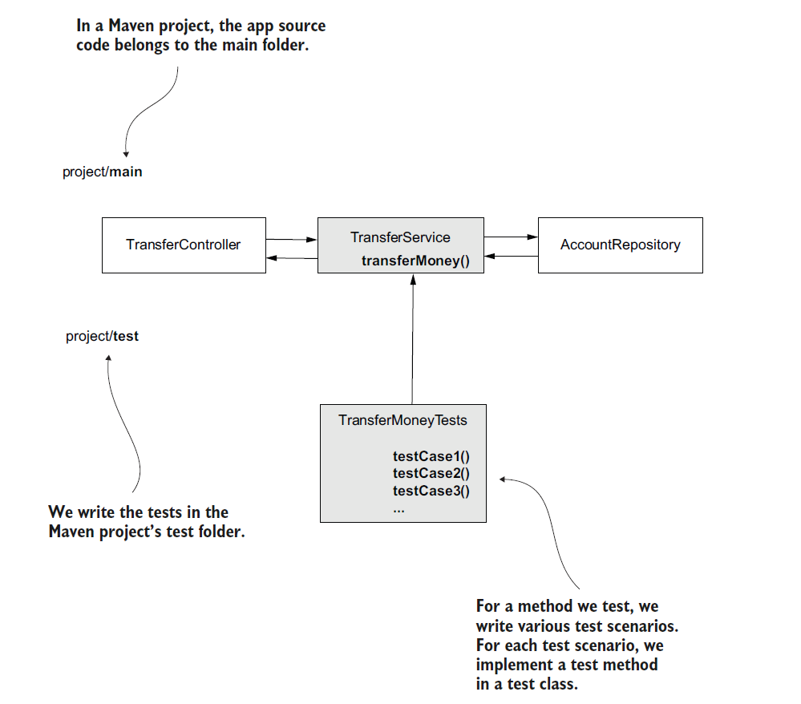
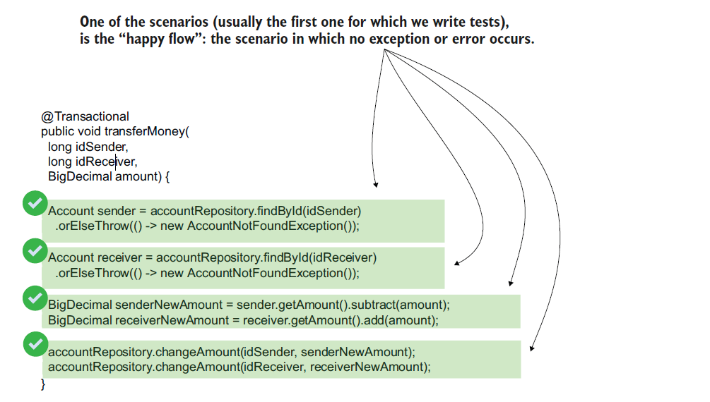
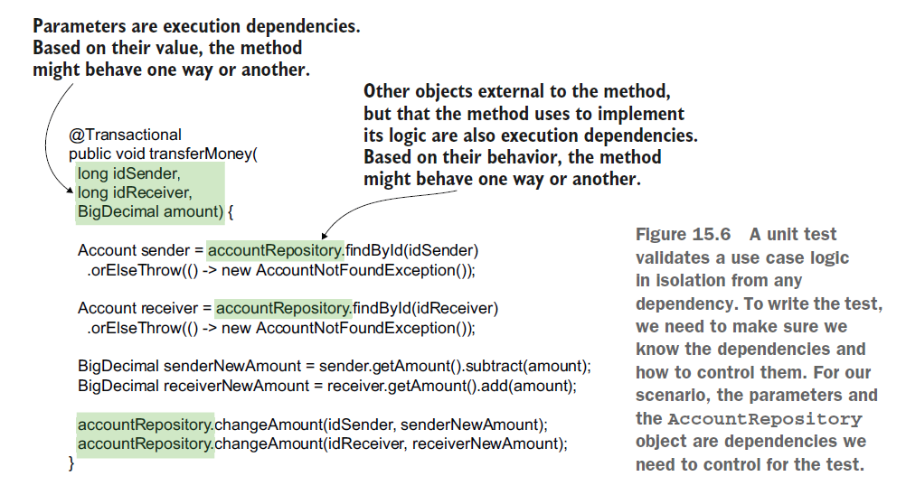
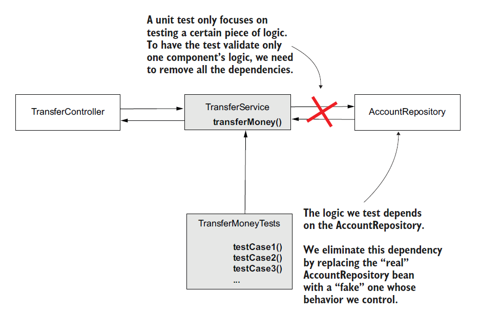
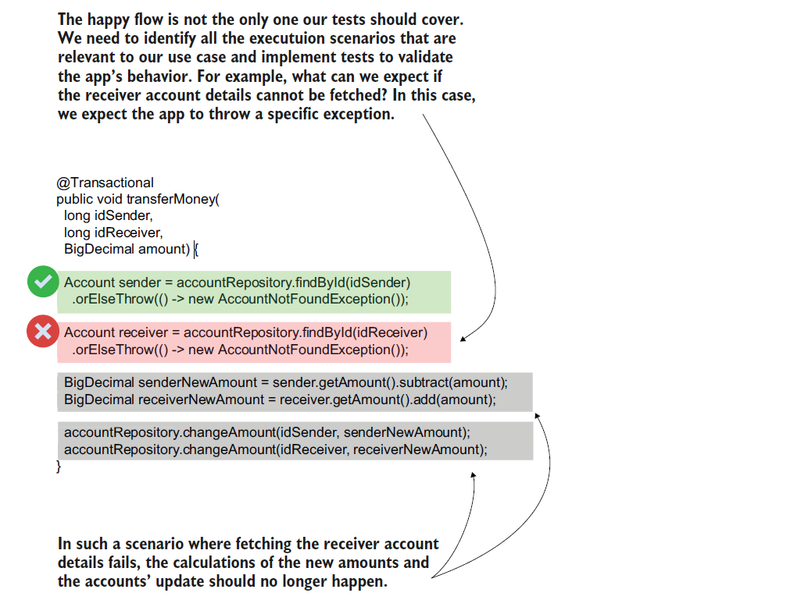
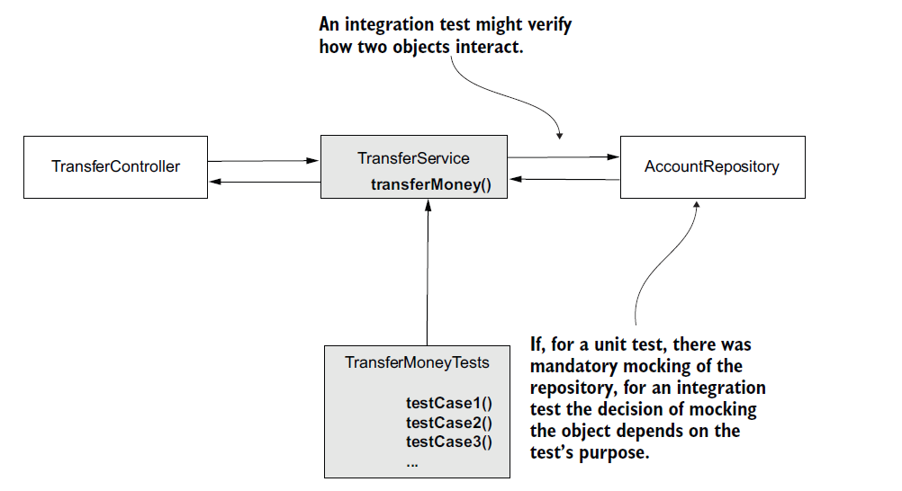

# [Spring Note](../../README.md) - Chapter 15 Testing your Spring app
| Chapter | Title |
| :-: | :- |
| 15.1 | [Tests](#151-tests) |
|  | [Reasons for Writing Tests](#reasons-for-writing-tests) |
|  | [Good Approach](#good-approach) |
|  | [Unit Tests](#unit-tests) |
|  | [Integration Tests](#integration-tests) |
| 15.2 | [Implementing Unit Tests](#152-implementing-unit-tests) |
|  | [Example of Testing a Function](#example-of-testing-a-function) |
|  | [Happy Flow](#happy-flow) |
|  | [Parts of a Test](#parts-of-a-test) |
|  | [Assumptions](#assumptions) |
|  | [Mocks](#mocks) |
|  | [Using @Test](#using-test) |
|  | [Using @ExtendWith, @Mock, @InjectMock, and @Test](#using-extendwith-mock-injectmock-and-test) |
|  | [Writing a Test for an Exception Flow](#writing-a-test-for-an-exception-flow) |
|  | [Testing the Value a Method Returns](#testing-the-value-a-method-returns) |
| 15.3 | [Implementing Integration Tests](#153-implementing-integration-tests) |
|  | [Differences between Unit Test and Integration Test](#differences-between-unit-test-and-integration-test) |
|  | [Example of an Integration Test](#example-of-an-integration-test) |
|  | [Using @SpringBootTest and @MockBean](#using-springboottest-and-mockbean) |

<br />

## 15.1 Tests
- A test is a small piece of logic whose purpose is to validate that a specific capability your app implements works as expected.
- We’ll classify the tests into two categories:
    1. Unit tests
        - Focus only on an isolated piece of logic
    2. Integration tests
        - Focus on validating that multiple components correctly interact with each other
- Tests are essential for any application.
- They ensure that the changes we make during the app’s development process don’t break existing capabilities (or at least they make errors less likely) and also serve as documentation.

### Reasons for Writing Tests
Why should you write a test instead of relying on manually testing a capability?

1. Because you can run that test over and over again to validate things are working as expected with minimum effort (validates the app behaves correctly continuously)
2. Because by reading the test steps you can easily understand the use-case purpose (serves as documentation)
3. Because tests provide early feedback about new application issues during the development process

Why wouldn’t the app’s capabilities work a second time if they initially worked?
1. Because we continuously change the app’s source code to fix bugs or add new features. When you change the source code, you might break previously implemented capabilities.

- If you write tests for those capabilities, you can run them any time you change the app to validate things are still working as expected.
- If you affected some existing functionality, you’d find out what happened before delivering your code to production.
- Regression testing is the approach of constantly testing existing functionality to validate it still
works correctly.

### Good Approach
- A good approach is making sure you test all the relevant scenarios for any specific capability you implement.
- You can then run the tests any time you change something to validate the previously implemented capabilities were not affected by your changes.

### Unit Tests
- Writing unit tests to validate a method’s logic. The unit tests are short, fast to execute, and focus on only one flow.
- These tests are a way to focus on validating a small piece of logic by eliminating all the dependencies.

### Integration Tests
- Writing Spring integration tests to validate a method’s logic and its integration with specific
capabilities the framework provides.
- These tests help you make sure your app’s capabilities still work when you upgrade dependencies.

<br />

## 15.2 Implementing Unit Tests
- Unit tests are methods that call a certain use case in specific conditions to validate behavior.
- The unit test method defines the conditions in which the use case executes and validates the behavior defined by the app’s requirements.
- They eliminate all the dependencies of the capability they test, covering only a specific, isolated piece of logic.
- Unit tests’ purpose is to validate a single unit of logic’s behavior, and like a car’s indicators, they help you identify problems in a specific component.

### Example of Testing a Function
Testing a Function



### Happy Flow

Happy Flow



### Parts of a Test
1. Assumptions
    - We need to define any input and find any dependency of the logic we need to control to achieve the desired flow scenario.
    - For this point, we’ll answer the following questions: what inputs should we provide, and how should dependencies behave for the tested logic to act in the specific way we want?
2. Call/Execution
    - We need to call the logic we test to validate its behavior.
3. Validations
    - We need to define all the validations that need to be done for the given piece of logic.
    - We’ll answer this question: what should happen when this piece of logic is called in the given conditions?

### Assumptions
- In the test’s assumptions, we identify the dependencies for the test case we write the test for.
- We choose the inputs and how the dependencies behave to make the tested logic act in a certain way.
- Which are the dependencies for the money transfer use case?
- Dependencies are anything the method uses but doesn’t create itself:
    1. The method’s parameters
    2. Object instances the method uses but that are not created by it



### Mocks
- When we call the method to test it, we can provide any values for its three parameters to control the execution flow.
- But the AccountRepository instance is a bit more complicated.
- The transferMoney() method execution depends on how the findById() method of the AccountRepository instance behaves.
- But remember, a unit test focuses on only one piece of logic, so it should not call the findById() method.
- The unit test should assume findById() works in a given way and assert that the tested method’s execution does what’s expected for the given situation.
- But the tested method calls findById(). How could we control it? To control such a dependency, we use mocks: a fake object whose behavior we can control.
- In this case, instead of using the real AccountRepository object, we’ll make sure the tested
method uses this fake object.
- We’ll take advantage of controlling how this fake object behaves to induce all the different executions of the transferMoney() method that we want to test.



### Using @Test
TransferServiceUnitTests.java
```Java
public class TransferServiceUnitTests {

    @Test
    @DisplayName("Test the amount is transferred from one account to another if no exception occurs.")
    public void moneyTransferHappyFlow() {
        AccountRepository accountRepository = mock(AccountRepository.class);
        TransferService transferService = new TransferService(accountRepository);

        Account sender = new Account();
        sender.setId(1);
        sender.setAmount(new BigDecimal(1000));

        Account destination = new Account();
        destination.setId(2);
        destination.setAmount(new BigDecimal(1000));

        given(accountRepository.findById(sender.getId())).willReturn(Optional.of(sender));
        given(accountRepository.findById(destination.getId())).willReturn(Optional.of(destination));

        transferService.transferMoney(sender.getId(), destination.getId(), new BigDecimal(100));

        verify(accountRepository).changeAmount(1, new BigDecimal(900));
        verify(accountRepository).changeAmount(2, new BigDecimal(1100));
    }
}
```

### Using @ExtendWith, @Mock, @InjectMock, and @Test
TransferServiceUnitTests.java
```Java
@ExtendWith(MockitoExtension.class)
public class TransferServiceWithAnnotationsUnitTests {

    @Mock
    private AccountRepository accountRepository;

    @InjectMocks
    private TransferService transferService;

    @Test
    public void moneyTransferHappyFlow() {
        Account sender = new Account();
        sender.setId(1);
        sender.setAmount(new BigDecimal(1000));

        Account destination = new Account();
        destination.setId(2);
        destination.setAmount(new BigDecimal(1000));

        given(accountRepository.findById(sender.getId())).willReturn(Optional.of(sender));
        given(accountRepository.findById(destination.getId())).willReturn(Optional.of(destination));

        transferService.transferMoney(sender.getId(), destination.getId(), new BigDecimal(100));

        verify(accountRepository).changeAmount(1, new BigDecimal(900));
        verify(accountRepository).changeAmount(2, new BigDecimal(1100));
    }
}
```

###  Writing a Test for an Exception Flow
Exception Flow



TransferServiceWithAnnotationsUnitTests.java
```Java
@ExtendWith(MockitoExtension.class)
public class TransferServiceWithAnnotationsUnitTests {

    @Mock
    private AccountRepository accountRepository;

    @InjectMocks
    private TransferService transferService;

    @Test
    public void moneyTransferDestinationAccountNotFoundFlow() {
        Account sender = new Account();
        sender.setId(1);
        sender.setAmount(new BigDecimal(1000));

        given(accountRepository.findById(1L)).willReturn(Optional.of(sender));
        given(accountRepository.findById(2L)).willReturn(Optional.empty());

        assertThrows(
                AccountNotFoundException.class,
                () -> transferService.transferMoney(1, 2, new BigDecimal(100))
        );

        verify(accountRepository, never()).changeAmount(anyLong(), any());
    }
}
```

### Testing the Value a Method Returns
LoginControllerUnitTests.java
```Java
@ExtendWith(MockitoExtension.class)
public class LoginControllerUnitTests {

    @Mock
    private Model model;

    @Mock
    private LoginProcessor loginProcessor;

    @InjectMocks
    private LoginController loginController;

    @Test
    public void loginPostLoginSucceedsTest() {
        given(loginProcessor.login()).willReturn(true);

        String result = loginController.loginPost("username", "password", model);

        assertEquals("login.html", result);

        verify(model).addAttribute("message", "You are now logged in.");
    }

    @Test
    public void loginPostLoginFailsTest() {
        given(loginProcessor.login()).willReturn(false);

        String result = loginController.loginPost("username", "password", model);

        assertEquals("login.html", result);

        verify(model).addAttribute("message", "Login Failed");
    }
}
```

<br />

## 15.3 Implementing Integration Tests
- An integration test is very similar to a unit test.
- But instead of focusing on how a particular component works, an integration test focuses on how two or more components interact.

What kind of integrations can we test? We have a few possibilities:
1. Integration between two (or more) objects of your app.
    - Testing that the objects interact correctly helps you identify problems in how they collaborate if you change one of them.
2. Integration of an object of your app with some capability the framework enhances it with.
    - Testing how an object interacts with some capability the framework provides helps you identify issues that can occur when you upgrade the framework to a new version.
    - The integration test helps you immediately identify if something changed in the framework and the capability the object relies on doesn’t work the same way.
3. Integration of the app with its persistence layer (the database).
    - Testing how the repository works with the database ensures you quickly identify problems that might occur when upgrading or changing a dependency that helps your app work with persisted data (such as the JDBC driver).

### Differences between Unit Test and Integration Test

- An integration test looks very similar to a unit test.
- You still follow the same steps of identifying the assumptions, calling the tested method, and validating the results.
- The difference is that now the test doesn’t focus on an isolated piece of logic, so you don’t
necessarily have to mock all the dependencies.
- You might allow a method you test to call another’s real object’s (not a mock’s) method because you want to test the two objects communicate correctly. 
- So, if for a unit test it was mandatory to mock the repository, for an integration test that is no longer mandatory.
- You can still mock it if the test you write doesn’t care about how the service interacts with that repository, but if you want to test how these two objects communicate, you can let the real object be
called.

### Example of an Integration Test



### Using @SpringBootTest and @MockBean

```Java
@SpringBootTest
public class TransferServiceSpringIntegrationTests {

    @MockBean
    private AccountRepository accountRepository;

    @Autowired
    private TransferService transferService;

    @Test
    void transferServiceAmountTest() {
        Account sender = new Account();
        sender.setId(1);
        sender.setAmount(new BigDecimal(1000));

        Account receiver = new Account();
        receiver.setId(2);
        receiver.setAmount(new BigDecimal(1000));

        when(accountRepository.findById(1L)).thenReturn(Optional.of(sender));
        when(accountRepository.findById(2L)).thenReturn(Optional.of(receiver));

        transferService.transferMoney(sender.getId(), receiver.getId(), new BigDecimal(100));

        verify(accountRepository).changeAmount(1, new BigDecimal(900));
        verify(accountRepository).changeAmount(2, new BigDecimal(1100));
    }
}
```

<br />
