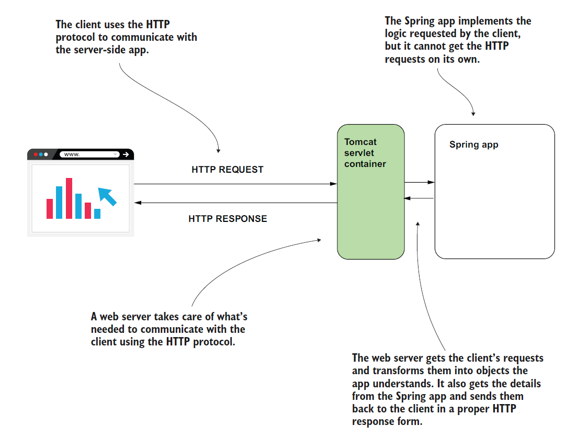
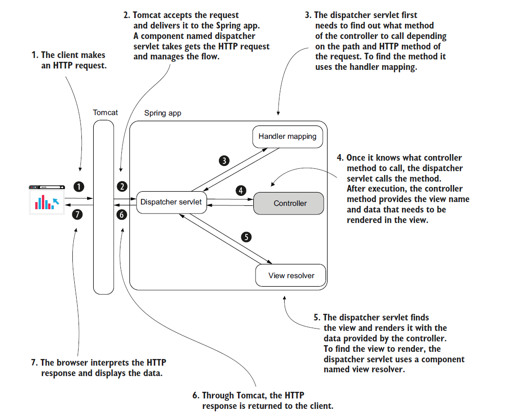
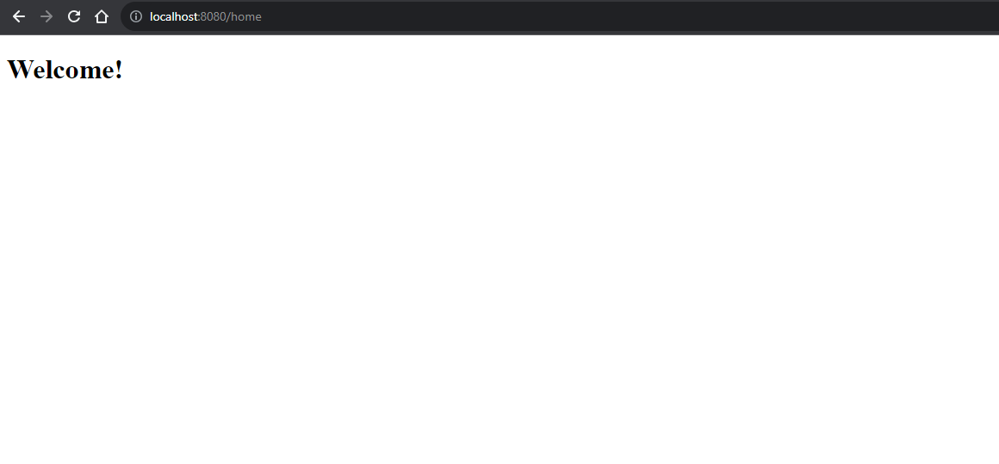

# [Spring Note](../../README.md) - Chapter 7 Understanding Spring Boot and Spring MVC
| Chapter | Title |
| :-: | :- |
| 7.1 | [Servlet Container](#71-servlet-container) |
| 7.2 | [Spring Boot Starter](#72-spring-boot-starter) |
|  | [Spring Boot Starter Parent](#spring-boot-starter-parent) |
|  | [Spring Boot Starter Dependency](#spring-boot-starter-dependency) |
|  | [Spring Boot Starter Test Dependency](#spring-boot-starter-test-dependency) |
|  | [Spring Boot Maven Plugin](#spring-boot-maven-plugin) |
|  | [Using @SpringBootApplication to Create a Spring Initializr](#using-springbootapplication-to-create-a-spring-initializr) |
| 7.3 | [Implementing a Web App with Spring MVC](#73-implementing-a-web-app-with-spring-mvc) |
|  | [Spring Boot Starter Web Dependency](#spring-boot-starter-web-dependency) |
|  | [Using @Controller and @RequestMapping to Create a Response](#using-controller-and-requestmapping-to-create-a-response) |

<br />

## 7.1 Servlet Container
- A translator of the HTTP messages for your Java app.
- This way, your Java app doesn’t need to take care of implementing the communication layer.
- One of the most appreciated servlet container implementations is Tomcat, which is also the dependency we’ll use for the examples in this book.
- When the servlet container gets an HTTP request, it calls a servlet object’s method and provides the request as a parameter.
- The same method also gets a parameter representing the HTTP response used by the servlet to set the
response sent back to the client that made the request.

Servlet Container Diagram



<br />

## 7.2 Spring Boot Starter
### Spring Boot Starter Parent
pom.xml
```XML
<parent>
	<groupId>org.springframework.boot</groupId>
	<artifactId>spring-boot-starter-parent</artifactId>
	<version>3.1.2</version>
	<relativePath/>
</parent>
```

### Spring Boot Starter Dependency
pom.xml
```XML
<dependency>
	<groupId>org.springframework.boot</groupId>
	<artifactId>spring-boot-starter</artifactId>
</dependency>
```

### Spring Boot Starter Test Dependency
pom.xml
```XML
<dependency>
	<groupId>org.springframework.boot</groupId>
	<artifactId>spring-boot-starter-test</artifactId>
	<scope>test</scope>
</dependency>
```

### Spring Boot Maven Plugin
pom.xml
```XML
<plugin>
	<groupId>org.springframework.boot</groupId>
	<artifactId>spring-boot-maven-plugin</artifactId>
</plugin>
```

### Using @SpringBootApplication to Create a Spring Initializr
Main.java
```Java
@SpringBootApplication
public class SpringStartHereApplication {

	public static void main(String[] args) {
		SpringApplication.run(SpringStartHereApplication.class, args);
	}
}
```

<br />

## 7.3 Implementing a Web App with Spring MVC
- Tomcat instance by default accessible on port 8080.

### Spring Boot Starter Web Dependency
pom.xml
```XML
<dependency>
    <groupId>org.springframework.boot</groupId>
    <artifactId>spring-boot-starter-web</artifactId>
</dependency>
```

### Using @Controller and @RequestMapping to Create a Response
- The controller is a component of the web app that contains methods (often named actions) executed for a
specific HTTP request.
- In the end, the controller’s action returns a reference to the web page the app returns in response.
- Say you want the browser to display this page’s content when the user accesses the /home path.
- To achieve this result, you annotate the action method with the @RequestMapping annotation specifying the path as a value of the annotation: @RequestMapping("/home").
- The method needs to return, as a string, the name of the document you want the app to send as a response.

System Design Diagram



home.html
```HTML
<!DOCTYPE html>
<html lang="en">
<head>
    <meta charset="UTF-8">
    <title>Home Page</title>
</head>
<body>
    <h1>Welcome!</h1>
</body>
</html>
```

MainController.java
```Java
@Controller
public class MainController {

    @RequestMapping("/home")
    public String home() {
        return "home.html";
    }
}
```

Main.java
```Java
@SpringBootApplication
public class SpringStartHereApplication {

	public static void main(String[] args) {
		SpringApplication.run(SpringStartHereApplication.class, args);
	}
}
```

URL: http://localhost:8080/home



<br />
