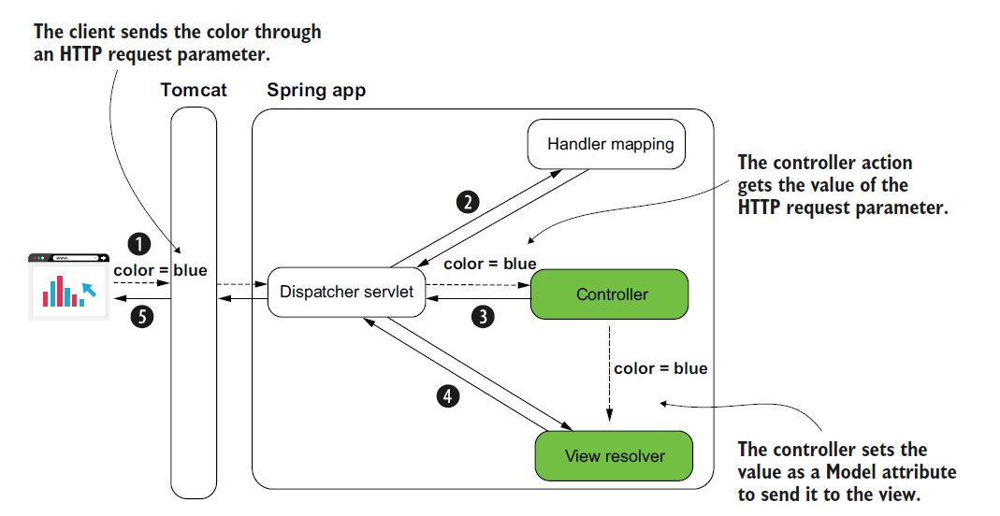

# [Spring Note](../../README.md) - Chapter 8 Implementing web apps with Spring Boot and Spring MVC
| Chapter | Title |
| :-: | :- |
| 8.1 | [ Implementing a Web App with Dynamic View](#81-implementing-a-web-app-with-dynamic-view) |
|  | [Spring Boot Starter Thymeleaf Dependency](#spring-boot-starter-thymeleaf-dependency) |
|  | [Using the Model to Return Key-Value Pairs](#using-the-model-to-return-key-value-pairs) |
| 8.2 | [Sending Data through a HTTP Request](#82-sending-data-through-a-http-request) |
|  | [HTTP Request Parameter](#http-request-parameter) |
|  | [HTTP Request Header](#http-request-header) |
|  | [HTTP Request Body](#http-request-body) |
|  | [Path Variable](#path-variable) |
| 8.3 | [Using the Request Parameter to Send Data](#83-using-the-request-parameter-to-send-data) |
|  | [Scenarios of Using Request Parameters](#scenarios-of-using-request-parameters) |
|  | [Using @RequestParam to Get the Value of a Request Parameter](#using-requestparam-to-get-the-value-of-a-request-parameter) |
| 8.4 | [Using Multiple Request Parameters to Send Data](#84-using-multiple-request-parameters-to-send-data) |
| 8.5 | [Optional Multiple Request Parameters](#85-optional-multiple-request-parameters) |
| 8.6 | [Using the Path Variable to Send Data](#86-using-the-path-variable-to-send-data) |
|  | [Using @PathVariable to Get the Value of a Path Variable](#using-pathvariable-to-get-the-value-of-a-path-variable) |
| 8.7 | [HTTP Methods](#87-http-methods) |
| 8.8 | [Using the GET and POST HTTP Methods](#88-using-the-get-and-post-http-methods) |
| 8.9 | [Using @GetMapping and @PostMapping to Replace @RequestMapping](#89-using-getmapping-and-postmapping-to-replace-requestmapping) |
| 8.10 | [Using One Parameter to Replace Multiple @RequestParam](#810-using-one-parameter-to-replace-multiple-requestparam) |

<br />

## 8.1 Implementing a Web App with Dynamic View
### Spring Boot Starter Thymeleaf Dependency
pom.xml
```XML
<dependency>
    <groupId>org.springframework.boot</groupId>
    <artifactId>spring-boot-starter-thymeleaf</artifactId>
</dependency>
```

### Using the Model to Return Key-Value Pairs
home.html
```html
<!DOCTYPE html>
<html lang="en" xmlns:th="http://www.thymeleaf.org">
<head>
    <meta charset="UTF-8">
    <title>Home Page</title>
</head>
<body>
    <h1>Welcome
        <span th:style="'color:' + ${color}"
              th:text="${username}"></span>!</h1>
</body>
</html>
```

MainController.java
```Java
@Controller
public class MainController {

    @RequestMapping("/home")
    public String home(Model model) {
        model.addAttribute("username", "Katy");
        model.addAttribute("color", "red");
        return "home.html";
    }
}
```

SpringStartHereApplication.java
```Java
@SpringBootApplication
public class SpringStartHereApplication {

	public static void main(String[] args) {
		SpringApplication.run(SpringStartHereApplication.class, args);
	}
}
```

URL: http://localhost:8080/home


<br />

## 8.2 Sending Data through a HTTP Request
1. HTTP Request Parameter
2. HTTP Request Header
3. HTTP Request Body
3. Path Variable

### HTTP Request Parameter
- An HTTP request parameter represents a simple way to send values from client to
server in a key-value(s) pair format.
- To send HTTP request parameters, you append them to the URI in a request query expression.
- They are also called query parameters.
- You should use this approach only for sending a small quantity of data.

### HTTP Request Header
- An HTTP request header is similar to the request parameters in that the request headers are sent through the HTTP header.
- The big difference is that they don’t appear in the URI, but you still cannot send large quantities of data using HTTP headers.

### HTTP Request Body
- The HTTP request body is mainly used to send a larger quantity of data (formatted
as a string, but sometimes even binary data such as a file).

### Path Variable
- A path variable sends data through the request path itself.
- It is the same as for the request parameter approach: you use a path variable to send a small quantity of
data.
- But we should use path variables when the value you send is mandatory.

<br />

## 8.3 Using the Request Parameter to Send Data
### Scenarios of Using Request Parameters
1. The quantity of data you send is not large.
    - You set the request parameters using query variables (as shown in this section’s example).
    - This approach limits you to about 2,000 characters.
2. You need to send optional data.
    - A request parameter is a clean way to deal with a value the client might not send.
    - The server can expect to not get a value for specific request parameters.
    
### Using @RequestParam to Get the Value of a Request Parameter
System Design Diagram



home.html
```html
<!DOCTYPE html>
<html lang="en" xmlns:th="http://www.thymeleaf.org">
<head>
    <meta charset="UTF-8">
    <title>Home Page</title>
</head>
<body>
    <h1>Welcome
        <span th:style="'color:' + ${color}"
              th:text="${username}"></span>!</h1>
</body>
</html>
```

MainController.java
```Java
@Controller
public class MainController {

    @RequestMapping("/home")
    public String home(@RequestParam String color, Model model) {
        model.addAttribute("username", "Katy");
        model.addAttribute("color", color);
        return "home.html";
    }
}
```

SpringStartHereApplication.java
```Java
@SpringBootApplication
public class SpringStartHereApplication {

	public static void main(String[] args) {
		SpringApplication.run(SpringStartHereApplication.class, args);
	}
}
```

URL: http://localhost:8080/home?color=blue


<br />

## 8.4 Using Multiple Request Parameters to Send Data
home.html
```html
<!DOCTYPE html>
<html lang="en" xmlns:th="http://www.thymeleaf.org">
<head>
    <meta charset="UTF-8">
    <title>Home Page</title>
</head>
<body>
    <h1>Welcome
        <span th:style="'color:' + ${color}"
              th:text="${username}"></span>!</h1>
</body>
</html>
```

MainController.java
```Java
@Controller
public class MainController {

    @RequestMapping("/home")
    public String home(@RequestParam String name, @RequestParam String color, Model model) {
        model.addAttribute("username", name);
        model.addAttribute("color", color);
        return "home.html";
    }
}
```

SpringStartHereApplication.java
```Java
@SpringBootApplication
public class SpringStartHereApplication {

	public static void main(String[] args) {
		SpringApplication.run(SpringStartHereApplication.class, args);
	}
}
```

URL: http://localhost:8080/home?color=blue&name=Jane


<br />

## 8.5 Optional Multiple Request Parameters
- A request parameter is mandatory by default. If the client doesn’t provide a value for it, the server sends back a response with the status HTTP “400 Bad Request.”
- If you wish the value to be optional, you need to explicitly specify this on the annotation using the optional attribute: @RequestParam(required = false).

home.html
```html
<!DOCTYPE html>
<html lang="en" xmlns:th="http://www.thymeleaf.org">
<head>
    <meta charset="UTF-8">
    <title>Home Page</title>
</head>
<body>
    <h1>Welcome
        <span th:style="'color:' + ${color}"
              th:text="${username}"></span>!</h1>
</body>
</html>
```

MainController.java
```Java
@Controller
public class MainController {

    @RequestMapping("/home")
    public String home(@RequestParam(required = false) String name, @RequestParam(required = false) String color, Model model) {
        model.addAttribute("username", name);
        model.addAttribute("color", color);
        return "home.html";
    }
}
```

SpringStartHereApplication.java
```Java
@SpringBootApplication
public class SpringStartHereApplication {

	public static void main(String[] args) {
		SpringApplication.run(SpringStartHereApplication.class, args);
	}
}
```
URL: http://localhost:8080/home?name=Jane


<br />

## 8.6 Using the Path Variable to Send Data
### Using @PathVariable to Get the Value of a Path Variable
- You don’t identify the value with a key anymore.
- You just take that value from a precise position in the path.
- On the server side, you extract that value from the path from the specific position.
- You may have more than one value provided as a path variable, but it’s generally better to avoid using more than a couple.
- You’ll observe that the path becomes more challenging to read if you go with more than two path variables.

home.html
```html
<!DOCTYPE html>
<html lang="en" xmlns:th="http://www.thymeleaf.org">
<head>
    <meta charset="UTF-8">
    <title>Home Page</title>
</head>
<body>
    <h1>Welcome
        <span th:style="'color:' + ${color}"
              th:text="${username}"></span>!</h1>
</body>
</html>
```

MainController.java
```Java
@Controller
public class MainController {

    @RequestMapping("/home/{color}")
    public String home(@PathVariable String color, Model model) {
        model.addAttribute("username", "Katy");
        model.addAttribute("color", color);
        return "home.html";
    }
}
```

SpringStartHereApplication.java
```Java
@SpringBootApplication
public class SpringStartHereApplication {

	public static void main(String[] args) {
		SpringApplication.run(SpringStartHereApplication.class, args);
	}
}
```

URL: http://localhost:8080/home/red


<br />

## 8.7 HTTP Methods
| HTTP Method | Description |
| :-- | :-- |
| GET | The client’s request only retrieves data. |
| POST | The client’s request sends new data to be added by the server. |
| PUT | The client’s request changes a data record on the server side. |
| PATCH | The client’s request partially changes a data record on the server side. |
| DELETE | The client’s request deletes data on the server side. |

<br />

## 8.8 Using the GET and POST HTTP Methods
products.html
```html
<!DOCTYPE html>
<html lang="en" xmlns:th="http://www.thymeleaf.org">
<head>
    <meta charset="UTF-8">
    <title>Home Page</title>
</head>
<body>
    <h1>Products</h1>

    <h2>View products</h2>

    <table>
        <tr>
            <th>PRODUCT NAME</th>
            <th>PRODUCT PRICE</th>
        </tr>
        <tr th:each="p: ${products}">
            <td th:text="${p.name}"></td>
            <td th:text="${p.price}"></td>
        </tr>
    </table>

    <h2>Add a product</h2>
    <form action="/products" method="post">
        Name: <input type="text" name="name"><br/>
        Price: <input type="number" step="any" name="price"><br/>
        <button type="submit">Add product</button>
    </form>
</body>
</html>
```

Product.java
```Java
public class Product {

    private String name;
    private double price;

    public String getName() {
        return name;
    }

    public void setName(String name) {
        this.name = name;
    }

    public double getPrice() {
        return price;
    }

    public void setPrice(double price) {
        this.price = price;
    }
}
```

ProductService.java
```Java
@Service
public class ProductService {

    private List<Product> products = new ArrayList<>();

    public void addProduct(Product p) {
        products.add(p);
    }

    public List<Product> findAll() {
        return products;
    }
}
```

ProductController.java
```Java
@Controller
public class ProductController {

    private final ProductService productService;

    @Autowired
    public ProductController(ProductService productService) {
        this.productService = productService;
    }

    @RequestMapping("/products")
    public String viewProducts(Model model) {
        var products = productService.findAll();
        model.addAttribute("products", products);

        return "products.html";
    }

    @RequestMapping(path = "/products", method = RequestMethod.POST)
    public String addProduct(@RequestParam String name, @RequestParam double price, Model model) {
        Product p = new Product();
        p.setName(name);
        p.setPrice(price);
        productService.addProduct(p);

        var products = productService.findAll();
        model.addAttribute("products", products);

        return "products.html";
    }
}
```

SpringStartHereApplication.java
```Java
@SpringBootApplication
public class SpringStartHereApplication {

	public static void main(String[] args) {
		SpringApplication.run(SpringStartHereApplication.class, args);
	}
}
```

URL: http://localhost:8080/products


<br />

## 8.9 Using @GetMapping and @PostMapping to Replace @RequestMapping
products.html
```html
<!DOCTYPE html>
<html lang="en" xmlns:th="http://www.thymeleaf.org">
<head>
    <meta charset="UTF-8">
    <title>Home Page</title>
</head>
<body>
    <h1>Products</h1>

    <h2>View products</h2>

    <table>
        <tr>
            <th>PRODUCT NAME</th>
            <th>PRODUCT PRICE</th>
        </tr>
        <tr th:each="p: ${products}">
            <td th:text="${p.name}"></td>
            <td th:text="${p.price}"></td>
        </tr>
    </table>

    <h2>Add a product</h2>
    <form action="/products" method="post">
        Name: <input type="text" name="name"><br/>
        Price: <input type="number" step="any" name="price"><br/>
        <button type="submit">Add product</button>
    </form>
</body>
</html>
```

Product.java
```Java
public class Product {

    private String name;
    private double price;

    public String getName() {
        return name;
    }

    public void setName(String name) {
        this.name = name;
    }

    public double getPrice() {
        return price;
    }

    public void setPrice(double price) {
        this.price = price;
    }
}
```

ProductService.java
```Java
@Service
public class ProductService {

    private List<Product> products = new ArrayList<>();

    public void addProduct(Product p) {
        products.add(p);
    }

    public List<Product> findAll() {
        return products;
    }
}
```

ProductController.java
```Java
@Controller
public class ProductController {

    private final ProductService productService;

    @Autowired
    public ProductController(ProductService productService) {
        this.productService = productService;
    }

    @GetMapping("/products")
    public String viewProducts(Model model) {
        var products = productService.findAll();
        model.addAttribute("products", products);

        return "products.html";
    }

    @PostMapping("/products")
    public String addProduct(@RequestParam String name, @RequestParam double price, Model model) {
        Product p = new Product();
        p.setName(name);
        p.setPrice(price);
        productService.addProduct(p);

        var products = productService.findAll();
        model.addAttribute("products", products);

        return "products.html";
    }
}
```

SpringStartHereApplication.java
```Java
@SpringBootApplication
public class SpringStartHereApplication {

	public static void main(String[] args) {
		SpringApplication.run(SpringStartHereApplication.class, args);
	}
}
```

<br />

## 8.10 Using One Parameter to Replace Multiple @RequestParam
- Because the request parameters’ names are the same as the Product class attributes’ names, Spring knows to match them and automatically creates the object.
- You can use the model class as a parameter of the controller’s action directly.
- Spring knows to create the instance based on the request attributes.
- The model class needs to have a default constructor to allow Spring to create the instance before calling the action method.

products.html
```html
<!DOCTYPE html>
<html lang="en" xmlns:th="http://www.thymeleaf.org">
<head>
    <meta charset="UTF-8">
    <title>Home Page</title>
</head>
<body>
    <h1>Products</h1>

    <h2>View products</h2>

    <table>
        <tr>
            <th>PRODUCT NAME</th>
            <th>PRODUCT PRICE</th>
        </tr>
        <tr th:each="p: ${products}">
            <td th:text="${p.name}"></td>
            <td th:text="${p.price}"></td>
        </tr>
    </table>

    <h2>Add a product</h2>
    <form action="/products" method="post">
        Name: <input type="text" name="name"><br/>
        Price: <input type="number" step="any" name="price"><br/>
        <button type="submit">Add product</button>
    </form>
</body>
</html>
```

Product.java
```Java
public class Product {

    private String name;
    private double price;

    public String getName() {
        return name;
    }

    public void setName(String name) {
        this.name = name;
    }

    public double getPrice() {
        return price;
    }

    public void setPrice(double price) {
        this.price = price;
    }
}
```

ProductService.java
```Java
@Service
public class ProductService {

    private List<Product> products = new ArrayList<>();

    public void addProduct(Product p) {
        products.add(p);
    }

    public List<Product> findAll() {
        return products;
    }
}
```

ProductController.java
```Java
@Controller
public class ProductController {

    private final ProductService productService;

    @Autowired
    public ProductController(ProductService productService) {
        this.productService = productService;
    }

    @GetMapping("/products")
    public String viewProducts(Model model) {
        var products = productService.findAll();
        model.addAttribute("products", products);

        return "products.html";
    }

    @PostMapping("/products")
    public String addProduct(Product p, Model model) {
        productService.addProduct(p);

        var products = productService.findAll();
        model.addAttribute("products", products);

        return "products.html";
    }
}
```

SpringStartHereApplication.java
```Java
@SpringBootApplication
public class SpringStartHereApplication {

	public static void main(String[] args) {
		SpringApplication.run(SpringStartHereApplication.class, args);
	}
}
```

<br />
