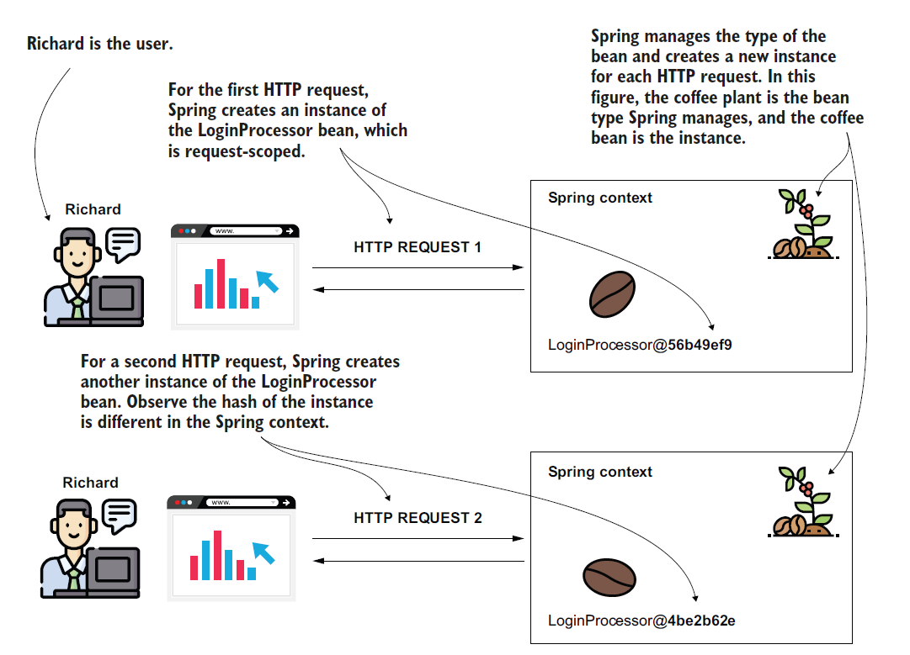
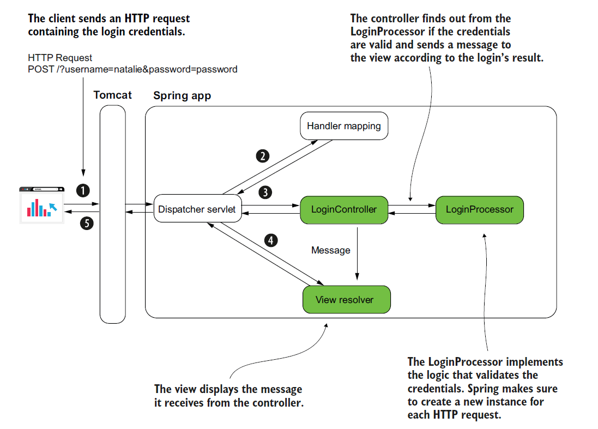
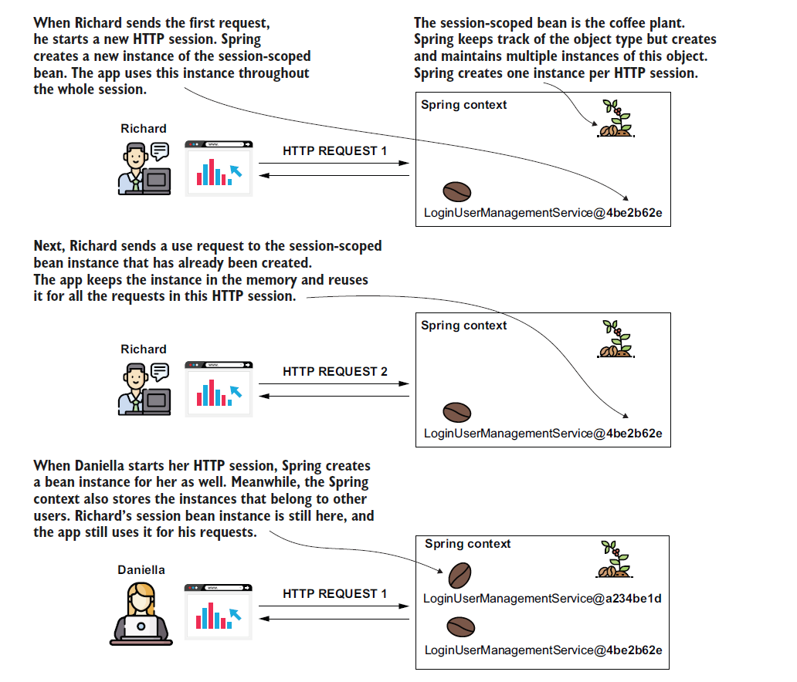
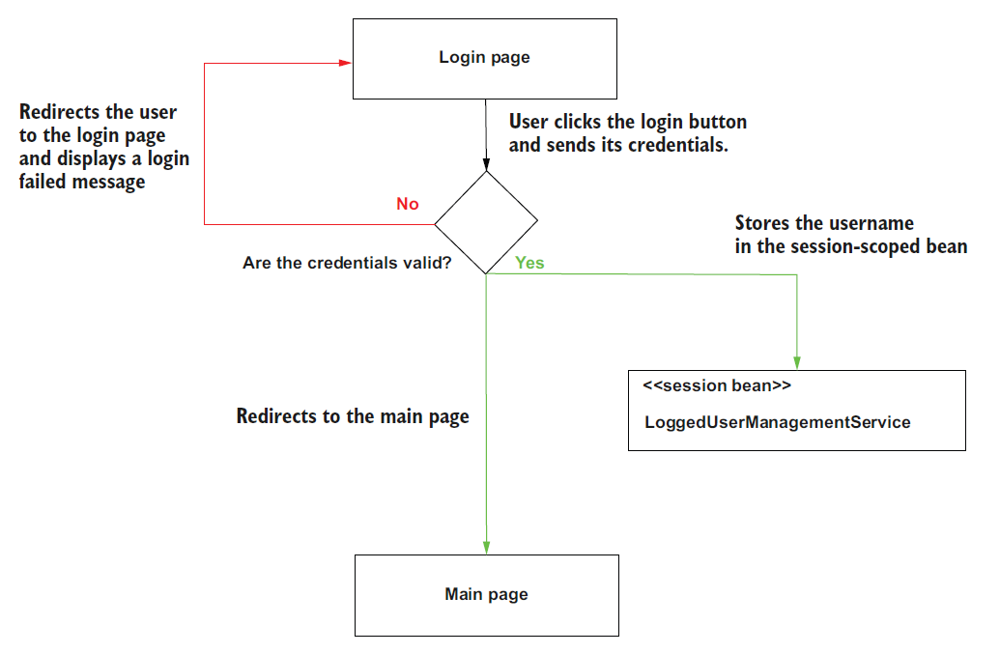
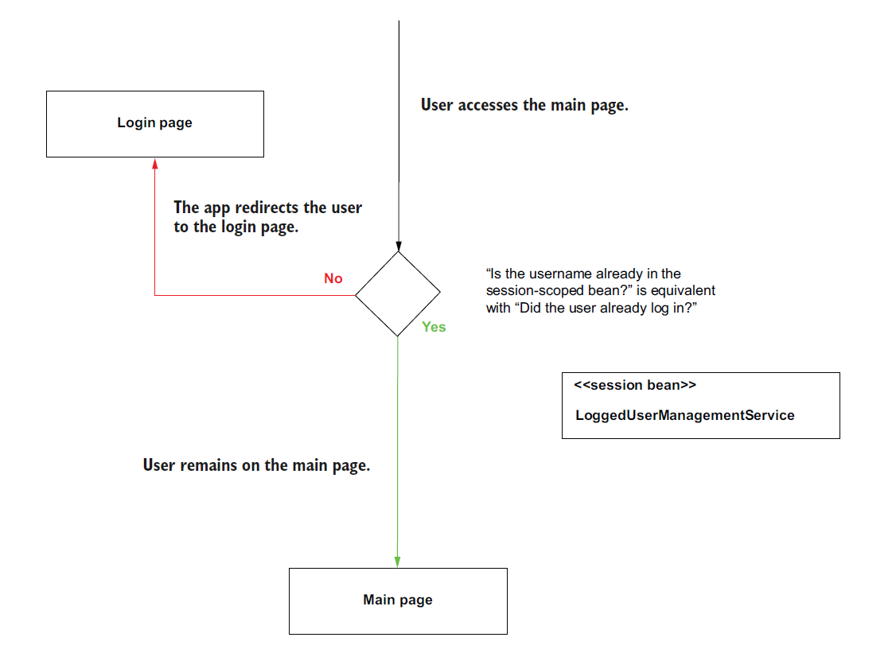
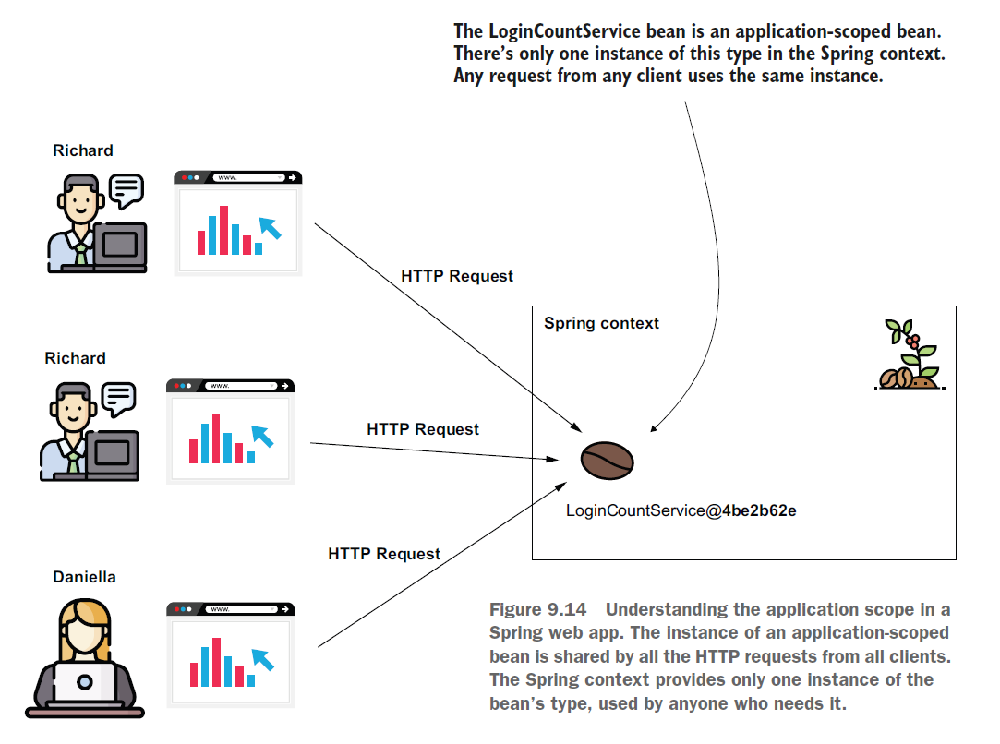
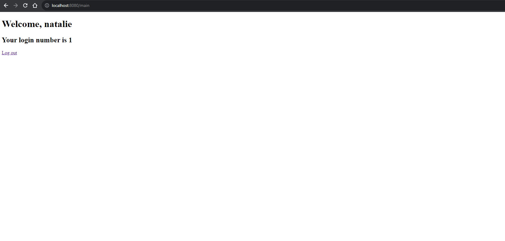

# [Spring Note](../../README.md) - Chapter 9 Using the Spring web scopes
| Chapter | Title |
| :-: | :- |
| 9.1 | [Request Scope](#91-request-scope) |
|  | [Using @RequestScope to Create a Reuest Scope](#using-requestscope-to-create-a-reuest-scope) |
| 9.2 | [Session Scope](#92-session-scope) |
|  | [Using @SessionScope to Create a Session Scope](#using-sessionscope-to-create-a-session-scope) |
| 9.3 | [Application Scope](#93-application-scope) |
|  | [Using @ApplicationScope to Create a Application Scope](#using-applicationscope-to-create-a-application-scope) |

<br />

## 9.1 Request Scope
- A request-scoped bean is an object managed by Spring, for which the framework creates a new instance for every HTTP request.
- The app can use the instance only for the request that created it.
- Any new HTTP request (from the same or other clients) creates and uses a different instance of the same class.

Request Scope Diagram



### Using @RequestScope to Create a Reuest Scope
System Design Diagram



login.html
```html
<!DOCTYPE html>
<html lang="en" xmlns:th="http://www.thymeleaf.org">
<head>
    <meta charset="UTF-8">
    <title>Login</title>
</head>
<body>
<form action="/" method="post">
    Username: <input type="text" name="username"/><br/>
    Password: <input type="password" name="password"/><br/>
    <button type="submit">Log in</button>
</form>

<p th:text="${message}"></p>
</body>
</html>
```

LoginProcessor.java
```Java
@Component
@RequestScope
public class LoginProcessor {

    private String username;
    private String password;

    public String getUsername() {
        return username;
    }

    public void setUsername(String username) {
        this.username = username;
    }

    public String getPassword() {
        return password;
    }

    public void setPassword(String password) {
        this.password = password;
    }

    public boolean login() {
        return "natalie".equals(username) && "password".equals(password);
    }
}
```

LoginController.java
```Java
@Controller
public class LoginController {

    private final LoginProcessor loginProcessor;

    @Autowired
    public LoginController(LoginProcessor loginProcessor) {
        this.loginProcessor = loginProcessor;
    }

    @GetMapping("/")
    public String loginGet() {
        return "login.html";
    }

    @PostMapping("/")
    public String loginPost(@RequestParam String username, @RequestParam String password, Model model) {
        loginProcessor.setUsername(username);
        loginProcessor.setPassword(password);
        boolean loggedIn = loginProcessor.login();

        if (loggedIn) {
            model.addAttribute("message", "You are now logged in.");
        } else {
            model.addAttribute("message", "Login Failed");
        }

        return "login.html";
    }
}
```

SpringStartHereApplication.java
```Java
@SpringBootApplication
public class SpringStartHereApplication {

    public static void main(String[] args) {
        SpringApplication.run(SpringStartHereApplication.class, args);
    }
}
```

URL: http://localhost:8080/

Log In


Login Succeeded with Username = "natalie" and Password = "password"


Login Failed with Username = "" and Password = ""


<br />

## 9.2 Session Scope
- A session-scoped bean is an object managed by Spring, for which Spring creates an instance and links it to the HTTP session.
- Once a client sends a request to the server, the server reserves a place in the memory for this request, for the whole duration of their session.
- Spring creates an instance of a session-scoped bean when the HTTP session is created for a specific client.
- That instance can be reused for the same client while it still has the HTTP session active.
- The data you store in the sessionscoped bean attribute is available for all the client’s requests throughout an HTTP session.
- This approach of storing the data allows you to store information about what users do while they’re surfing through the pages of your app.

Session Scope Diagram



### Using @SessionScope to Create a Session Scope
Logic Flow Diagram





login.html
```html
<!DOCTYPE html>
<html lang="en" xmlns:th="http://www.thymeleaf.org">
<head>
    <meta charset="UTF-8">
    <title>Login</title>
</head>
<body>
<form action="/" method="post">
    Username: <input type="text" name="username"/><br/>
    Password: <input type="password" name="password"/><br/>
    <button type="submit">Log in</button>
</form>

<p th:text="${message}"></p>
</body>
</html>
```

main.html
```html
<!DOCTYPE html>
<html lang="en">
<head>
    <meta charset="UTF-8">
    <title>Login</title>
</head>
<body>
<h1>Welcome, <span th:text="${username}"></span></h1>
<a href="/main?logout">Log out</a>
</body>
</html>
```

LoginProcessor.java
```Java
@Component
@RequestScope
public class LoginProcessor {

    private final LoggedUserManagementService loggedUserManagementService;

    private String username;
    private String password;

    @Autowired
    public LoginProcessor(LoggedUserManagementService loggedUserManagementService) {
        this.loggedUserManagementService = loggedUserManagementService;
    }

    public String getUsername() {
        return username;
    }

    public void setUsername(String username) {
        this.username = username;
    }

    public String getPassword() {
        return password;
    }

    public void setPassword(String password) {
        this.password = password;
    }

    public boolean login() {
        if ("natalie".equals(username) && "password".equals(password)) {
            loggedUserManagementService.setUsername(username);
            return true;
        }

        return false;
    }
}
```

LoggedUserManagementService.java
```Java
@Service
@SessionScope
public class LoggedUserManagementService {

    private String username;

    public String getUsername() {
        return username;
    }

    public void setUsername(String username) {
        this.username = username;
    }
}
```

LoginController.java
```Java
@Controller
public class LoginController {

    private final LoginProcessor loginProcessor;

    @Autowired
    public LoginController(LoginProcessor loginProcessor) {
        this.loginProcessor = loginProcessor;
    }

    @GetMapping("/")
    public String loginGet() {
        return "login.html";
    }

    @PostMapping("/")
    public String loginPost(@RequestParam String username, @RequestParam String password, Model model) {
        loginProcessor.setUsername(username);
        loginProcessor.setPassword(password);
        boolean loggedIn = loginProcessor.login();

        if (loggedIn) {
            return "redirect:/main";
        }

        model.addAttribute("message", "Login Failed");
        return "login.html";
    }
}
```

MainController.java
```Java
@Controller
public class MainController {

    private final LoggedUserManagementService loggedUserManagementService;

    @Autowired
    public MainController(LoggedUserManagementService loggedUserManagementService) {
        this.loggedUserManagementService = loggedUserManagementService;
    }

    @GetMapping("/main")
    public String home(@RequestParam(required = false) String logout, Model model) {
        if (logout != null) {
            loggedUserManagementService.setUsername(null);
        }

        String username = loggedUserManagementService.getUsername();

        if (username == null) {
            return "redirect:/";
        }

        model.addAttribute("username", username);
        return "main.html";
    }
}
```

SpringStartHereApplication.java
```Java
@SpringBootApplication
public class SpringStartHereApplication {

    public static void main(String[] args) {
        SpringApplication.run(SpringStartHereApplication.class, args);
    }
}
```

URL: URL: http://localhost:8080/

Log In


<br />

## 9.3 Application Scope
- The application scope is close to how a singleton works.
- The difference is that you can’t have more instances of the same type in the context and that we always use the HTTP requests as a reference point when discussing the life cycle of web scopes (including the application scope).
- We face the same concurrency problems for the singleton beans for application-scoped beans: it’s better to have immutable attributes for the singleton beans.
- The same advice is applicable to an application-scoped bean.
- But if you make the attributes immutable, then you can directly use a singleton bean instead.
- Generally, I recommend developers avoid using application-scoped beans.
- It’s better to directly use a persistence layer, such as a database.

Application Scope Diagram



### Using @ApplicationScope to Create a Application Scope
login.html
```html
<!DOCTYPE html>
<html lang="en" xmlns:th="http://www.thymeleaf.org">
<head>
    <meta charset="UTF-8">
    <title>Login</title>
</head>
<body>
<form action="/" method="post">
    Username: <input type="text" name="username"/><br/>
    Password: <input type="password" name="password"/><br/>
    <button type="submit">Log in</button>
</form>

<p th:text="${message}"></p>
</body>
</html>
```

main.html
```html
<!DOCTYPE html>
<html lang="en">
<head>
    <meta charset="UTF-8">
    <title>Login</title>
</head>
<body>
<h1>Welcome, <span th:text="${username}"></span></h1>
<h2>Your login number is <span th:text="${loginCount}"></span></h2>
<a href="/main?logout">Log out</a>
</body>
</html>
```

LoginProcessor.java
```Java
@Component
@RequestScope
public class LoginProcessor {

    private final LoggedUserManagementService loggedUserManagementService;
    private final LoginCountService loginCountService;

    private String username;
    private String password;

    @Autowired
    public LoginProcessor(LoggedUserManagementService loggedUserManagementService, LoginCountService loginCountService) {
        this.loggedUserManagementService = loggedUserManagementService;
        this.loginCountService = loginCountService;
    }

    public String getUsername() {
        return username;
    }

    public void setUsername(String username) {
        this.username = username;
    }

    public String getPassword() {
        return password;
    }

    public void setPassword(String password) {
        this.password = password;
    }

    public boolean login() {
        loginCountService.increment();

        if ("natalie".equals(username) && "password".equals(password)) {
            loggedUserManagementService.setUsername(username);
            return true;
        }

        return false;
    }
}
```

LoggedUserManagementService.java
```Java
@Service
@SessionScope
public class LoggedUserManagementService {

    private String username;

    public String getUsername() {
        return username;
    }

    public void setUsername(String username) {
        this.username = username;
    }
}
```

LoginCountService.java
```Java
@Service
@ApplicationScope
public class LoginCountService {

    private int count;

    public void increment() {
        count++;
    }

    public int getCount() {
        return count;
    }
}

```

LoginController.java
```Java
@Controller
public class LoginController {

    private final LoginProcessor loginProcessor;

    @Autowired
    public LoginController(LoginProcessor loginProcessor) {
        this.loginProcessor = loginProcessor;
    }

    @GetMapping("/")
    public String loginGet() {
        return "login.html";
    }

    @PostMapping("/")
    public String loginPost(@RequestParam String username, @RequestParam String password, Model model) {
        loginProcessor.setUsername(username);
        loginProcessor.setPassword(password);
        boolean loggedIn = loginProcessor.login();

        if (loggedIn) {
            return "redirect:/main";
        }

        model.addAttribute("message", "Login Failed");
        return "login.html";
    }
}
```

MainController.java
```Java
@Controller
public class MainController {

    private final LoggedUserManagementService loggedUserManagementService;
    private final LoginCountService loginCountService;

    @Autowired
    public MainController(LoggedUserManagementService loggedUserManagementService, LoginCountService loginCountService) {
        this.loggedUserManagementService = loggedUserManagementService;
        this.loginCountService = loginCountService;
    }

    @GetMapping("/main")
    public String home(@RequestParam(required = false) String logout, Model model) {
        if (logout != null) {
            loggedUserManagementService.setUsername(null);
        }

        String username = loggedUserManagementService.getUsername();
        int count = loginCountService.getCount();

        if (username == null) {
            return "redirect:/";
        }

        model.addAttribute("username", username);
        model.addAttribute("loginCount", count);
        return "main.html";
    }
}
```

SpringStartHereApplication.java
```Java
@SpringBootApplication
public class SpringStartHereApplication {

    public static void main(String[] args) {
        SpringApplication.run(SpringStartHereApplication.class, args);
    }
}
```

URL: http://localhost:8080/main



<br />
